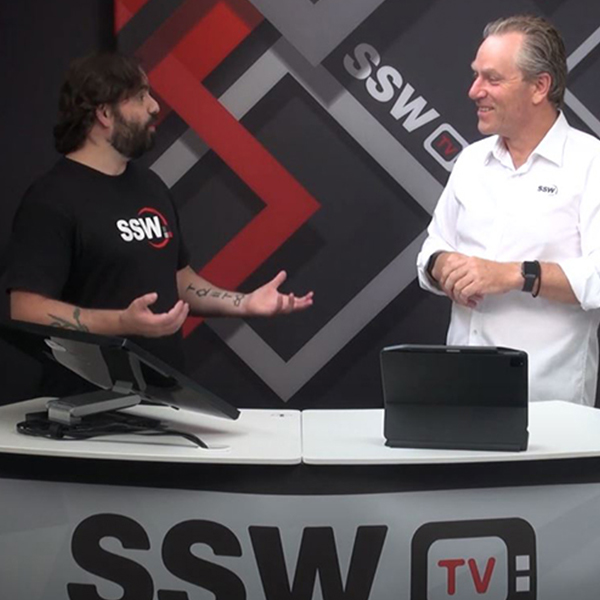
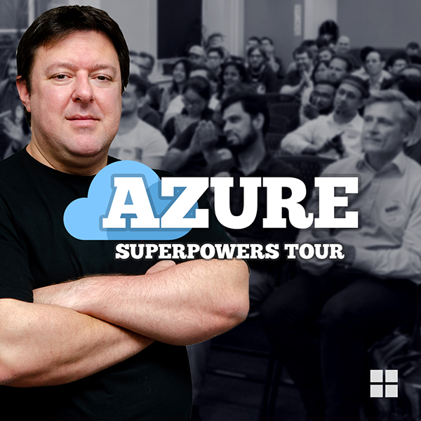

Sometimes it can be hard to keep **generating content daily for your social media, and even more when there’s not much going on.** However, here are a few types of content you could use for your next social media posts!

<!--endintro-->

So, here are a few examples taken from our social media of what you could post on yours:

### #1 - Internal projects, services or products that your business developed or offers

  

### #2 - Projects that your company worked on

  

### #3 - Video content

  

### #4 - Events that your company organised

  

  

### #5 - External events that you and your team attended to

  

### #6 - Your team members profiles

  

### #7 - Your employees' blogs posts

### #8 - Your business blog posts

  

### #9 - General content written by your team on your website

  

### #10 - Employment opportunities

### #11 - Teamwork, parties, etc.

 

### #12 - Relevant news for your industry

  

### #13 - Memes, if they suit your industry

To see best practices for sharing memes on your socials, check out our Rule: [Do you know why you should use memes as part of your business social media content?](/do-you-know-why-you-should-use-memes-as-part-of-your-business-social-media-content)

