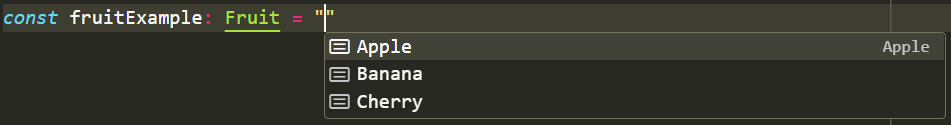
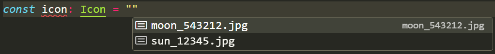
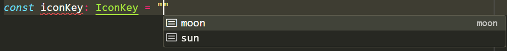

It's super important to ensure that [magic strings are not used in your codebase](/use-enums-instead-of-hard-coded-strings/). Typically, we would use constant values or enums to solve this problem, but this may not be applicable when using TypeScript. You might expect TypeScript enums to function like strongly typed languages like C# but often this is not the case.

<!--endintro-->

`youtube: jjMbPt_H3RQ`
**Video: Enums considered harmful (9 min)**

While TypeScript enums provide a lot of useful type safety at runtime, it's very important to consider that there may be cleaner options.

## Numerical Enums

When you define an enum like this:

```ts
enum Fruits {
    Apple,
    Banana,
    Cherry
}
```

When compiled to JavaScript, it looks like:

```js
var Fruits;
(function (Fruits) {
    Fruits[Fruits["Apple"] = 0] = "Apple";
    Fruits[Fruits["Banana"] = 1] = "Banana";
    Fruits[Fruits["Cherry"] = 2] = "Cherry";
})(Fruits || (Fruits = {}));
```

However, this makes it hard to loop over the keys of the enum, as when you run `Object.keys(Fruits)` you would get the following array returned:

```ts
["0", "1", "2", "Apple", "Banana", "Cherry"] 
```

::: bad
Bad example - An irritating DX, instead of returning just the values of the enum
:::

Instead, a much cleaner option is by using [const assertions](https://www.typescriptlang.org/docs/handbook/release-notes/typescript-3-4.html#const-assertions). With const assertions we can be sure the code is using the string values we want:

```ts
const fruits = ["Apple", "Banana", "Cherry"] as const;
```

Now, if we look into the content of the shapes array using:

```ts
type Fruit = typeof fruits[number];
```

We can construct this type from the above array, which is equivalent to:

```ts
type Fruit = "Apple" | "Banana" | "Cherry";
```

::: good
Good example - A much cleaner DX
:::

This makes it super easy to loop over keys within a union type. This also allows us to be able to pass `"Apple"` into a function that takes `Fruit` as an argument. We get super useful feedback from our code editor - the same as a typical TypeScript union type from VSCode from the `Fruit` union type:



## String Enums

```tsx
enum Icon {
  sun = "sun",
  moon = "moon"
}

const icons: Record<Icon, string> = {
  sun: "sun_12345.jpg",
  moon: "moon_543212.jpg"
};
```

::: bad
Bad example - Duplication of key values where it is not needed
:::

This is problematic, as it provides us no useful type hints for object values, as object values are typed as `string`, and there is an unecessary duplication of object keys. For cases like this with a single source of truth (i.e. the `icons` object), we can use const assertions, similiar to above with objects:

```tsx
const icons = {
  sun: "sun_12345.jpg",
  moon: "moon_543212.jpg",
} as const;

type IconKey = keyof typeof icons; // "sun" | "moon" union type

type Icon = (typeof icons)[IconKey]; // "sun_12345.jpg" | "moon_543212.jpg" union type
```

::: good
Good example - A much cleaner DX with a single source of truth in the `as const` object
:::

Similar to the array const assertion above, these also provide useful type hints in your code editor:





Remember, it's important to assess on a case-by-case basis when you are writing code to determine whether a const assertion can be used instead of an enum. For example, it's important when dealing with object values you don't want to overlap (i.e. `Icon1`, `Icon2` both with a `moon` key but with different moon images) to opt for enums. However, using const assertions will likely lead to better DX (Developer eXperience) in most cases.
