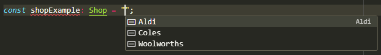

While it's super important to ensure that magic strings are not used in your codebase, there are better alternatives to using enums in TypeScript. You might expect TypeScript enums to function like strongly typed languages like C# and Rust, often this is not the case.


<!--endintro-->

`youtube: jjMbPt_H3RQ`
**Video: Enums considered harmful (9 mins)**

While TypeScript enums provide a lot of useful type safety both at runtime, it's very important to consider that there may be cleaner options.

```ts
enum Fruits {
    Apple, Pear, Strawberry
}
```

Becomes this when compile to JavaScript:

```js
var fruits;
(function (Fruits) {
    Fruits[Fruits["Apple"] = 0] = "Apple";
    Fruits[Fruits["Pear"] = 1] = "Pear";
    Fruits[Fruits["Strawberry"] = 2] = "Strawberry";
})(Fruits || (Fruits = {}));
```

However, this makes it hard to loop over the keys of the enum, as when you run `Object.keys(Fruits)` you would get the following array returned:

```ts
["0", "1", "2", "Apple", "Pear", "Strawberry"] 
```

Instead, a much cleaner option is by using [const assertions](https://www.typescriptlang.org/docs/handbook/release-notes/typescript-3-4.html#const-assertions). By using const assertions, we can be fully sure that our code is using the string values we want:

```ts

const shops = ["Coles", "Woolworths", "Aldi"] as const;
type Shop = typeof shops[number]; // type Shop = "Coles" | "Woolworths" | "Aldi";

```

This makes it super easy to loop over keys within a union type. This also allows us to be able to pass `"Coles"` into a function that takes `Shop` as an argument. We get super useful feedback from our code editor - the same as a typical TypeScript union type from VSCode from the `Shop` union type:



::: bad

```tsx

enum Icon {
  sun = "sun",
  moon = "moon"
}

const icons: Record<Icon, string> = {
  sun: "sun_12345.jpg",
  moon: "moon_543212.jpg"
};

```

:::

This is problematic, as it provides us no useful type hints for object values, as object values are typed as `string`, and there is an unecessary duplication of object keys. We can fix these issues by using const assertions, like above with objects. For example:

```tsx
const icons = {
  sun: "sun_12345.jpg",
  moon: "moon_543212.jpg",
} as const;

type IconKey = keyof typeof icons; // "sun" | "moon" union type

type Icon = (typeof icons)[IconKey]; // "sun_12345.jpg" | "moon_543212.jpg" union type

```

Similar to the array const assertion above, these also provide useful type hints in your code editor:


Remember, it's important to assess on a case-by-case basis when you are writing code whether a const assertion can be used instead of an enum, as it will likely lead to better DX for developers working with the codebase.
