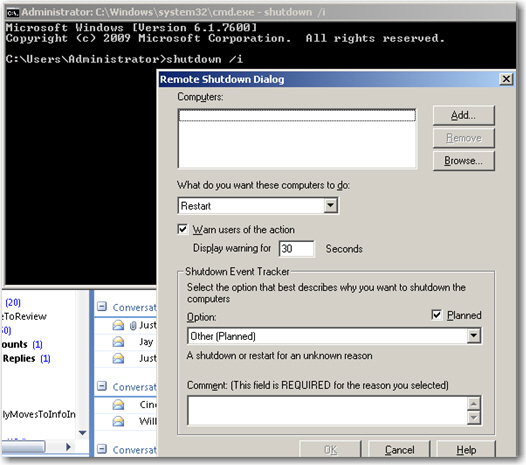
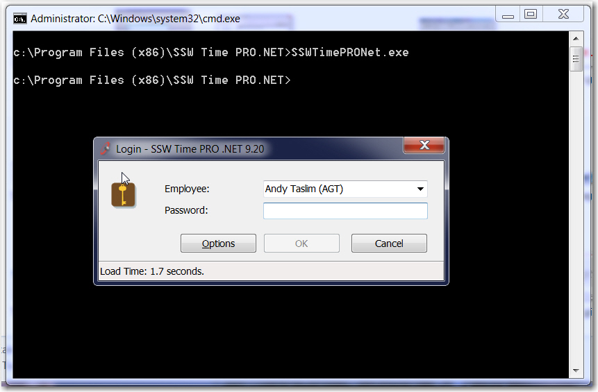

It is always a good practice to have UI opened when specifying `\[ApplicationName].exe` from command line. If the GUI is not done, show a messagebox "GUI coming...".

**Note:** If you prefer for not putting UI as the default, it should have be at least "/GUI" as the argument. Do **not** use "/i", because too many command lines are using “/i” already.

<!--endintro-->

::: bad

:::

::: good

:::
