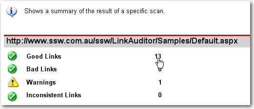
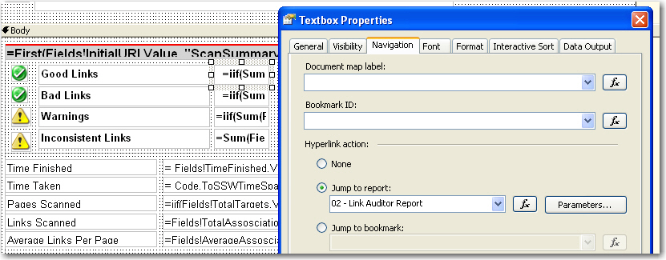
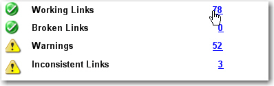
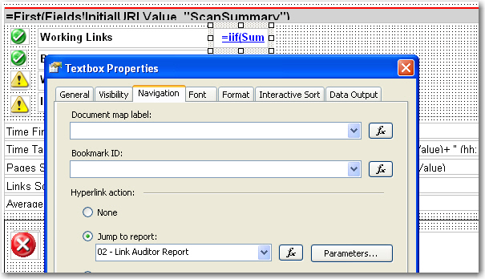

<!--endintro-->

The Hyperlink Action allows users to navigate between reports smoothly, but users may ignore the navigation functionality in your reports.

::: bad  
  
:::

::: bad  
  
:::

With the underline effect on your hyperlink items, it will be easy for users to find the navigation on your reports.

::: good  

:::

::: good  

:::

We have a program called [SSW Code Auditor](https://codeauditor.com/) to check for this rule.
