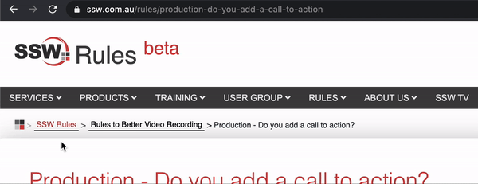
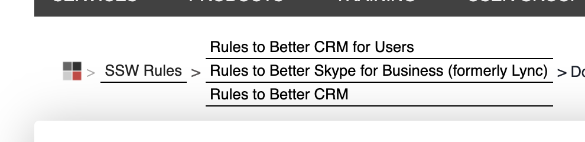

Ensure your links are easily distinguishable from the background and surrounding text by **always making them underlined**. Users expect underlined texts to be a link; and links to be underlined. 

<!--endintro-->

Keep in mind:
* Underlines are **not** necessary on obvious links, like menu items or buttons
* **Never underline a text that isn't a link** - Use bold or another styling if you need emphasis.

::: greybox
When you develop on SharePoint, you <u>do not</u> have a full copy of web.config in your Visual Studio project.
:::
::: bad  
Figure: Bad example - Never underline the text when it isn't a link  
:::

::: greybox
For more information on this, please go to [SSW website](https://www.ssw.com.au).
:::
::: good  
Figure: Good example - The link is nice and clear  
:::

::: info
**Tip:** You can [use a different color on underlines](https://www.w3schools.com/cssref/css3_pr_text-decoration-color.asp) as a nice touch.
:::

### Mouse hovering effect

Rollovers are also important as they offer visual feedback to a user that this link that will take them somewhere. While there is a myriad of ways to do this; you can't go wrong with a color change. Hover the good example above to see this working.

The basic CSS for changing the link color on hover is:

``` css
a:hover { 
    color: #cc4141;
}
```

### CSS - Avoid borders on text

The default implementation of underlines in CSS is:

``` css
text-decoration: underline;
``` 

Another way to add look-alike underlines is by adding `border-bottom: 1px;`, for example. In this case, you can even have a dotted underline. However, it's **not recommended** you use this method unless you are a designer and know what you are doing. It may create extra pixels in the interface, which can potentially cause other problems in your UI:

::: bad  
  
:::

::: bad  
  
:::
