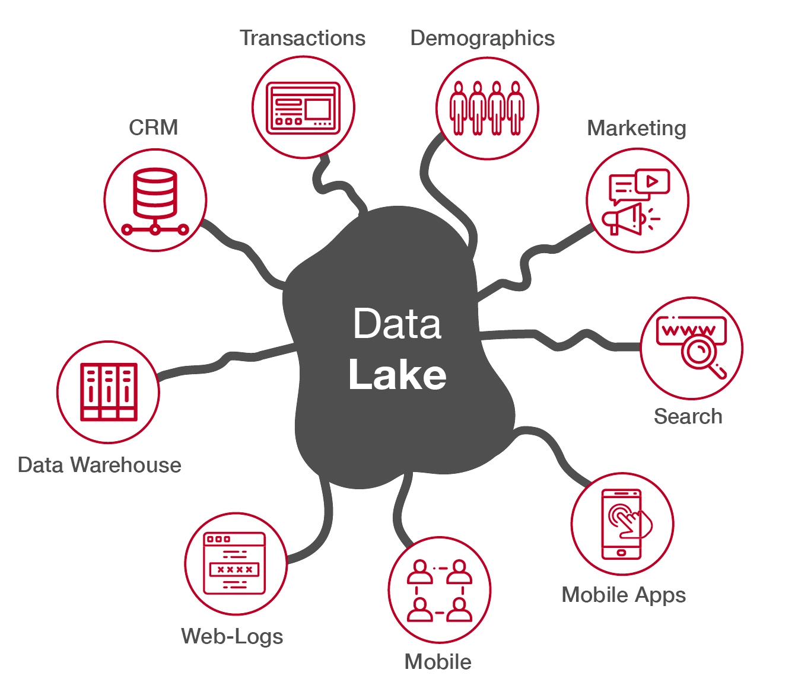

In today's data-driven world, businesses face the challenge of managing and extracting insights from vast and diverse datasets. But how can businesses leverage the power of their data to gain a big picture view of their operation and make informed business decisions?

Welcome to Data Lakes.

<!--endintro-->

A Data Lake is a centralized repository that stores vast amounts of raw, unprocessed data from various sources. It is designed to accommodate structured, semi-structured, and unstructured data in its native format, without the need for upfront data transformation or schema definition. The concept of a Data Lake emerged as a response to the limitations of traditional data warehousing approaches.

::: img-medium

:::

**Basic** - **@AltexSoft** gives a walk through of the data engineering process and how it would evolve in an organization:

`youtube: https://www.youtube.com/watch?v=qWru-b6m030`
**Video: How Data Engineering Works (14 min)**

In a Data Lake, data is stored in its original form, such as CSV files, log files, sensor data, social media posts, images, videos, or any other data format. This raw data is often referred to as "big data" due to its volume, variety, veracity, and velocity. The Data Lake allows organizations to store and analyze this diverse range of data without imposing a predefined structure or format on it.

## Key characteristics

* **Centralized Repository:** Data from multiple sources is ingested and stored in a single location, enabling easy access and exploration.
* **Schema on Read:** Unlike traditional data warehouses that enforce a schema upfront, Data Lakes allow for flexible schema definition during data retrieval or analysis. This enables data exploration and analysis without the need for extensive data transformation beforehand.
* **Scalability:** Data Lakes are built to scale horizontally, accommodating the growing volume of data as well as the increasing demands for processing power.
* **Data Variety:** Data Lakes accept and store various data formats, including structured, semi-structured, and unstructured data, allowing organizations to leverage diverse data sources.
* **Storage Cost:** Data Lakes typically use low-cost storage, as computations are done in batches or ad hoc, whereas a database/warehouse has its storage tightly coupled to its computational costs (as well as utilizing higher-cost storage).
* **Data Exploration and Analytics:** With the raw data stored in a Data Lake, organizations can apply various data processing and analytics techniques to extract insights, discover patterns, and derive value from the data.
* **Data Governance and Security:** It is crucial to implement proper governance policies and security measures to ensure data quality, privacy, and compliance within the Data Lake environment.

## 📈 Store now, analyze later

Perhaps the biggest point of differentiation between a Data Lake and a data warehouse, is the *warts-and-all* approach to its data capture. A data warehouse will typically have a very defined set of objectives that it's built to achieve, and the data it stores is hand-picked from various sources specifically for those purposes (via a process called ETL, or Extract, Transform, Load). This transformed data is great for delivering on its specific objectives, but will not be able to provide any meaningful answers to questions outside of its intended scope. 

A Data Lake is less concerned with curating data to meet a given objective, and instead provides a centralized pool of data that can queried in many different ways later (via ELT, or Extract, Load, Transform). As it contains **raw data**, data scientists and engineers are able to invent new ways of reading and analyzing that data on demand.

## 🤢 Data swamps

 Data swamps occur when adequate data quality and data governance measures are not implemented. 

 Given the flexibility of a Data Lake's storage abilities, a business is often enticed to throw every bit of data into it without due thought or consideration to organization or appropriate cataloguing. This can turn a Data Lake into a [data swamp](https://www.enterprisestorageforum.com/management/data-lake-data-swamp/) which makes any meaningful analysis later incredibly difficult.

Remember - great insights come from great data, and great data comes from strong governance!

::: greybox
### Scenario

Northwind Traders - a multinational enterprise - are struggling to answer a variety of questions about their business operations. Their daily operations are spread over many financial, CRM, inventory, and ERP systems.

Northwind already have a data warehouse that powers BI reports on their monthly sales statistics. Lately though, stakeholders are coming up with new and unique questions every week that go way outside the scope of the warehouse's purpose. The data team are constantly having to retrieve raw data from the line of business applications, and this process is both painful and time consuming.

In this instance, a Data Lake would be a strong suggestion for Northwind, as it would provide their data team a centralized repository of raw data from all line of business applications that would be easily queried and analyzed in any way the stakeholders requested.
:::
