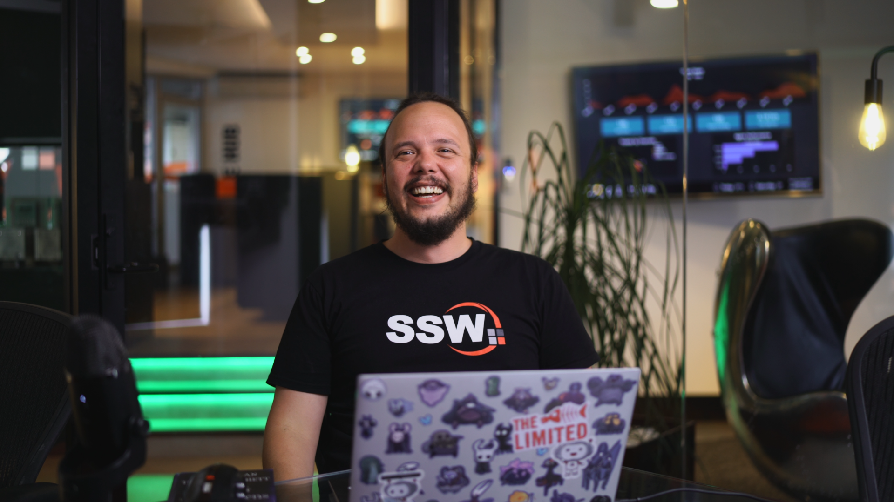
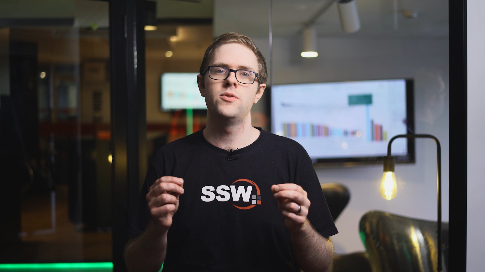
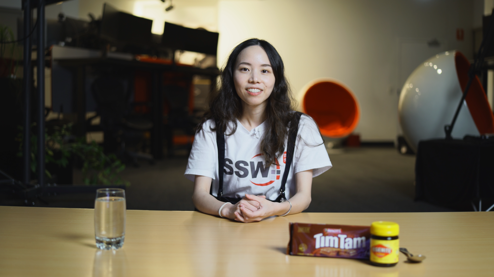
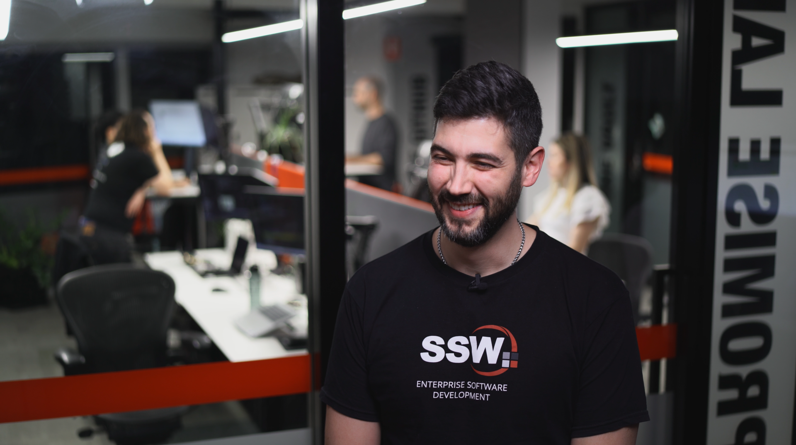
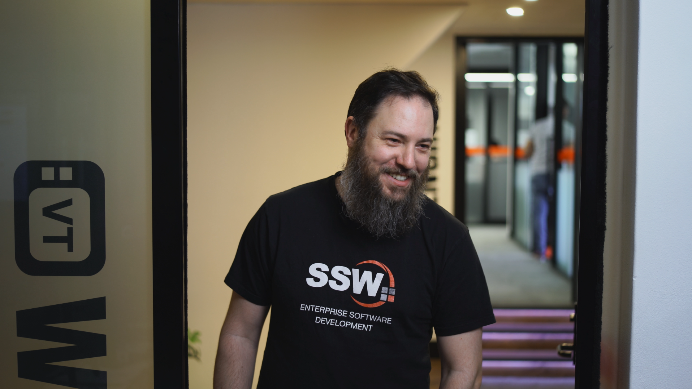

It can be time-consuming to think and plan a shoot with the background in mind. It is much better to have a library of different office backgrounds to save time. 

These will also act as approved office backgrounds from the Product Owner, giving the video team assurance and confidence in shooting the video. It also allows developers who are less creative or nervous about shooting to choose what background they would like.

::: greybox
Hey Sophie, 

Cool video idea. What were you thinking for the background?
:::
::: bad
Figure: Bad Example - Vague question and no visual references
:::

::: greybox
Hey Sophie, 

As per our conversation, this is a great and valuable video to make. Please check out the different options of backgrounds we can use for you:

[ssw.com.au/rules/unique-office-backgrounds](/unique-office-backgrounds)

1. Choose the one you most prefer

:::
::: good
Figure: Good Example - link to visual references and options for approved backgrounds
:::
