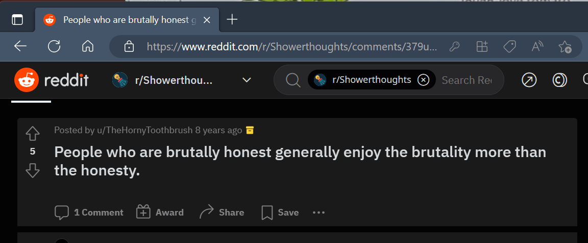

When you see an opportunity for someone to improve, either professionally or personally, it's tempting to immediately offer them some advice or feedback. But if they haven't asked, you need to approach it carefully and considerately; and, most importantly, ask yourself, _am I doing this for them, or for me?_

<!--endintro-->

`youtube: https://www.youtube.com/embed/dLgsQvvYqSQ`
**Video: How and when to offer unsolicited feedback | Matt Goldman & Ulysses Maclaren | SSW Rules (7 min)**

Feedback is critical in order to grow and improve, both personally and professionally, so we all like to receive constructive feedback. In some cases, like during a retro, we openly invite feedback; but other times it can be unexpected, which can often lead to misunderstandings and hurt feelings. Do you know when, how, and even _if_, to offer unsolicited feedback?

## Why offer unsolicited feedback?

The most important question to start with is _why_? Sometimes we can be excited to share something with someone, but it's critical to pause and reflect on your motivation. Are you doing this for their benefit, or for yours?
    
While it can be exciting to offer feedback, especially when you've got a great idea that can help someone improve, or when it's to resolve something that is negatively impacting you, the hard truth is that, more often than not, it's best to keep it to yourself. As [written by Shannon Martin in Psych Central](https://psychcentral.com/blog/imperfect/2020/02/its-time-to-stop-giving-unsolicited-advice), we should stop giving unsolicited advice.

However, sometimes it is the right thing to do. The best way to determine this, as with most things, is to start by defining your goals and outcome. Once you've determined what these are, and you know what you want to achieve, it's easier to approach it with confidence and be certain that offering the feedback is the right thing to do. And equally sometimes this can help you to realize that the best approach is to let it go.

### The honesty myth

"I'm just being honest" is a popular self-delusion. There is a myth that being honest is morally superior to any other course of action, or that the honesty cancels out any other negative aspects of an interaction. None of this is true, and it's often used as an excuse by people to criticize others.

:::info
**Note:** Criticizing someone is not the same as offering constructive feedback.
:::

[Kristy Sachse](https://twitter.com/kristysachse) gives a talk on shame (within the context of shaming others), and one of her key points is illustrated by the 'shame burrito'. It shows various ingredients being used to shame someone, but the key is the 'tortilla of truth', which is used to wrap it all up in the excuse of "I'm just being honest".

Similarly, the following post crops up on [Reddit](https://reddit.com) around once every year:

    
If you're about to provide someone some feedback, reflect on your motivation. If you detect even a hint of "brutal honesty" anywhere near it, it's a good sign you shouldn't do it.

**Tip:** 'Brutal honesty' is meant for yourself, not for others. 

## When to offer feedback - The 3 questions

Even if your motivation is pure, and the feedback that you want to offer someone is genuine, it still doesn't necessarily mean that providing that feedback is the right way to go. Before you offer the feedback, you should ask yourself 3 questions; or more accurately, 1 question 3 different ways.

### Do _I_ need to say this?

Sometimes, no matter how good your intentions, and no matter how good the advice, you're just not the right person to provide it. If you don't already have an established relationship with someone, your first introduction to them should not be criticism, no matter how constructive. Equally, if you don't know someone _that well_, unless they've invited feedback, it can be best not to give it.
    
Even if you do know someone well, the dynamic of that relationship can impact whether providing feedback is a good idea. For example, I once saw someone chewing a CFO's ear off at a Christmas Party explaining how he should be running the organization. The ideas may well have been sound, but the feedback was not appropriate.

Finally, there may already be people in place to provide this feedback. It's likely you weren't the only person to spot the improvements you want to suggest, and it's possible that other people closer to the issue or the person are better placed to provide this feedback.

### Do I _need_ to say this?

This is perhaps the most important question. Will it negatively impact you to _not_ provide the feedback? While there may be circumstances where providing unsolicited feedback to someone is the right thing to do, the default situation is that it isn't. So if you don't _need_ to say it, then you almost certainly shouldn't.

### Do I need to say _this_?

If you have suggestions or feedback for someone, you should think carefully about whether it's the right message, and whether it's being delivered in the right way.
    
For example, comments on someone's appearance are never ok. As an example, let's say you've just finished an important client meeting, and you didn't feel that your colleague presented themselves as well as they should have. It's never ok to tell someone that they are dressed poorly, or that you don't like their haircut, or anything along those lines.

If they have not adhered to a company dress code, it's ok to point that out, but beyond that is none of your business. It's also important to acknowledge that you don't know what may be happening in that person's life outside of work, and any number of factors could be involved.

**Note:** It's important to ensure that any company dress code is lawful and non-discriminatory.

## How to offer feedback

As noted above, feedback is critical and necessary for growth. While the above guidelines help to sieve out feedback which is not appropriate, sometimes offering feedback, even unsolicited, is the right thing to do. Knowing how to do this is essential.
    
When feedback has been invited, it's easy to offer it up, but when it hasn't, the best thing to do is ask.

:::greybox
> Hey Bob, have you got a few minutes to discuss some ideas I have about _x_? I have some suggestions, you may already be across them so if you have the time I'd love to chat to you about them.
:::

Phrasing things correctly is important too. For example, let's say you watched an interview, and you noticed that the interviewer was telling anecdotes more than they were eliciting them from the interviewee.

:::bad
> Bob, I saw your interview and it was terrible! All you did was talk about yourself, you didn't give your guest a chance to get a word in edgewise!
:::

:::good
> Hey Bob, I really enjoyed watching your interview with [guest] last week. You told some cool stories, and it really whet my appetite for more about the topic. Is there any chance of [guest] coming back? I'd love to hear more from _them_ next time about _their_ stories.
:::

## If feedback is personal

Sometimes the feedback you might want to give addresses an aspect of someone’s self rather than their work. For example, someone might be eating with their mouth open in a meeting and it looks unprofessional. If the feedback is personal like this, it's best to use a private chat or wait for a private setting to address it. This way, the recipient can accept the feedback without external pressure or judgment.

For more information, see our rule [Do you know the nice way to correct someone?](/do-you-know-the-nice-way-to-correct-someone)
