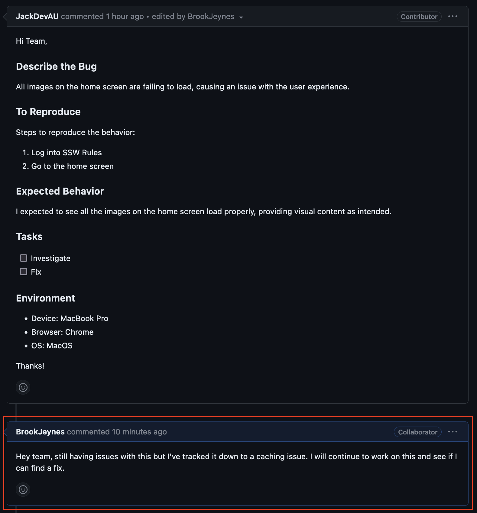
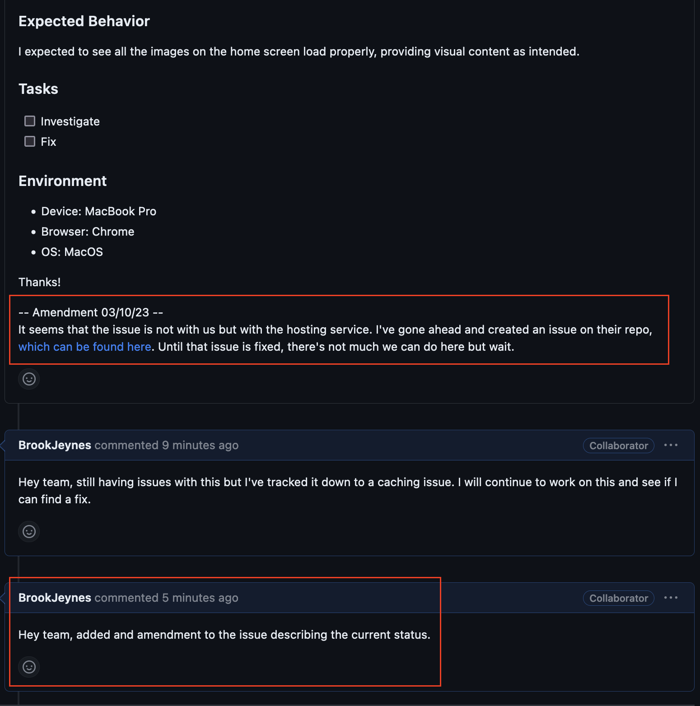

As issues evolve, it's common for their initial descriptions to become outdated or for significant developments to occur that must be recorded for the benefit of the entire team.

<!--endintro-->

Whenever an issue necessitates an update, the team should add a comment to the issue, detailing the change or event. 

::: good

:::

In cases where an update is long standing or important, it should be appended to the bottom of the issue description. This amendment must include the date it was made, serving as a chronological record of changes. In addition, a comment should be left on the issue thread to inform team members that significant information has been added to the issue.

This does not include changes regarding to who is currently working on the issue, GitHub tracks this via the “Assignees” tag.

::: good

:::
