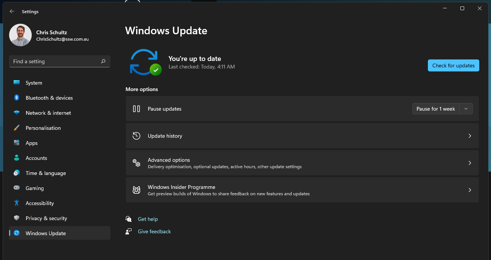

Microsoft is constantly releasing updates for Windows and one of the most important things they do is patch viruses. Without these updates, users would be vulnerable to attacks from hackers. This is the same for MacOS

So it is critical to always keep your operating system up to date.

<!--endintro-->

::: good

:::
