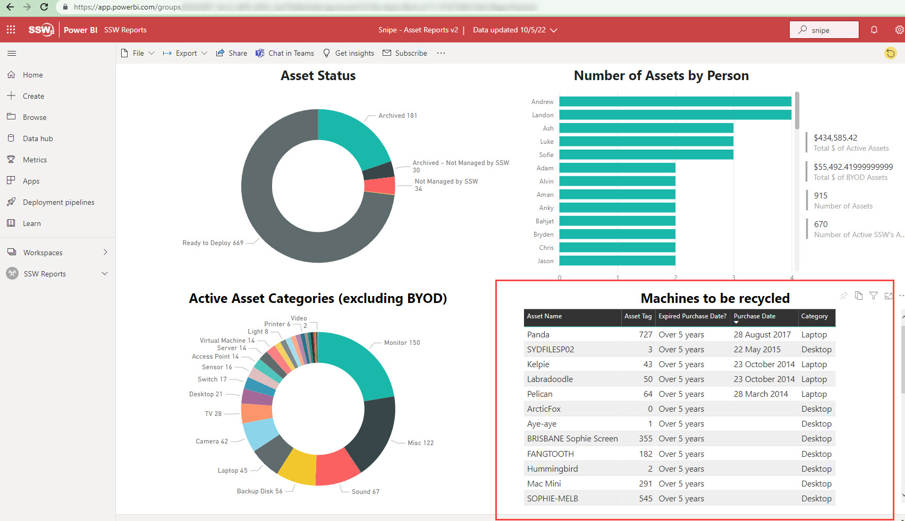
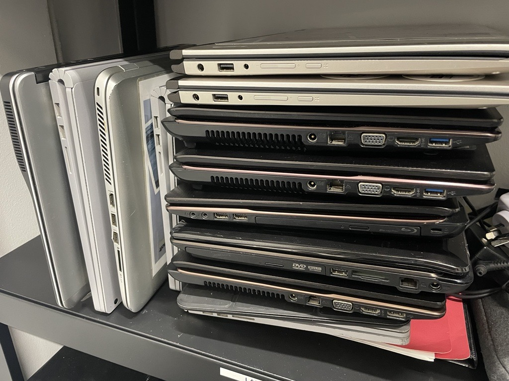
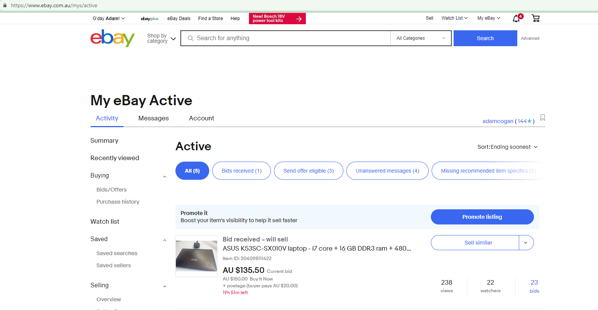
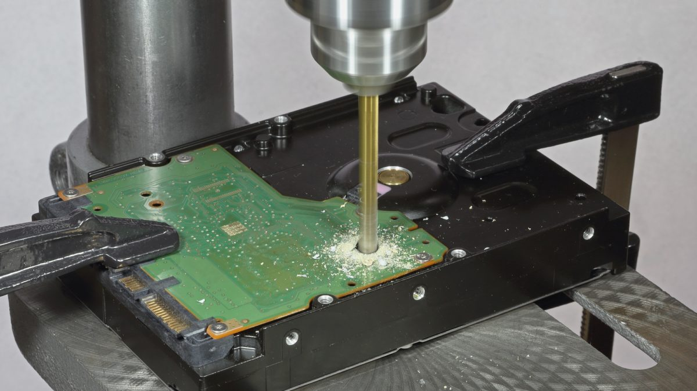

Managing multiple computers can be a challenging task, especially when it comes to keeping track of them. It can be a real pain to constantly monitor and manage numerous devices, each with its configurations and updates. Electronic gadgets should have an expiry date because their performance fades as we use them.

For example, in the IT industry, laptops are the tools of the trade. Employers spend thousands of $ on laptops with good specs. However, these laptops deteriorate over time leading to poor performance. Some employees notice and complain, some do not notice that their laptop is no longer performing well. If you don't have a computer rotation policy, then you only renew laptops for the squeaky wheels (the people who complain).

There are a few things that should be done with laptops in a company's fleet.

* Rotation - Keep the fleet up-to-date
* Waste management - Recycle old laptops

### Rotation - Keep the fleet up-to-date

The laptops in your fleet should be fit for purpose and performant. In the old days, people used to [Benchmark their laptops](/do-you-benchmark-your-pc) and it's still useful for personal machines, however, it is not the best method for enterprise asset management.

Enterprises should buy laptops with standardized specs, in batches, at regular intervals e.g. every 6 months. Then the laptops should be rotated for employees on a regular cadence e.g. every 5 years.

#### How do you figure out what cadence you replace laptops at?

Most experts estimate a laptop’s lifespan to be [2 to 3 years](https://www.empowerit.com.au/blog/it-planning/budgeting/laptops-desktops-how-long-do-they-last/). While a laptop might survive longer than its lifespan, its utility will be limited as the components become less capable of running advanced applications. However, many factors influence this lifespan, such as the quality of specifications and usage patterns. If buying high-spec laptops, a good rule of thumb is every 5 years.

#### How do you track your assets

To keep track of a laptop's lifespan, use an asset management tool e.g. [Snipe-IT](https://snipeitapp.com/) and use the audit option. That option allows a review date to be set after a period of time (5 years is recommended) so that the SysAdmin knows to upgrade the laptop.

:::good

:::

### Waste management - Recycle old laptops

Once you have determined a laptop is no longer an asset to keep, then there are two options:

1. Sell it (Recommended)
2. Recycle - Dispose of e-waste

#### Sell it (Recommended)

You want to keep your fleet modern, but that doesn't mean the assets you are getting rid of are worthless. So, to get back a few $ sell the old assets online.

:::bad

:::

:::good

:::

#### Recycle - Dispose of e-waste

When electronic devices stop working and can't be sold for significant $ then they need to be recycled (not chucked). Most countries now have an e-waste policies.
eg. Australian states require old electronic devices (e-waste) to be recycled, so follow the policy of the country and state your company operates in
e.g. [NSW Government e-waste policy](https://www.epa.nsw.gov.au/your-environment/recycling-and-reuse/warr-strategy/product-stewardship-schemes/ewaste)
e.g. [VIC Government e-waster policy - makes it illegal](https://www.epa.vic.gov.au/for-business/find-a-topic/manage-e-waste)

### How do you dispose of e-waste

1. Check your item is accepted for electronic recycling via your government policy e.g. [NSW e-waste policy](https://www.environment.nsw.gov.au/questions/dispose-or-recycle-e-waste)
2. Backup and delete any data from laptops, tablets, printers, and servers before you recycle them
3. Hard drives - Securely format them (preferred) or drill them to avoid data theft
4. Update the e-waste devices to archive them on the asset management tool

:::good

:::
