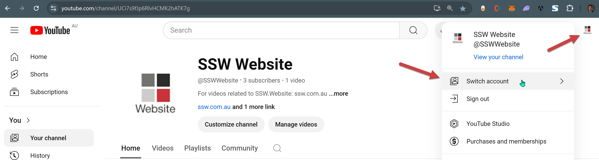
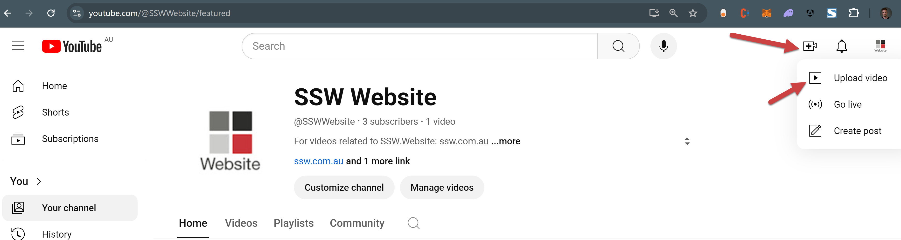
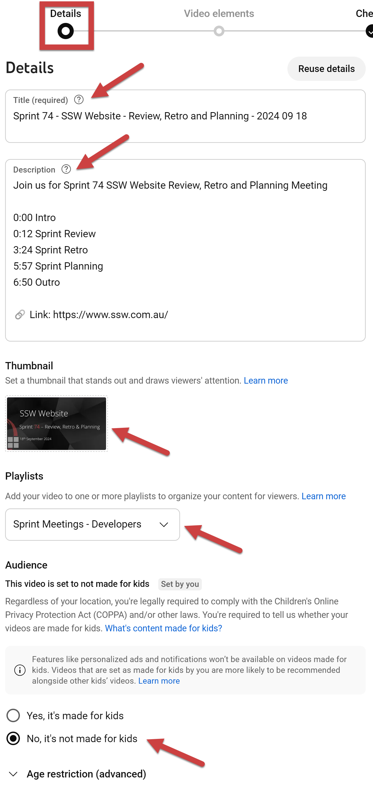
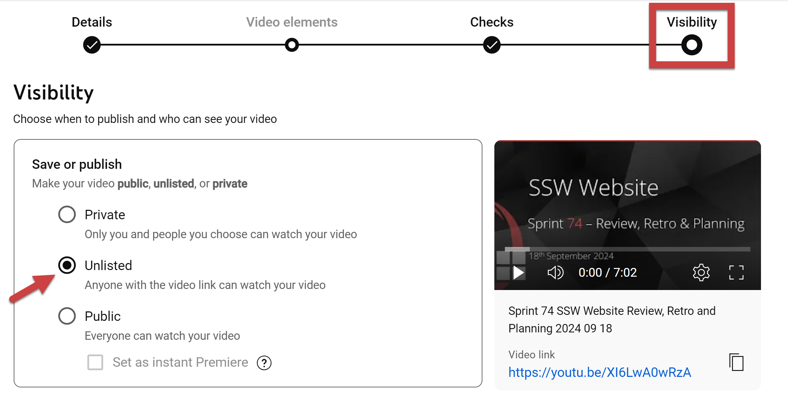
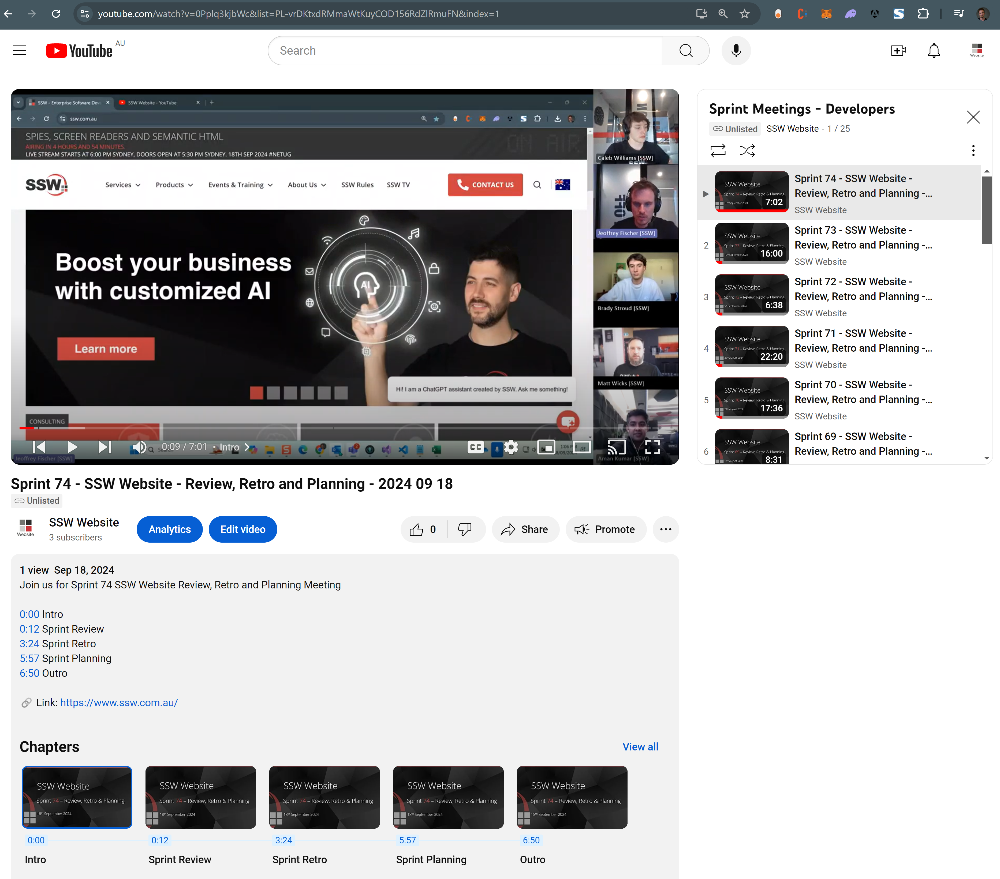

Today was Sprint Review and you have just finished recording your Sprint Review by following the rule [Do you record a summary of Sprint Reviews for the stakeholders?](/summary-recording-sprint-reviews/)

Now you need to upload your recording to YouTube - this is what this rule is about!

<!--endintro-->

## Prerequisites

Before starting, ensure that you have:

* The video recording file
* A thumbnail - make sure they are consistent. For instance, the Website Team uses a PowerPoint slide that they update every week: [SSW Website Thumbnail](https://sswcom.sharepoint.com/:p:/s/SSWWebsitev3/EXK91BgLmO9DnT9np2HabPoBm5vQiKfggtG3DqtDw-aQHA?e=Im08L9)
* Access to the related YouTube channel - see [📖 YouTube Channel Management](https://my.sugarlearning.com/SSW/items/14066/youtube-channel-management)

## Steps

1. Go to YouTube

    Go to your Team's YouTube channel e.g. [SSW Website YouTube channel](https://www.youtube.com/channel/UCi7s9fJp6RlvHCMK2hATK7g)

2. Select account

    Click the channel icon in the top-right corner, select "Switch account" and choose your Team's account.
    
      

3. Upload video

    In the top-right corner of the YouTube homepage, click the Create icon 🎥.   
    Then select "Upload video". A new window will pop up.   
    Click on "Select Files" - or drag and drop the video file from your computer into the upload area.  
    
    

4. Add details

    Fill the following fields:
    
    * **Title:** ensure to include the Sprint iteration, the Team's name and the date of the recording.
    
    Ex:
    ::: greybox  
    Sprint {{ ITERATION }} - {{ TEAM NAME }} - Review, Retro and Planning - {{ DATE }}
    :::
    
    * **Description:** ensure to include the Sprint iteration, the Team's name and a link to the team's website.
    
    ::: info
    **Tip:** Add timestamps to improve UX
    :::
    
    Ex:
    ::: greybox
    Join us for Sprint {{ ITERATION }} {{ TEAM NAME }} Review, Retro and Planning Meeting
    
    {{ MIN }}:{{ SEC }} Intro
    {{ MIN }}:{{ SEC }} Sprint Review
    {{ MIN }}:{{ SEC }} Sprint Retro
    {{ MIN }}:{{ SEC }} Sprint Planning
    {{ MIN }}:{{ SEC }} Outro
    
    🔗 Link: {{ TEAM WEBSITE }}
    :::
    
    * **Thumbnail:** upload the thumbnail
    
    * **Playlist (optional):**
    If you have a specific Playlist to store your Sprint meeting recordings, select it here.
    
    * **Audience:** select "No, it's not made for kids"
    This implicitly means that this video is not made exclusively for kids
    
    
    
    Click next until you reach the last category "Visibility"

5. Set video visibility

   Choose "unlisted"

   

6. Save and get link

   Once all required fields are filled out and your video is processed, click the Save button.   
   After saving, your video is uploaded, and you can share the link on your social media or with others.

   
