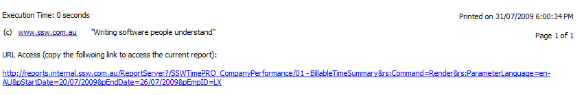

Reporting Service makes building, generating, managing and publishing report very easy, however sometime you want to refer to your report by URL from somewhere else. You will find that you can only link to the report default status, but not when you have changed the parameters. It should be as easy as using QueryString in ASP.NET application, but Microsoft didn't do that. See our Better Software Suggestions for Reporting Service.

<!--endintro-->

A workaround for this is to use URL Access to build up a link by yourself then put it at the bottom of the report, so any time you want to refer to your current report status, you can just copy this link and put into your emails.

At SSW, we have "URL Access" at the bottom of reports for easy reference.

::: good  

:::

``` html
http://localhost/ReportServer/Pages/ReportViewer.aspx?%2fSSWTimePRO_CompanyPerformance%2f01+-+BillableTimeSummary&rs:Command=Render
```

::: bad  
Bad example - Only refer to the default report URL, parameters on the report will be lost
:::

``` html
http://localhost/ReportServer/Pages/ReportViewer.aspx?/SSWTimePRO_CompanyPerformance/01%20-%20BillableTimeSummary&rs:Command=Render&rs:ParameterLanguage=en-AU&pStartDate=1/06/2009&pEndDate=7/06/2009&pEmpID=ALZ
```

::: good  
Good example - Refer to the report with all parameters ready
:::

Note `rs:ParameterLanguage=en-AU` in the query string, this is very important especially when you are passing culture sensitive data (DateTime) over URL. The server may not know your intended culture so you have to specify this together with the actual data in the URL.

Refer to the following MSDN references for more details:

* [URL Access for Reporting Services](https://learn.microsoft.com/en-us/sql/reporting-services/url-access-ssrs?view=sql-server-ver16&redirectedfrom=MSDN&WT.mc_id=DP-MVP-33518)
