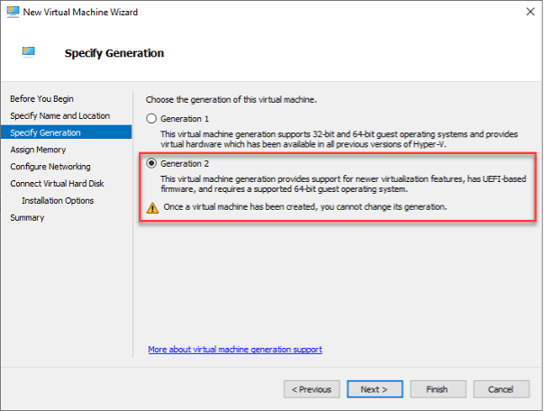

When creating a new VM, it is advised to always choose Gen 2 unless there is a specific reason not to. Some of the benefits of using Gen 2 VMs are:

- Secure Boot
- Faster Boot times
- Changes to Ram, CPU and VHDX can be made without shutting down
- Can support larger amounts or RAM and CPU

<!--endintro-->

Some reason you may not choose Gen 2 VMs:

- Operating system requirements
- Software vendor requirements
- Virtual floppy disk support
- Virtual COM ports

