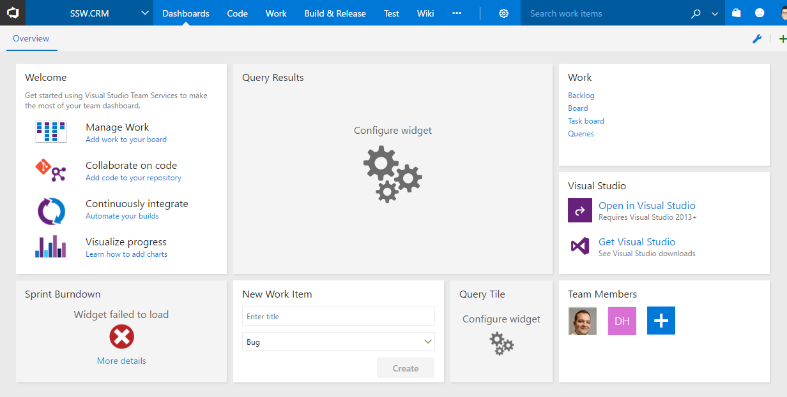

When a new developer joins a project, there is often a sea of information that they need to learn right away to be productive. This includes things like who the Product Owner and Scrum Master are, where the backlog is, where staging and production environments are, etc.

<!--endintro-->

Make it easy for the new developer by putting all this information in a central location like the Visual Studio dashboard.

::: info
**Note:** As of October 2021, this feature is missing in GitHub Projects.
:::

  

::: bad  
  
:::

::: good  
  
:::

The dashboard should contain:

1. Who the [Product Owner](/do-you-know-the-how-to-be-a-good-product-owner) is and who the [Scrum Master](/the-team-do-you-help-your-scrum-master-not-scrummaster-protect-and-serve-the-team) is
2. The [Definition of Ready](/have-a-definition-of-ready) and the [Definition of Done](/done-do-you-go-beyond-done-and-follow-a-definition-of-done)
3. When the [daily standups](/methodology-do-you-do-daily-scrums-aka-stand-up-meetings) occur and when the next sprint review is scheduled
4. The current sprint backlog
5. Show the current build status
6. Show links to:
    * Staging environment
    * Production environment
    * Any other external service used by the project e.g. Octopus Deploy, Application Insights, RayGun, Elmah, Slack

Your solution should also contain the standard [\_Instructions.docx](/do-you-make-instructions-at-the-beginning-of-a-project-and-improve-them-gradually) to your solution file for additional details on getting the project up and running in Visual Studio.

For particularly large and complex projects, you can use an induction tool like [SugarLearning](https://www.sugarlearning.com/) to create a course for getting up to speed with the project.

