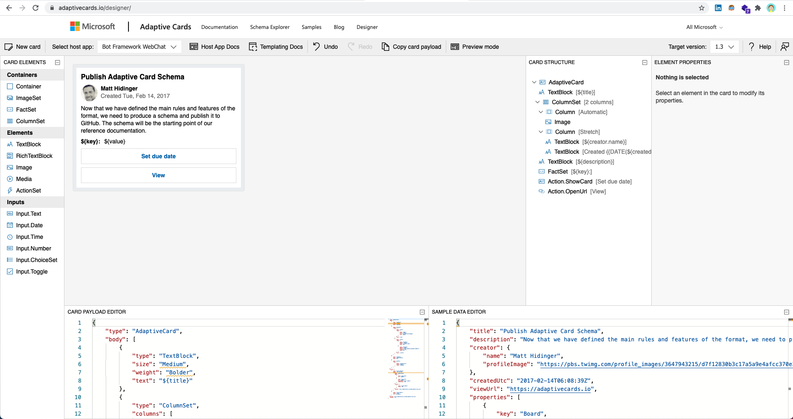

[Adaptive Cards Designer](https://adaptivecards.io/designer/) is a great tool for building your bot response cards. The reasons are the following.

* Online editing
* Multi-platform preview

::: good

:::
