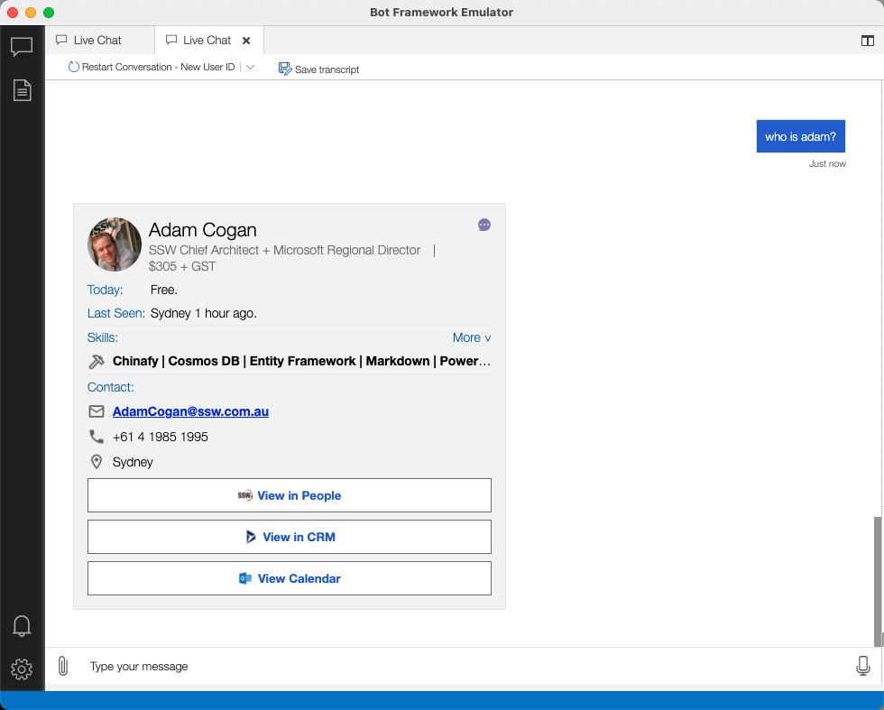
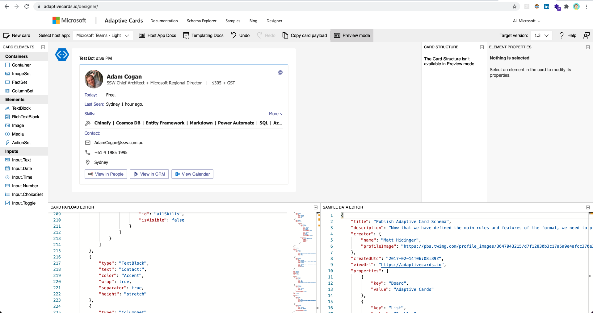

If you are using [Microsoft Bot Framework](https://dev.botframework.com/) and [Bot Framework Emulator](https://github.com/microsoft/BotFramework-Emulator), you can't preview what the card UI looks like in other platforms (e.g. Teams) until you deploy to production. [Adaptive Cards Designer](https://adaptivecards.io/designer/) helps you solve this problem by providing some awesome features... 

<!--endintro-->

* Online editing
* Multi-platform preview

There are two ways to use Adaptive Cards Designer:

* Using [online version](https://adaptivecards.io/designer/)
* Using [Adaptive Cards Designer SDK](https://docs.microsoft.com/en-us/adaptive-cards/sdk/designer) to embed into your application

::: bad

:::

::: good

:::