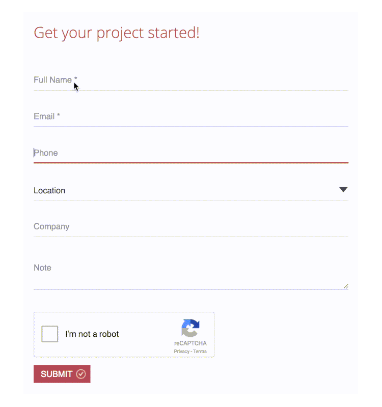

"Adaptive placeholders" are form labels that become into placeholders and vice-versa, depending on which fields have been filled or not. It gives your website a great UX.  
 <excerpt class='endintro'></excerpt> 

It's also a nice way to save space and achieve a neat visual appearance. Using this method users can easily to tell which field has been filled in and which data has been entered. 
<dl class="badImage"><dt> 
       
   </dt><dd>Figure: Bad Example - Having both label and placeholders can be repetitive and dull​​​ </dd></dl><dl class="goodImage"><dt> 
      </dt><dd>Figure: Good Example - Using placeholders</dd></dl>

