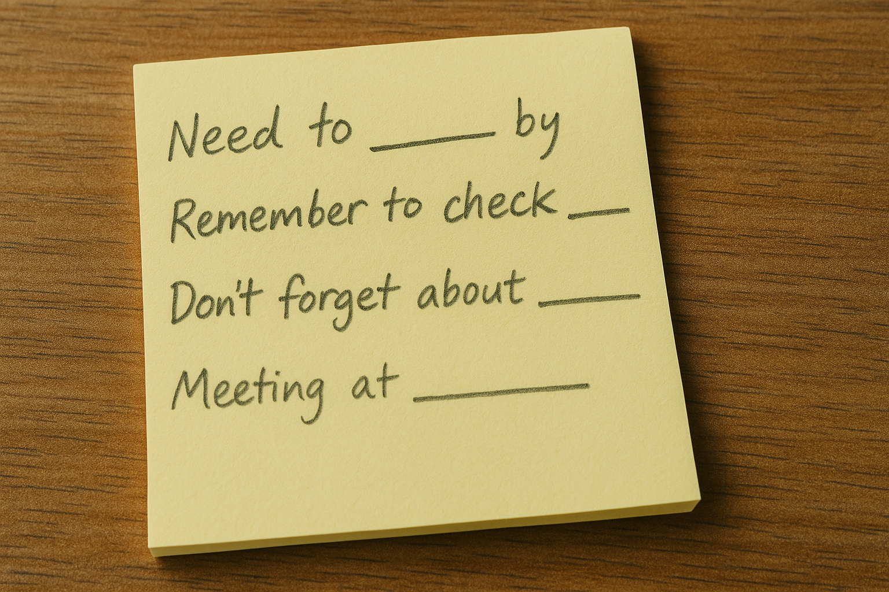
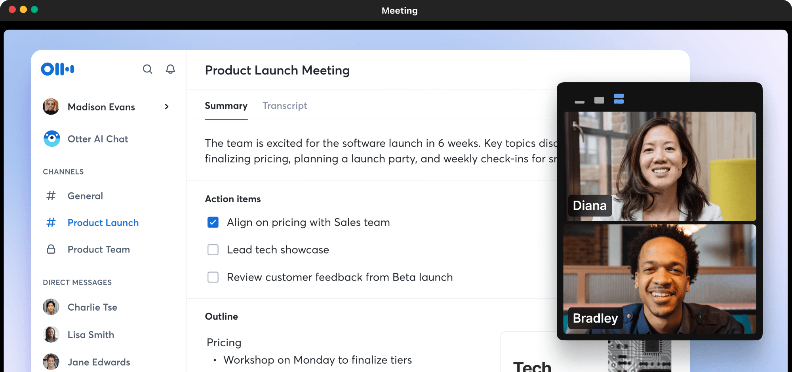

Manually typing out meeting notes is slow, error-prone, and distracting. While you’re typing, you’re likely missing parts of the discussion and contributing less. Worse, you might spend time afterward cleaning up notes instead of acting on them. 

In fact, employees estimate that [37% of their biggest cost is wasted time in meetings](https://joingenius.com/statistics/meeting-statistics/), and context-switching after interruptions takes an average of [9 minutes to recover from](https://www.atlassian.com/blog/productivity/context-switching). **Manual notetaking multiplies both problems.**

<!--endintro-->

## Why manual notes fall short

* **Hard to Keep Up:** Typing during fast talks makes it hard to understand everything
* **Lose Your Focus:** Note-takers miss things or can't join the discussion
* **Tiring Your Brain:** Switching between listening and typing is hard work
* **More Work Later:** You still have to fix up, sort, and send the notes

## Why AI note-takers are better

AI transcription tools like **[Read AI](https://www.read.ai/)**, **Otter.ai**, and **Fireflies.ai** handle notetaking for you, with:

* **Speed** – Get transcripts and summaries within seconds of the meeting ending
* **Accuracy** – Capture every word, no typos or forgotten context
* **Talk-time metrics** – See how much each participant contributed
* **Automated follow-up** – Receive email summaries with action items and highlights

| Feature                       | [Read AI](https://www.read.ai/)       | Otter.ai                            | Fireflies.ai                          |
| ----------------------------- | ------------------------------------- | ----------------------------------- | ------------------------------------- |
| **Real-time Transcription**   | ✅ Yes                                 | ✅ Yes                               | ✅ Yes                                 |
| **AI Meeting Summary**        | ✅ Yes (Detailed, Topic-based)         | ✅ Yes (Concise)                     | ✅ Yes (Customizable)                  |
| **Action Item Detection**     | ✅ Yes (AI-powered)                    | ✅ Yes (Keyword-based)               | ✅ Yes (AI-powered)                    |
| **Talk Time % Analysis**      | ✅ Yes (With engagement metrics)       | ✅ Yes                               | ✅ Yes (Talk/Listen Ratio)             |
| **Speaker Coaching/Feedback** | ✅ Yes                                 | 🟠 Limited                          | 🟠 Limited                            |
| **Automated Email Summary**   | ✅ Yes (Integrated with GMail/Outlook) | ✅ Yes                               | ✅ Yes                                 |
| **Key Integrations**          | Zoom, Teams, Meet, Calendar           | Zoom, Teams, Meet, Calendar         | Zoom, Teams, Meet, Calendar, **CRMs** |
| **Primary Strength**          | **Meeting Insights & Coaching**       | **Core Transcription & Simplicity** | **Integrations & Customization**      |

## 5-minute setup to modernize your meetings

1. Create an [Otter.ai (or similar) account](https://otter.ai/start-for-free)
2. Connect your calendar and meeting platform
3. Invite your AI notetaker to the call
4. After the call, check your inbox for a full summary
5. Share the summary in Teams or Slack

::: info\
**Important:** Always inform attendees if the call is being recorded or transcribed. Consent is required in most regions.
:::

**Let AI do the heavy lifting so you can stay present, contribute more, and act faster after the meeting.**
