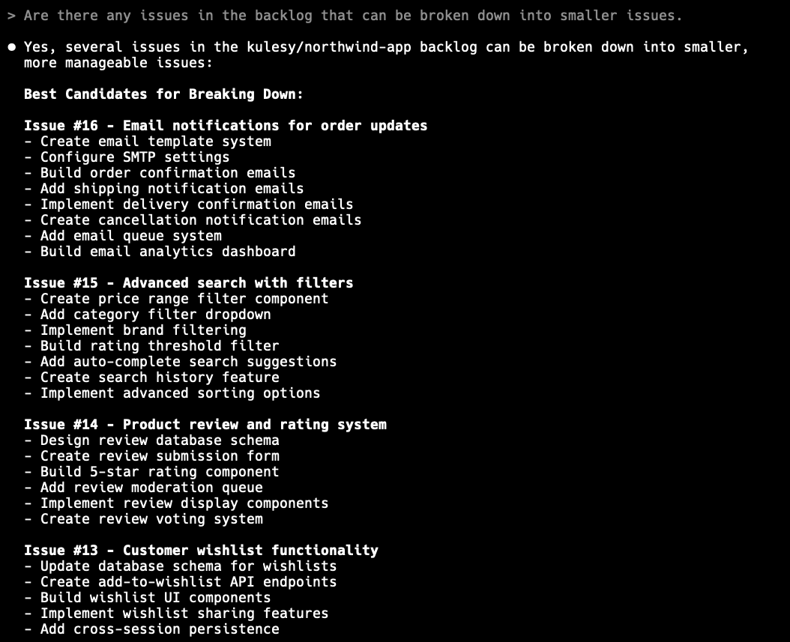
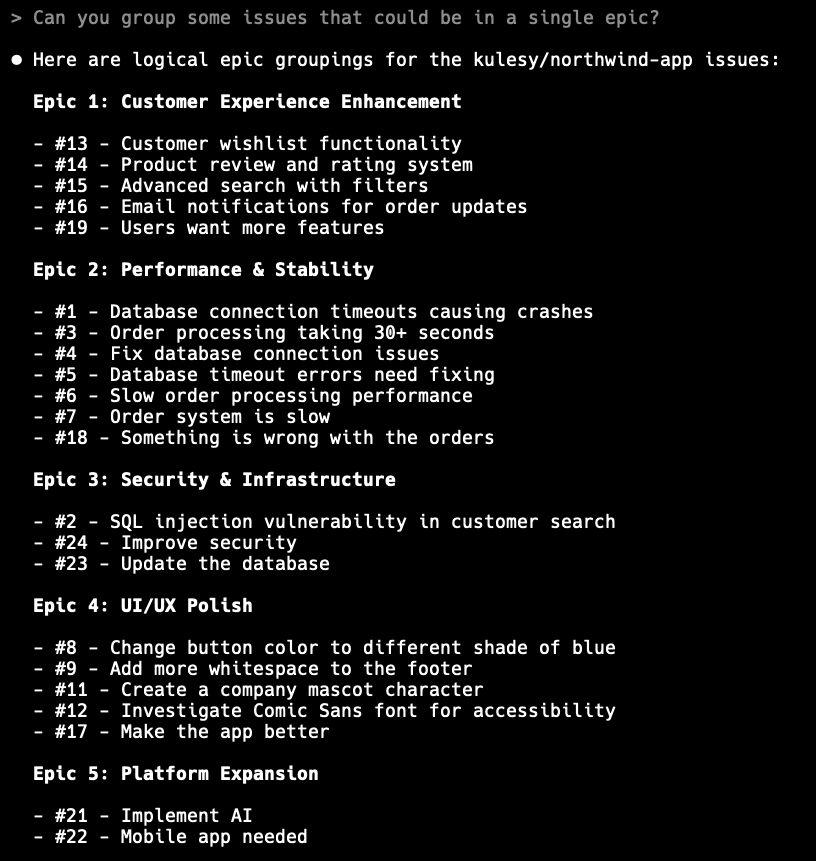
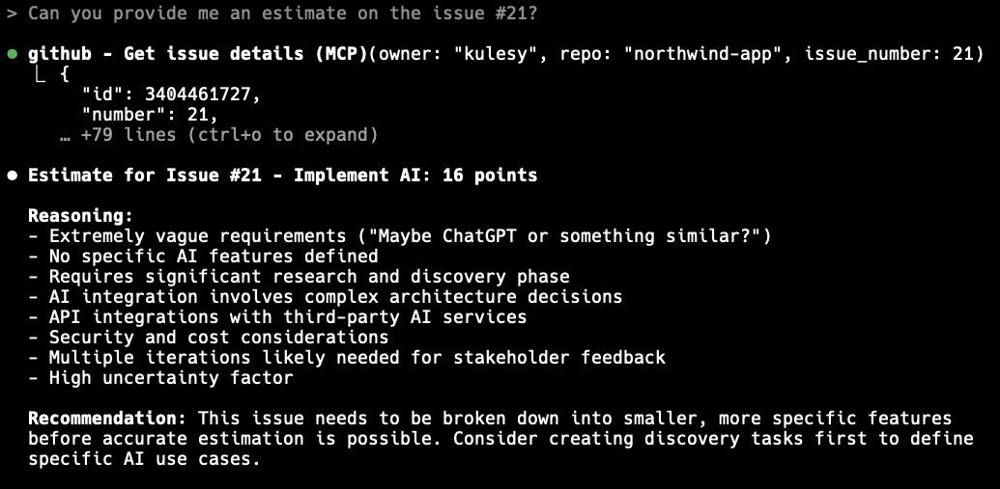
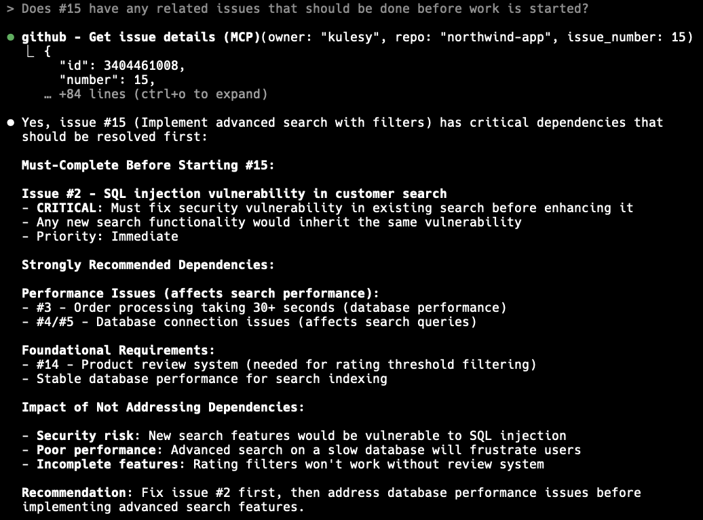
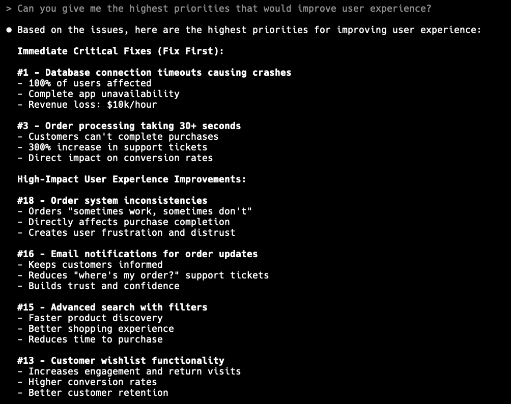

Managing a backlog can quickly become overwhelming. It often grows into a long, messy list of user stories, bugs, and features. High-priority items get buried, duplicates sneak in, and new requests don’t always come with clear next steps. This is where AI can help. By connecting the [GitHub](https://github.com/github/github-mcp-server) or [DevOps](https://github.com/microsoft/azure-devops-mcp) MCP to a host (eg. Claude Code), you can use natural language to query, refine, and prioritize your backlog — saving hours of manual effort.

<!--endintro-->

`youtube: https://www.youtube.com/watch?v=u_0WgkNn7dI`
**Video: Managing 1000+ GitHub Issues with Claude AI – Eli & Gert Reveal the Secret Sauce | SSW Rules (8 mins)**

## Why AI is useful for backlog management

### 1. Check for existing and duplicate issues

Backlogs often contain hundreds of items, and sometimes, it's hard to know if an issue already exists before you create it.
With AI managing your backlog, you can easily:

* **Find an existing issue** - Finds an existing issue based on the description provided
* **Detect duplicates** - Highlights backlog items that describe the same work, helping you merge and reduce clutter

::: bad

:::

::: good

:::

### 2. Break down large items

Some backlog items (PBIs) are simply too big to complete in a Sprint. AI can:

* **Suggest how to break a large user story into smaller, actionable issues** - Proposes logical sub-tasks with clear scope, making big items manageable within a Sprint
* **Provide acceptance criteria for each smaller issue** - Drafts clear, testable conditions that define when each sub-task is complete.

::: good

:::

### 3. Group-related work

Sprints are more effective when they focus on a single area or feature. AI can:

* **Tag related issues automatically** - Assigns consistent labels to similar backlog items, making it easier to organize and filter work
* **Create epics from groups of issues** - Clusters related backlog items under a single epic, giving structure and focus to larger initiatives
* **Suggest Sprint themes around common backlog areas** - Identifies patterns in the backlog and recommends focus areas that align related work into a cohesive Sprint

::: good

:::

### 4. Estimate effort

AI can compare a new item against similar past issues and suggest an estimate. This is especially helpful when:

* **Estimating bugs vs features** - AI compares similar past work to suggest effort ranges, factoring in hidden complexity for bugs and clearer scope for features
* **Providing quick estimating (at SSW we use [double estimates](http://ssw.com.au/rules/size-pbis-effectively/)) before team refinement** - AI offers rough size estimates upfront, helping teams spot oversized items early and speed up refinement

::: good

:::

### 5. Propose dependencies

When a request comes in, it isn't easy to know what issues are required to complete it. AI helps this by:

* **Identifying existing issues** - Finds prerequisites that need to be completed first to ensure the delivery is not blocked
* **Creating dependent issues** - Any dependencies that may have been missed can be identified and created

::: good

:::

### 6. Prioritize smarter

Not every backlog item has the same impact. AI can help prioritize by:  

* **Surfacing bugs that damage user experience as higher priority** - Flags issues with the biggest impact on users so they’re fixed before less critical work  
* **Recommending trade-offs (e.g., fixing a blocker vs shipping a nice-to-have feature)** - Helps balance effort and impact by suggesting which work delivers the most value first  

::: good

:::

## How to connect an MCP Host to GitHub  

You can connect any MCP-compatible host to [GitHub](https://github.com/github/github-mcp-server) or [DevOps](https://github.com/microsoft/azure-devops-mcp) and bring it into your backlog management workflow. Check out our rule on [using MCP to standardize connections between LLMs/Agents and external services](/use-mcp-to-standardize-llm-connections/) for more information.

**Start Querying Your Backlog**  

* Once connected, you can interact with your GitHub issues and pull requests in natural language  
* Example queries:  
  * *“Which issues are too big for a Sprint?”*  
  * *“Group all issues related to payments into an epic.”*  
  * *“Suggest estimates based on past completed issues.”*
