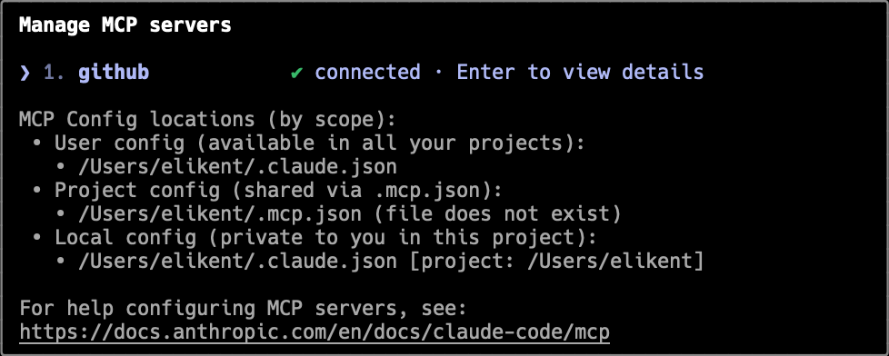

Managing a backlog can quickly become overwhelming. It often grows into a long, messy list of user stories, bugs, and features. High-priority items get buried, duplicates sneak in, and new requests don’t always come with clear next steps. This is where AI can help. By connecting **Claude.ai** (or alternatives like ChatGPT or Cursor.ai) to GitHub, you can use natural language to query, refine, and prioritize your backlog — saving hours of manual effort.

`youtube: https://www.youtube.com/watch?v=KWjYXYBIIQo`
**Video: Managing 1000+ GitHub Issues with Claude AI – Eli & Gert Reveal the Secret Sauce | SSW Rules (8 mins)**

## Why AI is useful for backlog management

### 1. Handle large, messy backlogs

Backlogs often contain hundreds of items, making it hard to spot what matters most.  
AI can:

* **Detect duplicates** - Highlights backlog items that describe the same work, helping you merge and reduce clutter.
* **Highlight overlooked high-priority items** - Spots critical issues buried in the backlog so they get the attention they deserve.
* **Summarize backlog areas at a glance** - Groups and condenses issues into clear themes, making it easy to see where work is concentrated.

❌ Figure: Bad Example — Wasting time manually searching for duplicates

✅ Figure: Good Example — AI automatically surfaces duplicates and overlaps  

### 2. Break down large items

Some backlog items (PBIs) are simply too big to complete in a sprint.  
AI can:

* **Suggest how to break a large user story into smaller, actionable issues** - Proposes logical sub-tasks with clear scope, making big items manageable within a sprint.
* **Provide acceptance criteria for each smaller issue** - Drafts clear, testable conditions that define when each sub-task is complete.  

### 3. Group related work

Sprints are more effective when they focus on a single area or feature.  
AI can:

* **Tag related issues automatically** - Assigns consistent labels to similar backlog items, making it easier to organize and filter work.
* **Create epics from groups of issues** - Clusters related backlog items under a single epic, giving structure and focus to larger initiatives.
* **Suggest sprint themes around common backlog areas** - Identifies patterns in the backlog and recommends focus areas that align related work into a cohesive sprint.  

### 4. Estimate effort

AI can compare a new item against similar past issues and suggest an estimate.  
This is especially helpful when:

* **Estimating bugs vs features** - Compares similar past work to suggest effort ranges, factoring in hidden complexity for bugs and clearer scope for features.  
* **Providing quick t-shirt sizing (S, M, L) before team refinement** - Offers rough size estimates upfront, helping teams spot oversized items early and speed up refinement.  

### 5. Kick-start new requests

When a vague request comes in (“Improve reporting”), AI can help you:  

* **Break it into concrete tasks** - Transforms vague requests into specific, actionable steps the team can pick up immediately.  
* **Draft acceptance criteria** - Generates clear, testable conditions that define when a task or feature is successfully completed.  
* **Propose dependencies** - Identifies related tasks or prerequisites that need to be completed first, reducing blockers during delivery.

### 6. Prioritize smarter

Not every backlog item has the same impact.  
AI can help prioritize by:  

* **Surfacing bugs that damage user experience as higher priority** - Flags issues with the biggest impact on users so they’re fixed before less critical work.  
* **Recommending trade-offs (e.g., fixing a blocker vs shipping a nice-to-have feature)** - Helps balance effort and impact by suggesting which work delivers the most value first.  

## How to connect Claude Code to GitHub

There are several ways to bring Claude into your backlog management workflow:

1. **Claude Code + GitHub (via MCP)**  
   * Install **Claude Code** (available as a VS Code extension or standalone app).  
   * [Configure Claude Code with the GitHub MCP server](https://github.com/github/github-mcp-server/blob/main/docs/installation-guides/install-claude.md).  
   * Start asking questions directly in your editor or Claude Code interface, like:  
     * *“Which issues are too big for a sprint?”*  
     * *“Group all issues related to payments into an epic.”*  
     * *“Suggest estimates based on past completed issues.”*

  

2. **ChatGPT or Cursor.ai**  
   * Both can access your GitHub backlog if you connect via MCP (Model Context Protocol) or with a connector like `codex`.  
   * Once connected, you can query your backlog directly in natural language.  

3. **Build your own with GitHub MCP**  
   * GitHub already provides an MCP server.  
   * You can write a custom connector for more tailored queries (e.g., tagging, sprint planning automation).  

## Key Takeaways

* **AI won’t replace your product owner** — but it *does* save time by surfacing insights, drafting breakdowns, and automating the repetitive parts of backlog grooming.  
* Use AI as a **decision-support tool**, not an autopilot. The team still makes the final call.  
* The more data (issues, history, estimates) AI has, the more accurate and helpful it becomes.  
