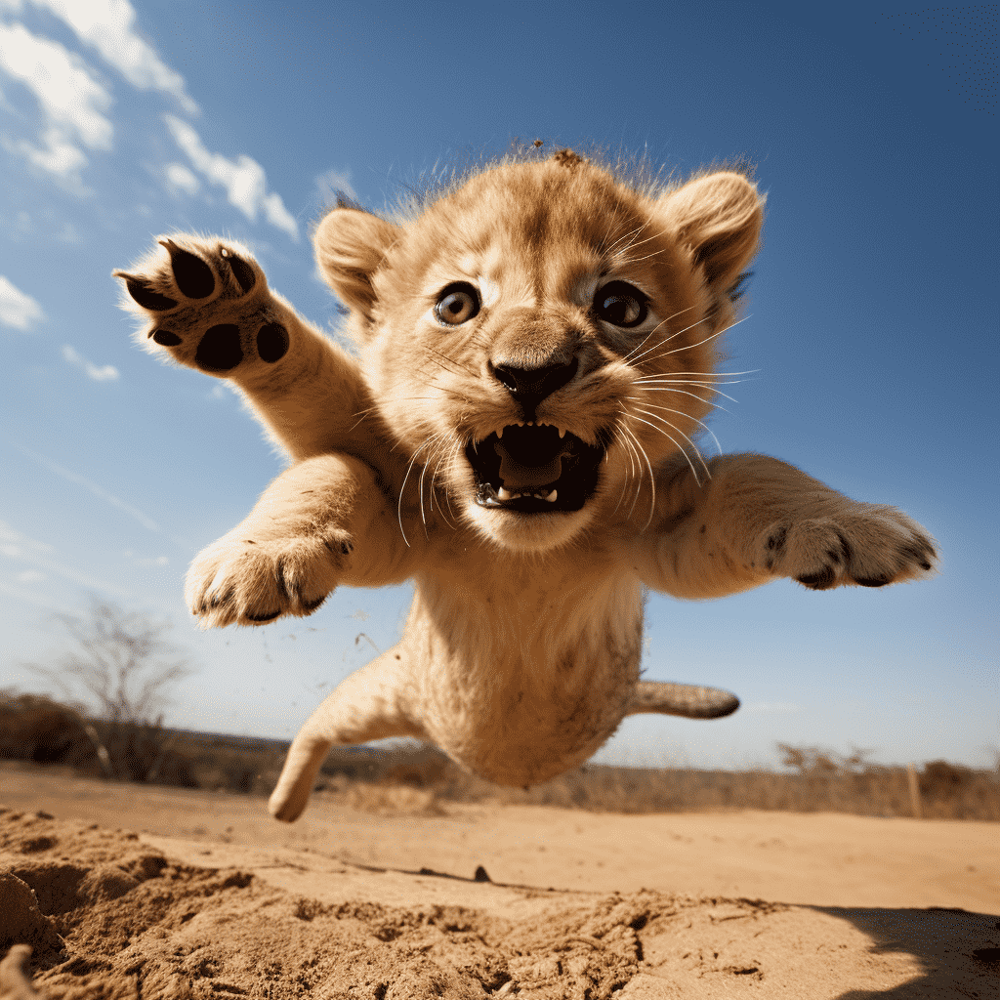
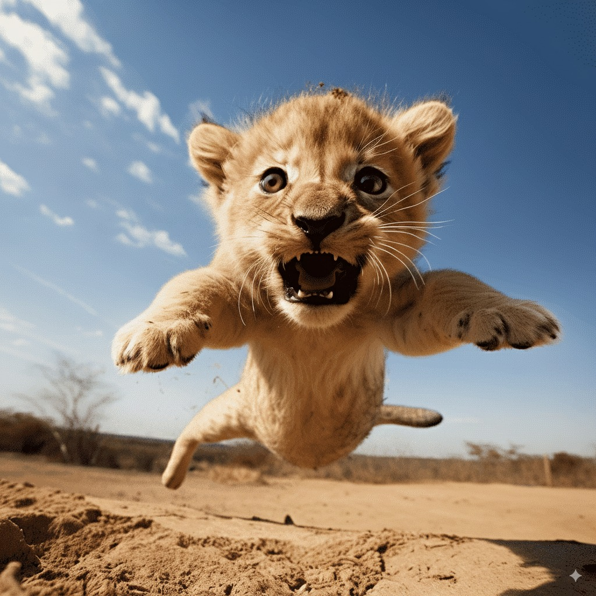
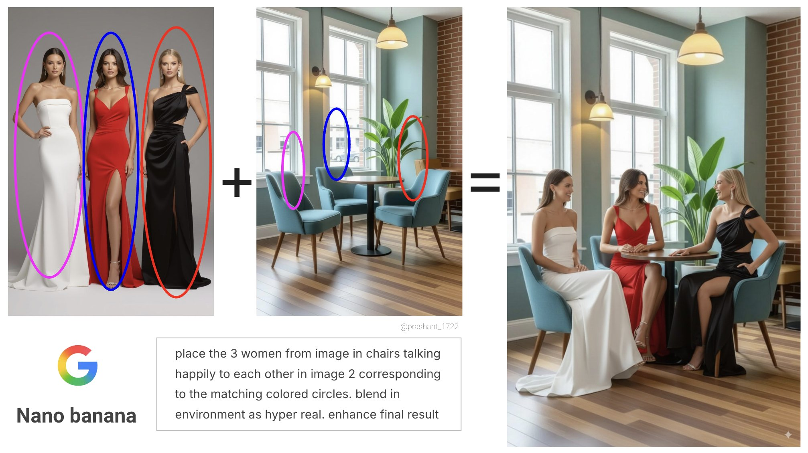
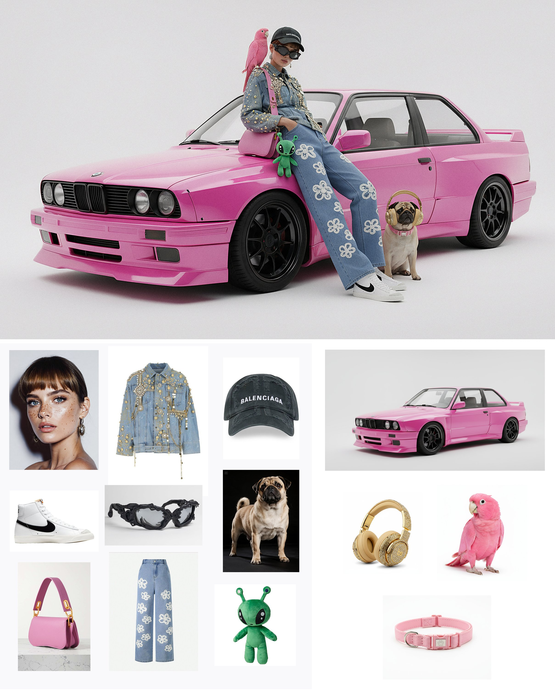
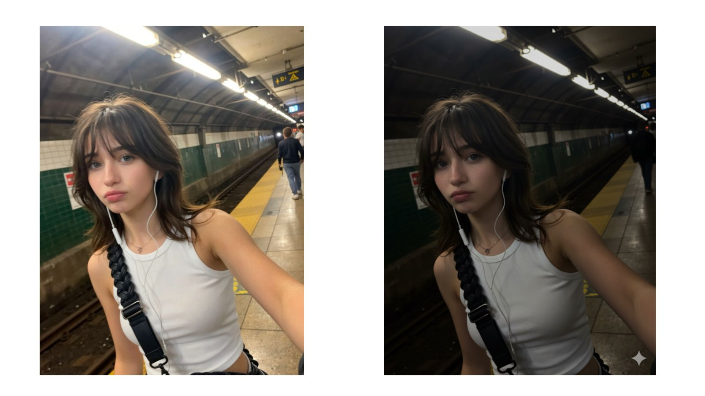
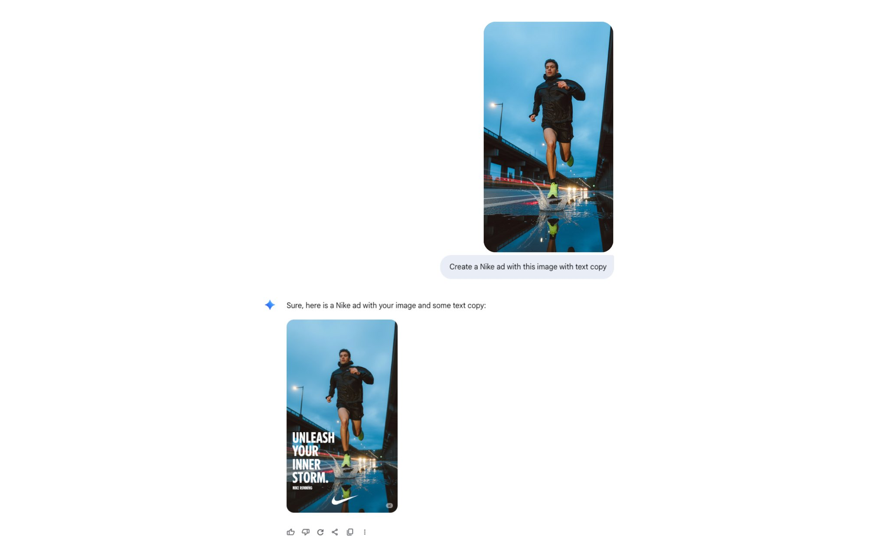

You've probably seen AI churn out gorgeous images from a sentence... then watched it *ruin* a photo when you asked for a tiny tweak.

Teams waste time regenerating whole scenes, your subject look-alike drifts between edits, and brand consistency suffers. Modern **editing-first** AI models fix this by making *targeted, local edits* while preserving everything else, so you can remove a bin, change the background, or adjust a shirt color without re-generating the whole shot.

<!--endintro-->

`youtube: https://www.youtube.com/watch?v=8_GgeASwHwQ`
**Video: Google’s nano banana just killed Photoshop... let’s run it (3 min)**

## When should you use AI to edit images?

Use AI editing when you need **surgical changes** and fast iteration:

* Remove or replace small elements (e.g. "remove the chair in the background")
* Background swaps and extensions (outpainting), canvas cleanup, or sky replacement
* Consistent variations for marketing (same product/person, different scenes)
* Style harmonization (color matching, lighting tweaks, subtle restyling)
* Text fixes in images (signs, labels) when allowed

Avoid or get explicit approval for:

* Sensitive content (medical, legal/forensic, news)  
* Deceptive changes (e.g. misrepresenting events)  
* Portrait retouching without consent or policy coverage

## From text-to-image to intelligent editing

**Early days (2022):** Text-to-image models like DALL·E 2, Imagen, and Midjourney popularized "prompt to picture" and introduced basic inpainting/outpainting. Great for creation, but edits often **regenerated the whole image**, causing drift and detail loss.

::: bad  

:::  

### Enter Nano Banana 🍌

**Today's shift:** Editing-first models like [Google's gemini-2.5-flash-image-preview](https://aistudio.google.com/prompts/new_chat?model=gemini-2.5-flash-image-preview) (aka Nano Banana) and [Flux.1 Kontext](https://bfl.ai/models/flux-kontext) take an **image + instruction** and apply **localized edits**. They preserve subjects and scene layout, follow prompts tightly, and support **iterative workflows** (step-by-step revisions without degradation). Like "Photoshop with natural-language brushes."

::: good  

:::  

## What makes editing-first models different?

**1) Targeted local edits**\
They change only what you ask for and leave everything else untouched. This makes them practical for production assets where fidelity matters.

**2) Consistency & identity preservation**\
They maintain the same person/product across edits (haircut, outfit, background changes) without subtle morphing.

**3) Strong prompt adherence**\
They follow instructions literally (“make the shirt red” means *only* the shirt becomes red) and are less likely to hallucinate unrelated changes.

**4) Iterative & interactive**\
You can chain edits (clean background → add shadow → tweak contrast) while keeping quality stable—mirroring designer workflows.

## Practical workflow

1. **Duplicate your source** and keep originals under version control.  
2. **Write a narrow prompt**: describe the change + what to preserve.  
3. **Call out constraints**: “keep pose, keep lighting, keep composition.”  
4. **Iterate in small steps** (one change per pass).  
5. **Compare A/B** after each step; revert quickly if drift appears.  
6. **Record provenance** (tool, prompt, who approved).  
7. **Label the output** according to your policy (see below).

## Prompt patterns that work

Use these templates and tweak the nouns:

* “**Remove** the \[unwanted object] in the \[location]. Keep subject identity, pose, and lighting unchanged.”  
* “**Change** the \[attribute] of the \[object] to \[new value], **only** affecting that item. Keep everything else identical.”  
* “**Replace background** with \[description]. Preserve subject edges, shadows, and color balance.”  
* “**Add** a \[small object] to \[location] with consistent perspective and soft shadow matching the scene.”  
* “**Extend canvas** to the \[direction] and continue the \[background pattern/scene] naturally.”

::: greybox

Prompt: “A model is posing and leaning against a pink bmw. She is wearing the following items, the scene is against a light grey background. The green alien is a keychain and it's attached to the pink handbag. The model also has a pink parrot on her shoulder. There is a pug sitting next to her wearing a pink collar and gold headphones.”
:::
**Figure: Here we have 13 images merged into one using Gemini 2.5 Flash Image (“Nano Banana”). Even at 13 elements, consistency holds up impressively.**

::: greybox

Prompt: “Relighting Apply: RAW-ISO 100 - F28-1/200 24mm setting"
:::
**Figure: Nano Banana relighting applied. Shot simulated as RAW.**

::: greybox

Prompt: “Create a Nike ad with this image with text copy"
:::
**Figure: Image models used to butcher text. Now they can drop in clean, ad-ready copy like this Nike caption..**

## Origin & trust (label your edits)

As AI editing becomes standard, **origin** is essential. **SynthID** is an industry approach that embeds an **imperceptible, pixel-level watermark** at generation/edit time (in addition to any visible “AI” label). It’s designed to **survive common transforms** (compression, mild crops/brightness changes) and can be **verified** by compatible detectors.

**Team policy:**

* **Enable watermarking** where your stack supports it (e.g. tools that offer SynthID-style invisible marks plus visible "AI-edited" labels).  
* **Store proof** of detection alongside the final asset (export the verifier result or checksum).  
* **Disclose edits** in captions/metadata ("Edited with AI; objects removed; colors adjusted").  
* **Know the limits:** very tiny edits may be too subtle to flag; keep manual logs regardless.

::: good  

:::  

## Common pitfalls and fixes

* **Identity drift**  
❌ The pitfall: The subject (face, object, or brand element) gradually morphs into something unrecognizable after repeated edits.  
✅ The fix: Re-state constraints each turn ("keep the same face, same product texture"). If drift persists, roll back one step and re-edit in smaller increments.  
* **Over-editing look**
❌ The pitfall: Edits pile up until the result looks artificial, plastic, or uncanny.  
✅ The fix: Prefer subtle adjustments; specify "natural" or "minimal" in the prompt.
* **Perspective mismatches**  
❌ The pitfall: Inserted or modified objects appear at the wrong scale, angle, or depth compared to the base image.  
✅ The fix: Add guidance like "match camera angle and lens feel."  
* **Lighting inconsistency**
❌ The pitfall: New elements don’t share the same light source, shadow direction, or color temperature, breaking realism.  
✅ The fix: Include "soft shadow matching light direction" and "keep global color balance."

## Try it yourself

One quick way to experiment with AI image editing:

1. Go to [Google AI Studio](https://aistudio.google.com/prompts/new_chat) and select **gemini-2.5-flash-image-generation** as the model.\
   *Upload a photo and give it a small edit prompt like: "remove the tree in the background."*  
2. Try other models via [fal.ai](https://fal.ai) – including **FLUX.1 Kontext**, which is purpose-built for image editing.\
   *Upload the same photo and prompt: "replace the background with a sunset sky."*  

Comparing the results side by side will help you see how different models handle **precise edits vs. full regeneration**.

What do you think about using tools like Nano Banana to create varied poses and portraits of yourself, for use on social media posts/YouTube thumbnails, etc?
