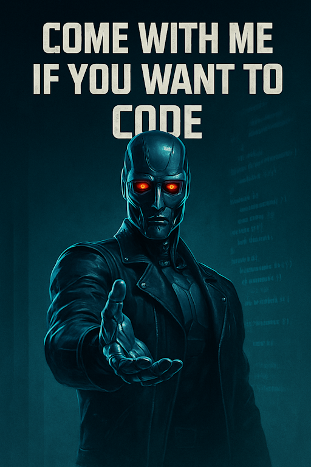
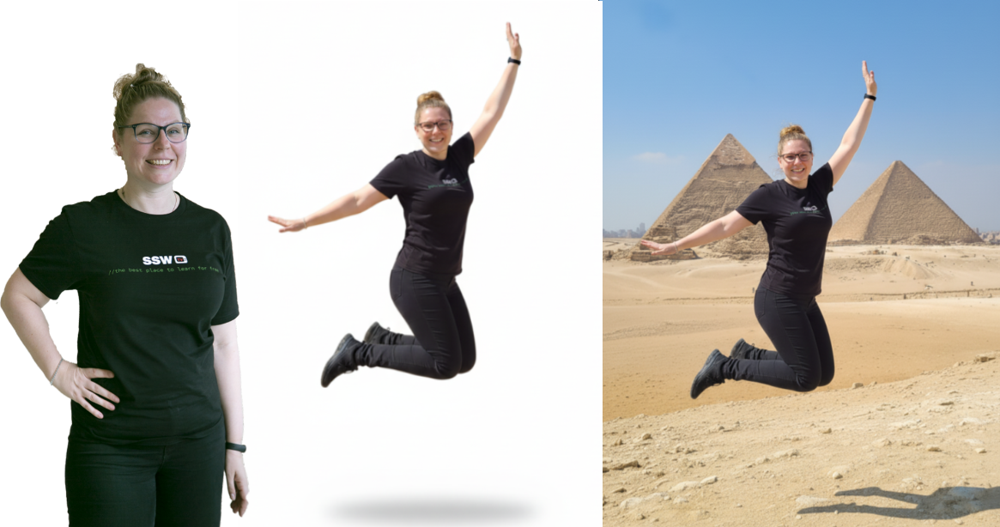
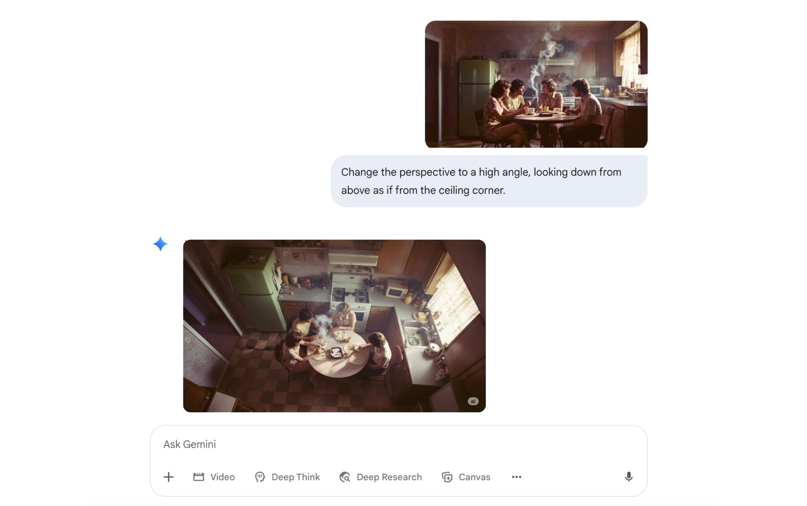
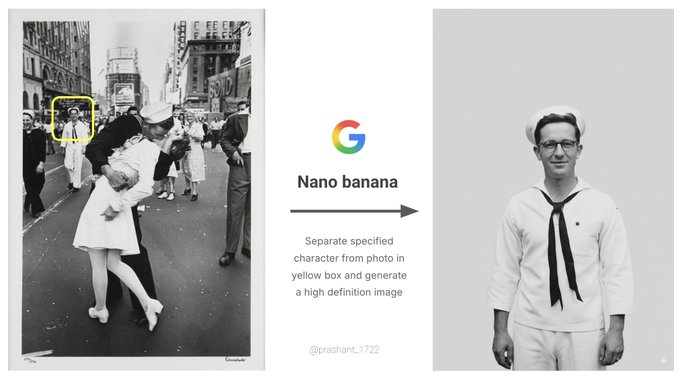
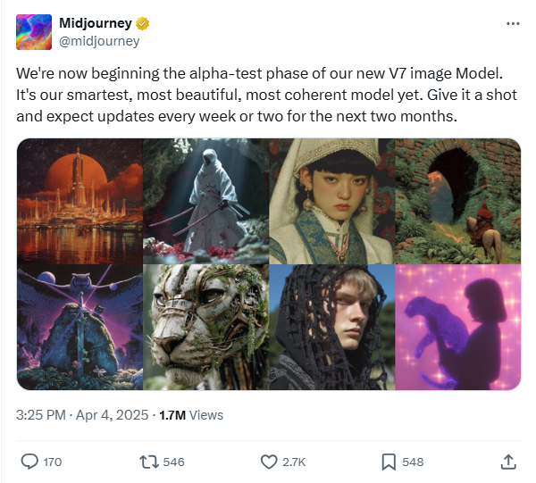
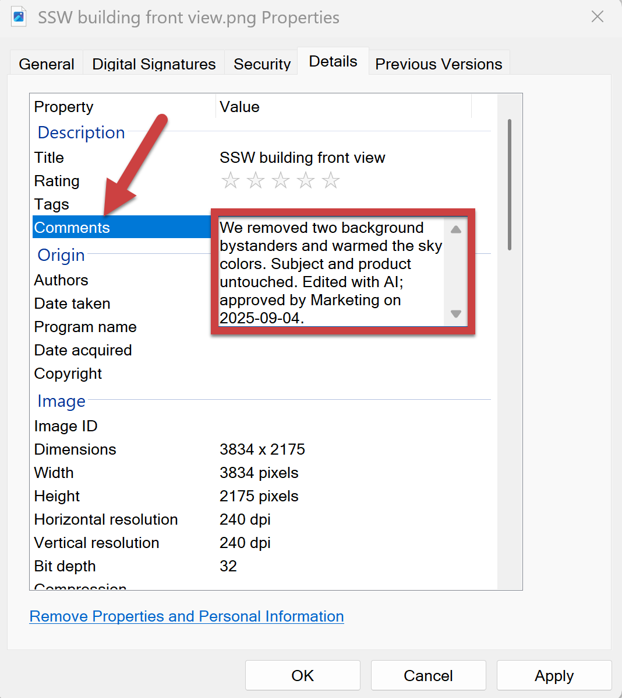

You've probably seen AI churn out gorgeous images from a sentence... then watched it **ruin** a photo when you asked for a tiny tweak.

Teams waste time regenerating whole scenes, your subject look-alike drifts between edits, and brand consistency suffers. Modern **editing-first** AI models fix this by making **targeted, local edits** while preserving everything else, so you can remove a bin, change the background, or adjust a shirt color without re-generating the whole shot.

<!--endintro-->

`youtube: https://www.youtube.com/watch?v=8_GgeASwHwQ`
**Video: Google’s nano banana just killed Photoshop... let’s run it (3 min)**

## When should you use AI to edit images?

Use AI editing when you need **surgical changes** and fast iteration:

* Remove or replace small elements (e.g. "remove the chair in the background")
* Background swaps and extensions (outpainting), canvas cleanup, or sky replacement
* Consistent variations for marketing (same product/person, different scenes)
* Style harmonization (color matching, lighting tweaks, subtle restyling)
* Text fixes in images (signs, labels) when allowed

Avoid or get explicit approval for:

* Sensitive content (medical, legal/forensic, news)  
* Deceptive changes (e.g. misrepresenting events)  
* Portrait retouching without consent or policy coverage

## From text-to-image to intelligent editing

### Early days (2022)

**Text-to-image models** like DALL·E 2, Imagen, and Midjourney popularized "prompt to picture" and introduced basic inpainting/outpainting. Great for creation, but edits often **regenerated the whole image**, causing drift and detail loss.

::: bad

:::

### Today's shift - Enter Nano Banana 🍌

Editing-first models like [Google's gemini-2.5-flash-image-preview](https://aistudio.google.com/prompts/new_chat?model=gemini-2.5-flash-image-preview) (aka Nano Banana) and [Flux.1 Kontext](https://bfl.ai/models/flux-kontext) take an image + instruction and applies localized edits. They preserve subjects and scene layout, follow prompts tightly, and support iterative workflows (step-by-step revisions without degradation). Like "Photoshop with natural-language brushes."

::: good

:::

### What makes editing-first models different?

1. **Targeted local edits** - They change only what you ask for and leave everything else untouched. This makes them practical for production assets where fidelity matters
2. **Consistency & identity preservation** - They maintain the same person/product across edits (haircut, outfit, background changes) without subtle morphing
3. **Strong prompt adherence** - They follow instructions literally (“make the shirt red” means *only* the shirt becomes red) and are less likely to hallucinate unrelated changes
4. **Iterative & interactive** - You can chain edits (clean background → add shadow → tweak contrast) while keeping quality stable—mirroring designer workflows

## Today’s shift - Midjourney v7

MidJourney was one of the first quality image generators, but the most recent version is a real step up! The latest version, Midjourney V7, has been designed to better understand text prompts and produce images that are noticeably higher quality. This, as Midjourney CEO David Holz explained on the company Discord, can be seen in textures, bodies, and hands, as well as in objects.

It is great for highly aesthetic, cinematic, and artistic output, making it ideal for detailed, professional-grade visuals. We recommend it for hero images, stylised key art with minimal edits.

V7 offers 2 modes: **Turbo**, which is faster but more expensive, and **Relax**, which is slower but more affordable.

There’s also a new Draft Mode that generates images around 10x faster and at roughly half the cost of standard mode. Draft images are lower quality by default, but you can upscale them if you’re happy with the result.

## OpenAI Images (DALL·E 3 / GPT‑4o Images)

Best known for prompt fidelity, legible typography, and chat‑first iteration in ChatGPT, Open AI images makes AI-generated images really accessible.

OpenAI's latest model can be used as a 'chat-driven design assistant'. It's intended to create precise, usable images rather than just pretty art.

It’s tightly integrated into ChatGPT, so it remembers your conversation and follows detailed instructions. It is designed to handle text in images properly (great for posters, slides, UI mockups, and social tiles), it supports reference images so you can refine or restyle existing designs, and it’s strong at both photorealistic and illustrated styles, making it ideal for marketing assets, product and UI concepts, diagrams and explainers, and quick visual variations you can iterate on in a few conversational steps.

It does have its limitations; for example, if you were trying to create a poster for a horror-themed movie, you would likely be rejected by the automated safety system. To create the image below, many iterations were necessary to make it 'safe to render'.

::: greybox
**Prompt example:** *"Tall, vertical gothic-inspired movie poster for a fantasy film set in the Victorian era, featuring three powerful mermaids rising from a dark, stormy ocean near a foggy Victorian harbor. Their long, shimmering mermaid tails are clearly visible beneath Victorian gowns made of black and deep-blue lace and velvet, with corset bodices, high collars, and flowing sleeves that drift as if underwater. Gas lamps, iron railings, and silhouettes of Victorian buildings appear in the background, partially obscured by mist. The lighting is dramatic but not horror: silver moonlight, deep shadows, and glowing teal highlights on the water. Mood is mysterious, elegant, and adventurous. Color palette of deep blues, greens, greys, and inky blacks with silver and teal accents. At the top, the title text in ornate gothic lettering: “Dark Mermaids” and at the bottom a subtle tagline, in smaller elegant serif type. Highly detailed, cinematic, poster art, no studio logos, no extra text."*
:::
::: good

:::

## Origin & trust (label your edits)

As AI editing becomes standard, origin is essential. SynthID is an industry approach that embeds an imperceptible, pixel-level watermark at generation/edit time (in addition to any visible “AI” label). It’s designed to survive common transforms (compression, mild crops/brightness changes) and can be verified by compatible detectors.

**Best Practices for AI image use:**

* **Enable watermarking** where your stack supports it (e.g. tools that offer SynthID-style invisible marks plus visible "AI-edited" labels)  
* **Store proof** of detection alongside the final asset (export the verifier result or checksum)
* **Disclose edits** in captions/metadata ("Edited with AI; objects removed; colors adjusted")
* **Know the limits:** because very tiny edits may be too subtle to flag; keep manual logs regardless

::: good

:::  

## Common pitfalls and fixes

### Identity drift

The subject (face, object, or brand element) gradually morphs into something unrecognizable after repeated edits.  

**✅ The fix:** Re-state constraints each turn (*"keep the same face, same product texture"*). If drift persists, roll back one step and re-edit in smaller increments.  

### Over-editing look

Edits pile up until the result looks artificial, plastic, or uncanny.  

✅ **The fix:** Prefer subtle adjustments; specify *"natural"* or *"minimal"* in the prompt.  

### Perspective mismatches

Inserted or modified objects appear at the wrong scale, angle, or depth compared to the base image.  

✅ **The fix:** Add guidance like *"match camera angle and lens feel"*.  

### Lighting inconsistency

New elements don’t share the same light source, shadow direction, or color temperature, breaking realism.  

✅ **The fix:** Include *"soft shadow matching light direction" and "keep global color balance"*.

---

If you would like more information on AI image generators, check out Adam Cogan’s blog post:

* [My Top 3 AI Image Generators – Adam Cogan](https://adamcogan.com/2025/11/17/my-top-3-ai-image-generators/)

---

::: greybox

## AI Shorts - What SSW thinks about the latest Generative AI tools?  

The SSW TV team has been exploring how AI is changing design workflows, boosting productivity, and raising the quality bar for everyone creating graphics today.

### Nano Banana Pro

`youtube: https://www.youtube.com/embed/rdnwqBMpiCY`  
**Video: The AI powerhouse lifting the quality bar for all graphics... Nano Banana Pro (2 min)**

* [Watch on YouTube](https://youtube.com/shorts/rdnwqBMpiCY?si=xpkBV9WK_4isnxfd)
* [Explore more of our AI Shorts on SSWTV](https://www.youtube.com/@SSWTV/shorts)

:::
