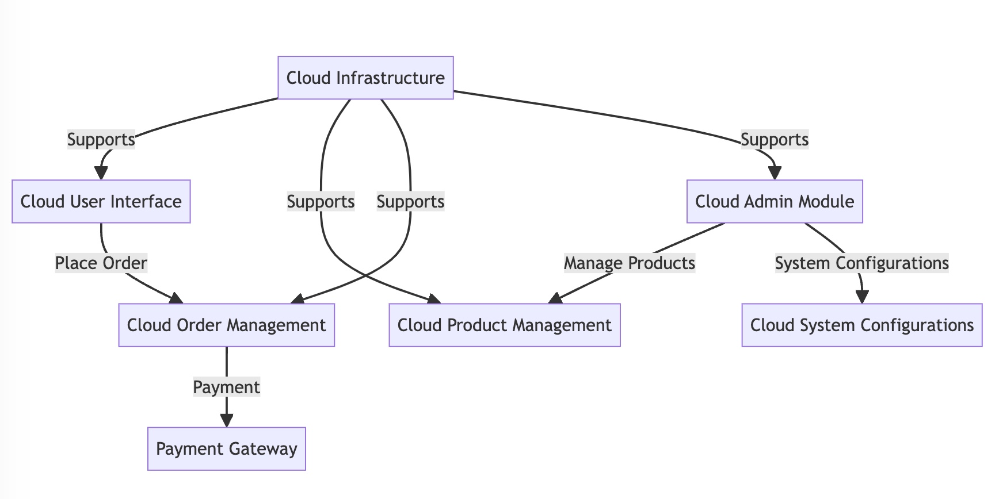
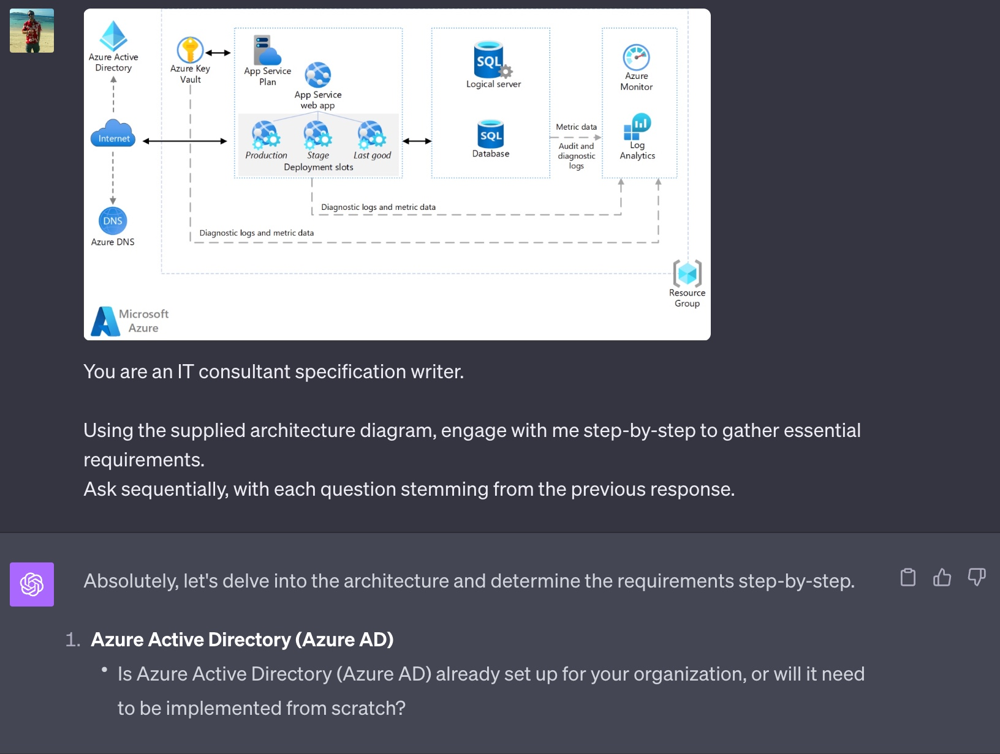

Even the most seasoned analysts might occasionally overlook certain details in a Specification Review. Leveraging technology, especially AI, not only augments our capabilities but also acts as a safety net for those unintentional oversights.

<!--endintro-->

## The Role of AI in Enhancing Reviews

* **Tool, Not Replacement:** AI greatly aids in generating Specification Reviews. Yet, the expertise and discernment of a human are irreplaceable. AI provides a foundational understanding, but professionals provide the nuanced depth.
* **Interactive AI:** Foster a dynamic interaction with AI. Instead of providing it with a predetermined set of requirements, let the AI ask progressive questions. This way, it captures the intricacies of the project scope.

  ::: greybox
  Prompt:
  _You are an IT Consultancy specification writer.

  Engage with me step-by-step to gather essential requirements. 
  Ask sequentially, with each question stemming from the previous response._
  :::
  ::: good
  Figure: Good example - AI adapts and evolves its questions based on ongoing answers, offering more tailored results
  :::

  ::: greybox
  Prompt:
  _Use these requirements to draft a Specification Review:

  1. Web application on Azure
  2. Capture user feedback
  3. User sign-up process
     ..._
  :::
  ::: bad
  Figure: Bad example - Missing critical elements like security considerations, data migration paths, or integration with existing systems
  :::
  
* **Customization Over Templates:** 
  While templates offer consistency, they may not always cater to project-specific nuances. Every project is unique, and relying solely on templates can lead to gaps in the specification.

## Value Additions from AI

* **Generating PBIs:** Harness AI to create Product Backlog Items (PBIs) with both speed and consistency.
* **Architecture Visualization:** With tools like [Mermaid](https://mermaid.js.org/), AI can manifest complex data into clear, interactive architecture diagrams.

  ::: greybox
  graph TB\
  CUI\[Cloud User Interface]\
  CPM\[Cloud Product Management]\
  COM\[Cloud Order Management]\
  CAM\[Cloud Admin Module]\
  CPG\[Payment Gateway]\
  CI\[Cloud Infrastructure]\
  CUI -->|Order Placement| COM\
  COM -->|Payment Processing| CPG\
  CAM -->|Product Management| CPM\
  CAM -->|System Configurations| CSC\[Cloud System Configurations]\
  CI -->|Supports| CUI\
  CI -->|Supports| CPM\
  CI -->|Supports| COM\
  CI -->|Supports| CAM
  :::

  ::: good
  
  :::
  
* **From Architecture to Specification:** 
  Entrust your AI with an architecture blueprint. See it draft an initial Specification Review, ready for human refinement.

  ::: good 
  
  :::

## Example

::: greybox
Prompt:
_You are an IT consultant specification writer.

Engage with me step-by-step to collect essential requirements.

For each section, provide comprehensive paragraphs detailing the rationale behind the given information.

Ask me one question at a time, and then only ask the next after I have answered the last one.

At the end, give me the opportunity to give you more information if needed

Upon completion, gather the information based on my answers and then:

1. Provide me the Specification Review.
   Also include the current state of the solution.
   Be sure to include detailed explanations of each section, adding why we recommend the approach and what the benefits are.

2. Develop Product Backlog Items (PBIs) corresponding to the tasks required to fulfil the specifications.

3. Provide the Mermaid syntax to draft both the present and projected architectural flow diagrams._
:::
::: good
Figure: Good example - A good prompt to get the conversation started
:::

In harnessing AI, it's pivotal to recognize its value as a tool. Its true strength emerges when combined with our expertise, elevating the final output to unmatched quality.
