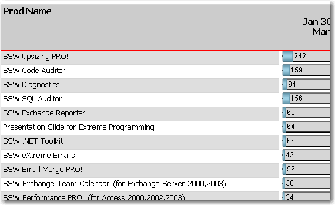

For readability, always use alternating row colors.

<!--endintro-->

Use White and Gainsboro (a light shade of grey). Select the row, and enter this expression in the BackgroundColor property:

```sql
= iif(RowNumber(Nothing) Mod 2, "White", "Gainsboro")
```

::: good  

:::
