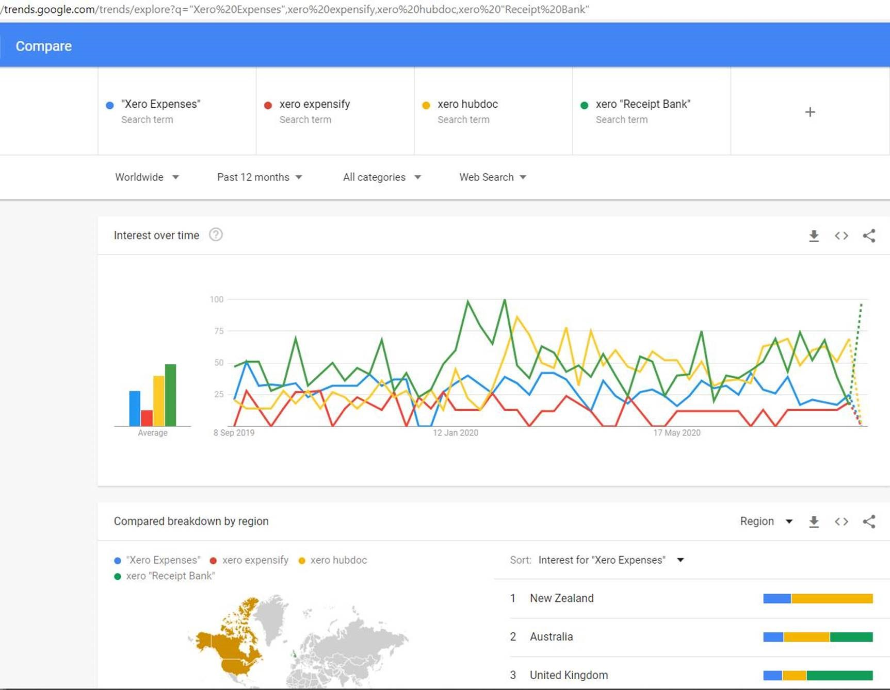
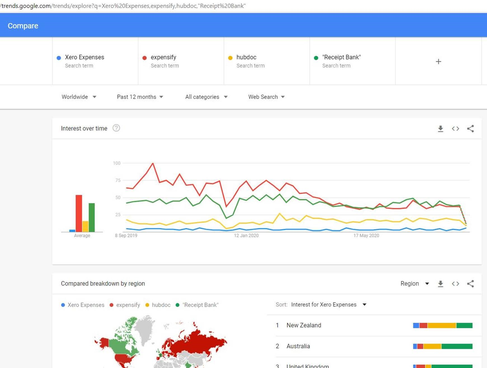

​​​​​​​​​​​Tracking expenses can be a painful process of accumulating receipts and entering them into outdated systems… but there is a better way.  

 
     

Various apps help solve the above problem. Using a modern Accounting system such as Xero, some connected apps can be used in conjunction with the accounting system and they include:

<ul><li> 
         <a href="https://apps.apple.com/au/app/xero-expenses/id1106018845">Xero Expenses​</a> </li><li> 
         <a href="https://www.expensify.com/">Expensify​</a> </li><li> 
         <a href="https://www.hubdoc.com/">Hubdoc</a> </li><li> 
         <a href="https://www.receipt-bank.com/au/">Receipt Bank​</a> </li></ul>
It may be difficult to determine which app would be best suited for your business so below is a comparison of some of the major features of each app. 

There are 2 purposes when evaluating an Expense app: 

 
         <b>#1 Reimbursements</b> – when you are at the shop and you pay for something personally and want the app to take a photo and send it to the office and later see the $ come back into your account.
 
      <b>#2 General expenses </b>– when you are at the shop and using the company credit card, you don’t need reimbursement, but you do need to give accounts a photo of the receipt and the purchased item. 

 
        
   

 <table class="ssw15-rteTable-default" cellspacing="0" style="width:99%;height:1114px;"><tbody><tr class="ssw15-rteTableEvenRow-default"><td class="ssw15-rteTableEvenCol-default" style="width:169px;"><h3 class="ssw15-rteElement-H3">Features (based on 5 users) </h3></td><td class="ssw15-rteTableOddCol-default" style="width:20%;"><h3 class="ssw15-rteElement-H3">​Xero Expenses </h3></td><td dir="ltr" class="ssw15-rteTableEvenCol-default" style="width:20%;"><h3 class="ssw15-rteElement-H3">​Expens​​​ify </h3></td><td class="ssw15-rteTableOddCol-default" style="width:20%;"><h3 class="ssw15-rteElement-H3">Hubdoc </h3></td><td class="ssw15-rteTableEvenCol-default" style="width:20%;"><h3 class="ssw15-rteElement-H3">Receipt Bank </h3></td></tr><tr class="ssw15-rteTableOddRow-default"><td class="ssw15-rteTableEvenCol-default" style="width:169px;">​Pricing​ </td><td class="ssw15-rteTableOddCol-default">$5 per active user/mo </td><td class="ssw15-rteTableEvenCol-default">​$840/year (minimum) </td><td class="ssw15-rteTableOddCol-default">
                  <b>​Free with Xero ✔</b> </td><td class="ssw15-rteTableEvenCol-default">​​$360/year </td></tr><tr class="ssw15-rteTableEvenRow-default"><td class="ssw15-rteTableEvenCol-default" style="width:169px;">​Submission Procedure  </td><td class="ssw15-rteTableOddCol-default">Same as Receipt Bank </td><td class="ssw15-rteTableEvenCol-default">​Same as Receipt Bank </td><td class="ssw15-rteTableOddCol-default">​Same as Receipt Bank  See Figure: Hubdoc email for receiving </td><td class="ssw15-rteTableEvenCol-default">​Phone App – take a photo and submit it to the Receipt Bank email OR forward an email to the Receipt Bank email.  </td></tr><tr class="ssw15-rteTableOddRow-default"><td class="ssw15-rteTableEvenCol-default" style="width:169px;">​Restriction on Invoice uploads  </td><td class="ssw15-rteTableOddCol-default"><strong>​Unlimited​ ✔</strong> </td><td class="ssw15-rteTableEvenCol-default">
                  <b>​Unlimited​ ✔</b> </td><td class="ssw15-rteTableOddCol-default">
                  <b>​Unlimited ✔</b> </td><td class="ssw15-rteTableEvenCol-default">​300/mo </td></tr><tr class="ssw15-rteTableEvenRow-default"><td class="ssw15-rteTableEvenCol-default" style="width:169px;">​Back-up </td><td class="ssw15-rteTableOddCol-default">Unlimited - use cloud back up and security. Never deletes </td><td class="ssw15-rteTableEvenCol-default">​Unlimited – Never deletes and remains archived </td><td class="ssw15-rteTableOddCol-default">​Unlimited – use cloud back up and security. Never deletes  </td><td class="ssw15-rteTableEvenCol-default">​Unlimited – Never deletes and remains archived </td></tr><tr class="ssw15-rteTableOddRow-default"><td class="ssw15-rteTableEvenCol-default" style="width:169px;">​Organizing </td><td class="ssw15-rteTableOddCol-default">Organised on user-submitted, expense type or date order </td><td class="ssw15-rteTableEvenCol-default">
                  <b>Can be manually organized into folders or reports ✔</b> </td><td class="ssw15-rteTableOddCol-default">Requires greater security privileges than uploader only. ​Automatically organized into folders (can be updated).  </td><td class="ssw15-rteTableEvenCol-default">​No real organization of documents. Either inactive or archived and ordered in date/supplier order </td></tr><tr class="ssw15-rteTableEvenRow-default"><td class="ssw15-rteTableEvenCol-default" style="width:169px;">​Expense Rules </td><td class="ssw15-rteTableOddCol-default">Same as Receipt Bank - however, instead relied upon Xero receipt analysis which is little less powerful </td><td class="ssw15-rteTableEvenCol-default">
                  <b>​Same as Receipt Bank – little easier to navigate to the section ✔</b> </td><td class="ssw15-rteTableOddCol-default">​Same as Receipt Bank – however seems to only be on each invoice (can’t create outside of existing invoice – not that important) </td><td class="ssw15-rteTableEvenCol-default">​Automate rules (or after the first occurrence) as to where expenses are to be accounted to (account categories)  </td></tr><tr class="ssw15-rteTableOddRow-default"><td class="ssw15-rteTableEvenCol-default" style="width:169px;">​Accounting Codes </td><td class="ssw15-rteTableOddCol-default"><strong> Same as Receipt Bank </strong><strong>✔</strong>  </td><td class="ssw15-rteTableEvenCol-default">​Only available on the subscription plan of $1800/year </td><td class="ssw15-rteTableOddCol-default">
                  <b>​Same as Receipt Bank ✔</b> </td><td class="ssw15-rteTableEvenCol-default">
                  <b>​Syncs with Xero account categories and automatically chooses those options. Brings bank reconciliations of these invoices to 90% of the way ✔</b> </td></tr><tr class="ssw15-rteTableEvenRow-default"><td class="ssw15-rteTableEvenCol-default" style="width:169px;">​Phone Compatibility </td><td class="ssw15-rteTableOddCol-default"><strong>All Phones ✔</strong> </td><td class="ssw15-rteTableEvenCol-default">
                  <b>​All Phones ✔</b> </td><td class="ssw15-rteTableOddCol-default">
                  <b>​All Phones ✔</b> </td><td class="ssw15-rteTableEvenCol-default">​iPhone, Android, and Web-based  </td></tr><tr class="ssw15-rteTableOddRow-default"><td class="ssw15-rteTableEvenCol-default" style="width:169px;">​Two-factor Authentication </td><td class="ssw15-rteTableOddCol-default"><strong>Yes ✔</strong> </td><td class="ssw15-rteTableEvenCol-default">​No </td><td class="ssw15-rteTableOddCol-default">
                  <b>Yes​ ✔</b> </td><td class="ssw15-rteTableEvenCol-default">​No </td></tr><tr class="ssw15-rteTableEvenRow-default"><td class="ssw15-rteTableEvenCol-default" style="width:169px;">​How-to Videos </td><td class="ssw15-rteTableOddCol-default">Yes </td><td class="ssw15-rteTableEvenCol-default">
                  <b>Yes​ The most videos ✔</b> </td><td class="ssw15-rteTableOddCol-default">Yes​ </td><td class="ssw15-rteTableEvenCol-default">​No </td></tr><tr class="ssw15-rteTableOddRow-default"><td class="ssw15-rteTableEvenCol-default" rowspan="1" style="width:169px;">Descriptive Notes </td><td class="ssw15-rteTableOddCol-default" rowspan="1">​<strong>Yes ✔</strong> </td><td class="ssw15-rteTableEvenCol-default" rowspan="1"><strong>​</strong><strong>Yes ✔</strong> </td><td class="ssw15-rteTableOddCol-default" rowspan="1">​Not available </td><td class="ssw15-rteTableEvenCol-default" rowspan="1"><strong>Yes ✔</strong> </td></tr><tr class="ssw15-rteTableEvenRow-default"><td class="ssw15-rteTableEvenCol-default" rowspan="1" style="width:169px;">​Bank Specification </td><td class="ssw15-rteTableOddCol-default" rowspan="1"><strong>​Yes✔</strong> </td><td class="ssw15-rteTableEvenCol-default" rowspan="1">​Not at $840/year </td><td class="ssw15-rteTableOddCol-default" rowspan="1">​<strong>Yes ✔</strong> </td><td class="ssw15-rteTableEvenCol-default" rowspan="1"><strong>​Yes✔</strong> </td></tr></tbody></table>​ 
       <strong>Overall, the winner is Xero Expense app. </strong>The design of the Xero Expense app provides all the user experience to enable simple and convenient reimbursement requests or company spent money receipts for reconciliation. 

 

The best feature of Xero Expense reimbursement is that the employee's bank details are automatically assigned when they submit a claim. The approver (Accountant or Business Owner), approves of the expense, it will be generated as a payable invoice in the 'Bills' section of Xero and dealt with like any other bill.  

Although Expensify and Receipt Bank are usable too for this purpose, their costs cannot compare to Xero Expense app for this purpose.​  

 <excerpt class='endintro'></excerpt> 

Expense apps are a timesaver, both for the day to day user, as well as the accountant receiving the expenses.

​​As a user, all you have to do is take a photo of the receipt from your mobile app, file or add any comments (all other data is pulled in via OCR “Smart-scan”), then all of these expenses get batched together and sent on a weekly basis to the accountant, who can then manage them in bulk.  
<h3 class="ssw15-rteElement-H3">What are the most popular ex​​​​penses apps​?​ </h3>
​ 

<strong>With Xero:</strong> ​​​<strong style="color:#333333;">F</strong><strong style="color:#333333;"><strong>igure</strong>: Google Trends (September 2020) show that Hubdoc and Receipt Bank are the most popular apps. More at 
</strong><a href="https://trends.google.com/trends/explore?q=%22Xero%20Expenses%22%2cxero%20expensify%2cxero%20hubdoc%2cxero%20%22Receipt%20Bank%22"><strong>Google Trends</strong></a><strong style="color:#333333;">​​​​</strong> 

 

<b>Without Xero:</b>
<dl>
​

<strong>F​igure: ​​​​​G​oogle Trends (Septe​mber 2020) ​show 
   Expensify and 
   Receipt Bank as the most popular. More at 
   </strong><a href="https://trends.google.com/trends/explore?geo=US&q=Xero%20Expenses%2cexpensify%2chubdoc%2c%22Receipt%20Bank%22"><strong>Google Trends</strong></a>
</dl><h3 class="ssw15-rteElement-H3">Related Rules​ </h3><ul><li>
         <a href=/how-to-enter-an-expensify-receipt>Do you know how to enter an Expensify receipt?</a> </li><li>
         <a href=/do-you-create-a-new-report-for-related-expenses>Do you create a new report for related expenses?</a> </li><li>
         <a href=/do-you-know-how-to-claim-expense-reimbursements>Do you know how to claim expense reimbursements?​</a> </li></ul>
    
                          

