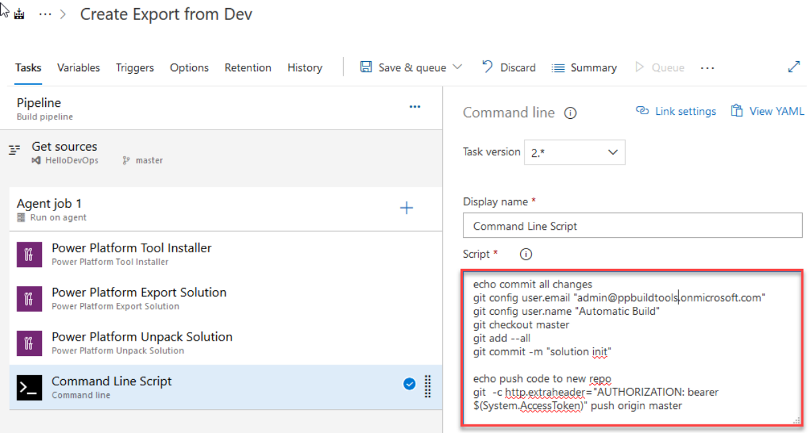
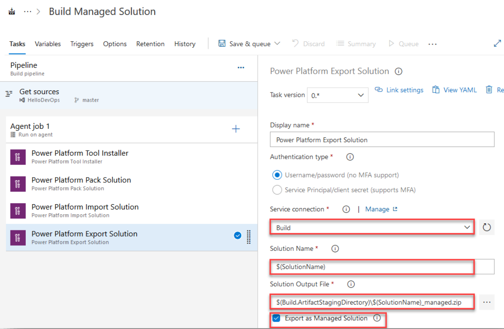
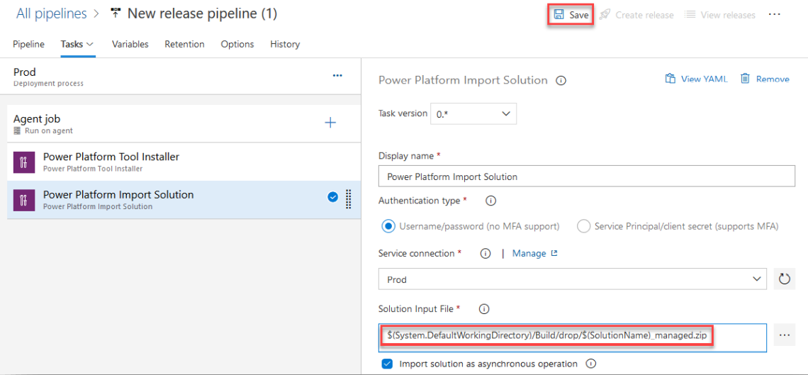

​Are you still managing your Dynamics solution changes manually? Manually exporting and importing solutions across environments? Manually exporting unmanaged solutions to commit to source control. If so, read on, because there is a better way! ​ 

 <excerpt class='endintro'></excerpt> 

Dynamics (and model-driven Power Apps) use solution files to store and apply changes across environments. Using the 
   <a href="https://docs.microsoft.com/en-us/power-platform/alm/devops-build-tools">Power Platform Build Tools for Azure DevOps</a> will let automate manual tasks like: 
<ul><li>Exporting unmanaged solutions and committing to source control </li><li>Generating managed solutions for use in downstream environments such as Testing and Production </li><li>Deploying solutions to downstream environments </li><li>Provisioning or de-provisioning environments </li></ul>
Want to learn more? 

Check out the guide on 
   <a href="https://github.com/microsoft/PowerApps-Samples/tree/master/build-tools">GitHub</a>. The guide demonstrates: 
<ol><li>Configuring Azure DevOps </li><li>Build the 'Capture Pipeline' (Export solution) </li><li>Build the 'Build Pipeline' (Generate Build Artifact) </li><li>Build the 'Release Pipeline' (Deploy to Production) </li></ol><dl class="image"><dt>
      
   </dt><dd>Figure: Sample Azure Pipeline to export solution and commit to source control </dd></dl><dl class="image"><dt>
</dt><dd>Figure: Sample Azure Pipeline to create a managed solution from source  </dd></dl><dl class="image"><dt>
</dt><dd>Figure: Sample Release Pipeline to deploy the managed solution to production​​</dd></dl>

