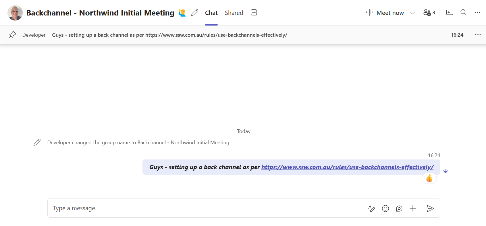

Often, when a manager is called in to help out with a conflict situation, they don’t have all the context or details, so backchannels can help to fill the gap.

<!--endintro-->

- **Prior backchannels** - Have a "[corridor conversation](/corridor-conversations)" with your manager or teammate before a client meeting. If your manager has no idea about an issue, when they’re put on the spot in a meeting, they then have to interrogate regarding processes followed, etc. It’s better to have them prepared before they go in. One way to do this is by asking good questions – see the video on how to ask good questions below.
- **Live backchannels** - Assist in real-time with relevant information in an alternative private channel (e.g. SMS or Teams). This can help the conversation flow and help to verify what is being said, and limits the need for phrases such as _“William, is that true?”_
- **Post backchannels** – Debrief your manager or teammate how the call or situation was handled, outcomes, where it is at now, next steps, etc.

In general, use Teams for private information, or SMS as a last resort. Treat sensitive information or scenarios with care to ensure a good outcome for all parties.

### Using Teams chat to backchannel

When using a private Teams Chat to backchannel a Teams Meeting, it's a good idea to name the chat at prefix with "**Backchannel - {{ MEETING NAME }}**".

This makes it purpose of the chat obvious and reduces the risk of private messages being mistakenly sent through to the wider audience.

::: good  
  
:::

### Let everyone know when something feels "off"

Often, you might feel that a decision made by a colleague or manager is not quite right. In such cases, backchanneling can help clarify and resolve these situations. Here’s how you should handle it:

::: greybox

In a meeting of 5 people, which includes the Product Owner, Solution Architect and 3 Software Engineers, the Software Engineers disagree with a decision made during the meeting. They start a backchannel to talk about it, without the Product Owner and Solution Architect involved, and reach a decision to not proceed.
:::
::: bad
Figure: Bad example - Not all team members are involved in the backchannel
:::

::: greybox
3 Software Engineers disagree with a decision made in a meeting. They open a group chat with the Product Owner and Solution Architect soon after to discuss the decision.
:::
::: good
Figure: Good example - All team members, including the Product Owner and Solution Architect, are involved in a group chat and are kept informed
:::

#### Use "For the record" if disagreement persists

If the Software Engineers still disagree after the group chat, then they should make the matter official by sending a ['For the record'](/for-the-record) email.

### Keep managers informed about important conversations with clients

::: greybox
**Client:** _"I told them we’d need {{ SOLUTION }}"_
**Manager:** _"Oh that does sound reasonable. Devs, why was that missed?"_
:::
::: bad
Figure: Bad example - Manager looks uninformed and is always on the back foot, and needing to ask questions that everyone else in the call on both sides already knows
:::

::: greybox
**Client:** _"I told them we’d need {{ SOLUTION }}."_
**Dev (on a private channel with Manager):** _"That’s true, but it only came up after the 1st Sprint was already done."_
**Manager:** _"My understanding was that was only asked for after the 1st Sprint."_
:::

::: good
Figure: Good example - Manager is armed with relevant information as needed
:::

::: greybox
**Dev:** _"Heads up, they might be sensitive about this part as they have been very clear with us about it from the start and I missed it. This part was really my fault."_
:::
::: good
Figure: Good example - Let the manager know what parts are reasonable to push, and what battles are better surrendered
:::

---

### Video - Asking good questions

`youtube: https://www.youtube.com/embed/RlADH0sLOmc`
