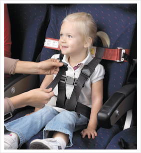

The best way to emphasize your point is to show the pain first, and then the solution. Use "Bad example" and "Good example" with crosses and ticks, respectively, in the captions.

<!--endintro-->

To do this, we give a bad example and raise users' expectation first.

::: bad  
  
:::

Then show the solution by giving a good example as the result, making them feel released.

::: good  
  
:::
