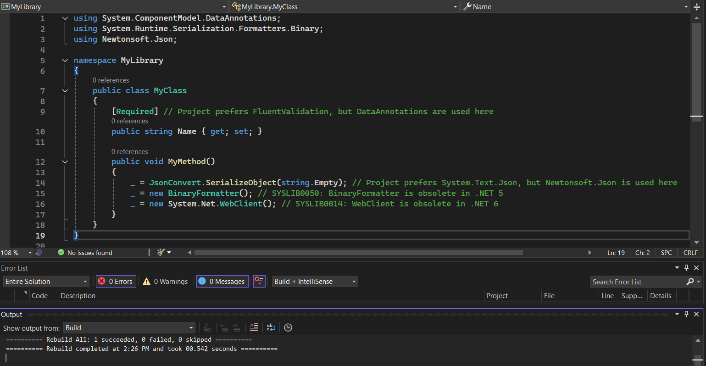

You finally dumped `BinaryFormatter`, replaced `WebClient` with `HttpClient`, and standardised on **System.Text.Json**!  
But in a big codebase (or with a rotating team) someone can unknowingly add the old API back in a new feature branch, **undoing days of migration work**. The same risk appears with *library preferences*: you want everybody using `FluentValidation`, yet the next pull request pulls in `DataAnnotations` again.

<!--endintro-->

### Ban unwanted APIs at the compiler gate

**[BannedApiAnalyzers](https://www.nuget.org/packages/Microsoft.CodeAnalysis.BannedApiAnalyzers/)** (the Microsoft-maintained NuGet package *Microsoft.CodeAnalysis.BannedApiAnalyzers*) lets you fail the build the instant a forbidden symbol is referenced. It’s compatible with SDK-style projects (e.g., `<Project Sdk="Microsoft.NET.Sdk">`), including those targeting .NET Framework.

::: bad

:::

::: good

:::

# Step 1: Install the NuGet package
`dotnet add package Microsoft.CodeAnalysis.BannedApiAnalyzers`

```xml
<PackageReference Include="Microsoft.CodeAnalysis.BannedApiAnalyzers" Version="3.3.4" PrivateAssets="all" />
```

# Step 2: Create `BannedSymbols.txt` file in the project directory

If you can name the symbol, you can ban it.

See the [BannedApiAnalyzers documentation](https://github.com/dotnet/roslyn/blob/main/src/RoslynAnalyzers/Microsoft.CodeAnalysis.BannedApiAnalyzers/BannedApiAnalyzers.Help.md) for symbol syntax details.

```text
# Obsolete .NET APIs
T:System.Runtime.Serialization.Formatters.Binary.BinaryFormatter; Use System.Text.Json instead
T:System.Net.WebClient; Use HttpClient instead

# Non-preferred libraries
T:System.ComponentModel.DataAnnotations.RequiredAttribute; Use FluentValidation instead
M:Newtonsoft.Json.JsonConvert.SerializeObject(System.Object); Use System.Text.Json instead
M:Newtonsoft.Json.JsonConvert.SerializeObject(System.Object, Newtonsoft.Json.JsonConverter[]); Use System.Text.Json instead
M:Newtonsoft.Json.JsonConvert.SerializeObject(System.Object, Newtonsoft.Json.JsonSerializerSettings); Use System.Text.Json instead
```

# Step 3: Add the `BannedSymbols.txt` to the `.csproj`
```xml
<ItemGroup>
  <AdditionalFiles Include="BannedSymbols.txt" />
</ItemGroup>
```

# Step 4: Make it fail on build to give instant feedback to the developer
```xml
<WarningsAsErrors>RS0030</WarningsAsErrors>
```
The analyzer emits diagnostic RS0030 (Banned Symbol), so you can elevate it to an error.

Putting it all together, your `.csproj` should look like this:
```xml
<Project Sdk="Microsoft.NET.Sdk">
  <PropertyGroup>
    <TargetFramework>net4.8</TargetFramework>
    <WarningsAsErrors>RS0030</WarningsAsErrors>
  </PropertyGroup>
  <ItemGroup>
    <AdditionalFiles Include="BannedSymbols.txt" />
  </ItemGroup>
  <ItemGroup>
    <PackageReference Include="Microsoft.CodeAnalysis.BannedApiAnalyzers" Version="3.3.4" PrivateAssets="all" />
    <PackageReference Include="Newtonsoft.Json" Version="13.0.3" />
    <PackageReference Include="System.ComponentModel.Annotations" Version="5.0.0" />
  </ItemGroup>
</Project>
```

# Tips for a high-impact `BannedSymbols.txt`

| What to do | Why it matters |
| ------------- | ----------- |
| Start with the “no-brain-ers.” Ban APIs already removed or obviously harmful. | Instant high signal, low friction. |
| Include a helpful hint after each symbol. | Developers know what preferred alternative to choose. |
| Refine over time. Tighten rules as the migration progresses. | Keeps the list relevant and avoids early-stage noise. |
