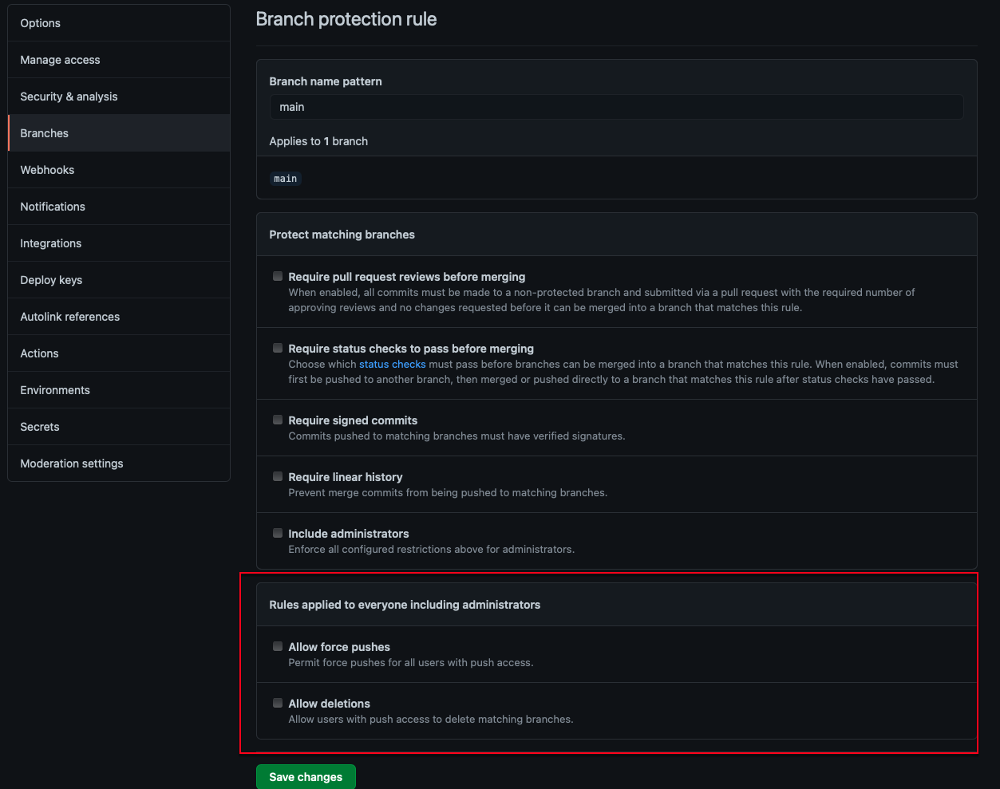
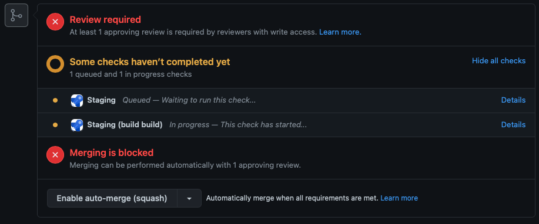

Disabling the 'Allow force pushes' and 'Allow Deletions' settings on your main branch will protect the branch from being accidentally deleted and the history from being rewritten.

Using force push is dangerous and should be used with extreme caution, as it will override other contributor's changes with your own — and it won't stop to check if it will override any changes pushed up to remote in the process.

<!--endintro-->

1. Go to your repo | Settings | Branches 
2. If it doesn't already exist, create a branch protection rule on the 'main' or 'master' branch
3. Ensure 'Allow force pushes' and 'Allow Deletions' are disabled
4. Save changes

::: good

:::

See the GitHub docs [Managing a branch protection rule](https://docs.github.com/en/github/administering-a-repository/managing-a-branch-protection-rule)

If you need to check that your code changes will build, you can use required status checks. Status checks are GitHub Actions that are required to succeed before the PR can be merged, so developers wont be able to merge failing code. You can enable required status checks in the same location as 'Allow force pushes' and 'Allow Deletions'.

::: good

:::

See the GitHub docs [Require status checks before merging](https://docs.github.com/en/github/administering-a-repository/defining-the-mergeability-of-pull-requests/about-protected-branches#require-status-checks-before-merging)