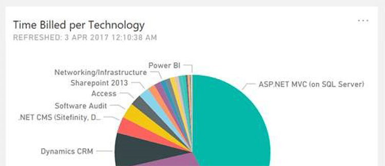
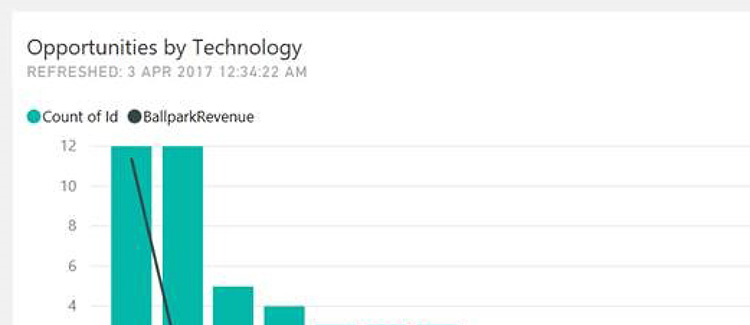

When making reports, charts, and visualizations, it’s important to be consistent with your titles. 
 <excerpt class='endintro'></excerpt> 

Power BI shows "XXX by YYY" (e.g. total earnings by month) rather than "XXX per YYY" and so it’s best to stay with the default and use this throughout your charts. 
<dl class="badImage"><dt></dt><dd>Figure: Bad example - Using "per"</dd></dl><dl class="goodImage"><dt></dt><dd>Figure: Good example - Using "by" ​ </dd></dl>

