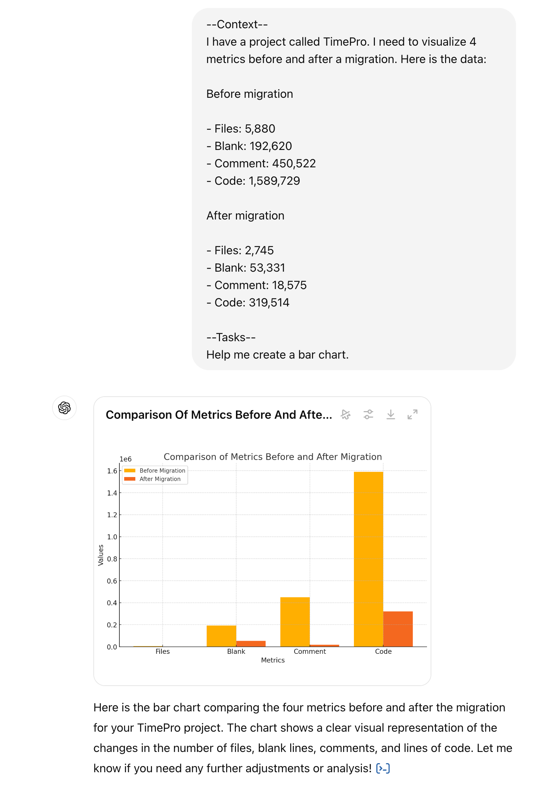

Generating charts is essential in conveying data effectively. While creating charts can sometimes be a tedious process, ChatGPT can assist by generating various types of charts quickly, saving you time and ensuring accuracy. This is especially useful when you need to visualize data for reports, presentations, or data analysis.

<!--endintro-->

### ✅ Benefits of using ChatGPT to generate charts

* **Speed:** Quickly generate charts without needing to know specific charting software
* **Accuracy:** Ensure that data is correctly represented with the right type of chart
* **Customization:** Easily customize chart parameters to suit your specific needs

### How to prompt ChatGPT for chart generation

1. **Specify the Type of Chart:** Clearly indicate the type of chart you need. For example: "Generate a bar chart comparing the sales of different products"
2. **Provide the Data:** Ensure you provide the data in a format that ChatGPT can interpret. For example: "Here’s the data: Product A - 30, Product B - 45, Product C - 25"
3. **Ask for Customizations:** If needed, specify any customizations like colors, labels, or titles. For example: "Label the X-axis as 'Products' and the Y-axis as 'Sales in Units'"

::: good

:::

### Limitations to keep in mind

* **Data Size:** ChatGPT works best with smaller datasets. For large datasets, it may be better to use specialized charting tools
* **Customization Options:** While you can request customizations, they might not be as extensive as those available in dedicated software
* **Interpretation:** Ensure that the data you provide is clear and unambiguous to avoid misinterpretations

By using ChatGPT for generating charts, you can streamline your workflow, making it easier to visualize and present your data effectively.
