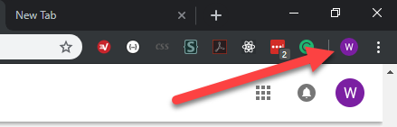
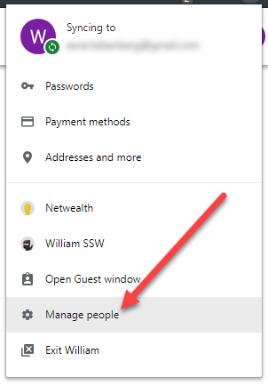
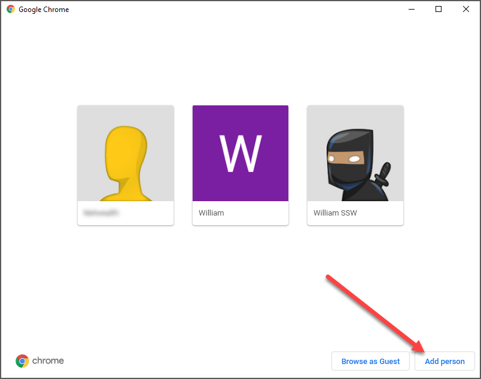
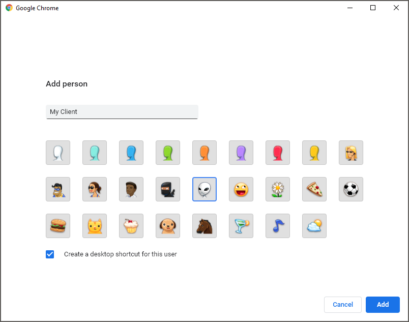
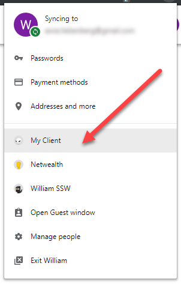
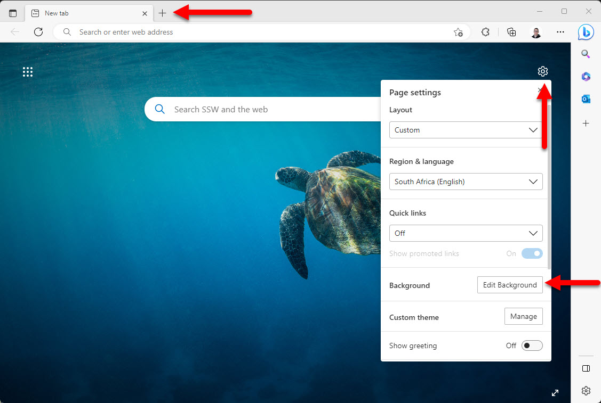
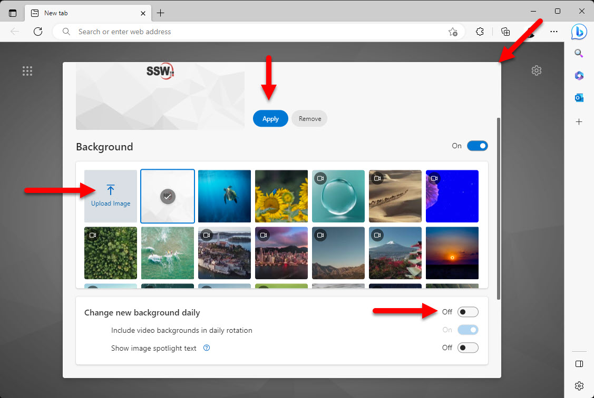
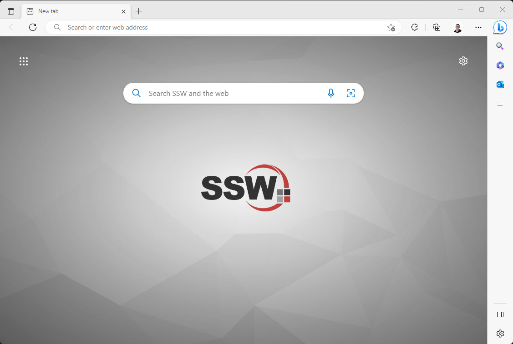

Imagine this... a client calls you in a panic when you are working at another client. You need to login to their DevOps portal to see the problem and so you sign out of your current clients DevOps portal ...wait... wait... get a 2-factor SMS... wait... and then finally get in! But then you notice it also knocked you out of the Azure Portal and your Office 365 email that you were previously signed into. Annoying!

<!--endintro-->

### Microsoft Edge & Google Chrome Profiles allow you to use different credentials

Tips:

* Never log out
* Never use Incognito (where you need to login)
* Install your cool extensions in each of your Edge or Chrome Profiles
* Set a different image for your new tab page for each of your Edge or Chrome Profiles

Consultants usually work on different client projects and use different client credentials eg. Azure DevOps, Azure Portal and sometimes an email account with the client’s branding. Password managers are great, but going from client to client you have to continually switch between accounts by logging out and logging in with different credentials.

**Q:** Is this only for developers?   
**A:** No, my PA uses this (in her case, her "client" is Adam 😉)

Many people have an Office 365 account, and a personal Office 365 account. If you want to avoid keeping logging in and out to switch between them, try setting up a separate "person profile" for each in Edge or Chrome.

Make use of Edge or Chrome Profiles to separate your bookmarks, history, passwords and other browser settings for different clients and that means that the frequent log out and log in overhead is eliminated. Simply switch to a client specific Edge or Chrome Profile and all the credentials are automatically restored.

### Creating a new profile

1. Open your Edge or Chrome browser
2. Click on you profile button

3. Select Manage People to create a new person/profile

4. Click Add Person

5. Fill in the person/client name and select an icon

### Switching profiles

1. Open your Edge or Chrome browser
2. Click on you profile button

3. Select the person/profile you want to switch to

### How to add or remove a person profile?

Please have a look at [Use Edge or Chrome with multiple profiles](https://support.google.com/chrome/answer/2364824).

### Setting a custom background image

Setting a different per Edge or Chrome profile background image is a great way to quickly identify which profile you are using when opening the browser or a new tab.

1. Open your Edge or Chrome browser
2. If you are not in the new tab experience click the + button to open a new tab
3. Click on settings | Edit Background

4. Click on Upload Image, select the image you want to use and click Open
5. Click Apply
6. Uncheck Change new background daily 
7. Close the dialog box, note you might have to scroll back up to see the close button

Now every time you open a new tab or the browser you will see your custom background image and immediately know which tab you are in without having to glance over to the small profile image.

### Remove new tab noise

