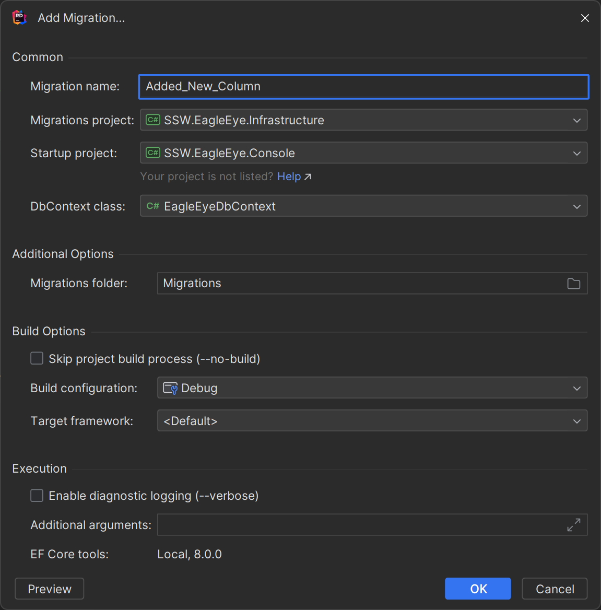

Most enterprise applications require a database to store data.  Once you have a database you need a way to manage the schema.

Entity Framework Code First Migrations allow you to update a database schema rather than recreate it from scratch. This is useful when you have a production database that you want to keep, but you want to make changes to the schema.

<!--endintro-->

## Database Schema Management Options

1. Manually modify the database schema (not recommended)
2. Manually creating SQL scripts (not recommended)
3. DB Up
4. Entity Framework Code First Migrations (recommended)

## Configuring Entity Framework Code First Migrations

The following assumes you have an existing project with a database context, entities, and have already installed the EF Core nuget packages.

1. Install EF Core Tools

    ```bash
    dotnet new tool-manifest
    dotnet tool install dotnet-ef
    ```

2. Enable migrations

    ```bash
    dotnet ef migrations add InitialCreate
    ```

3. Update database

    ```bash
    dotnet ef database update
    ```

### Using Rider

If you struggle to remember the commands above, Rider has a great UI that makes creating migrations easy. This is especially useful when you have different projects for both startup and migrations.

::: img-large  

:::

## Executing Entity Framework Code First Migrations

Once you have some migration, you'll then need to decide when these get run. Naively, developers will often run migrations during program start-up, but this is not recommended. Doing so can cause issues in a web farm environment, as well as cause unnecessary delays during start-up.  

```csharp
var dbContext = scope.ServiceProvider.GetRequiredService<EagleEyeDbContext>();
await dbContext.Database.MigrateAsync();
```

::: bad
Figure: Bad example - Running migrations manually during startup in `program.cs`
:::

### Entity Framework Migration Bundles

A place to run migrations is during your CICD deployment pipeline.

```bash
dotnet ef migrations bundle --self-contained --force
.\efbundle.exe --connection {$ENVVARWITHCONNECTION}
```

::: good
Figure: Good example - Creating and executing a migration bundle during a CICD pipeline
:::

::: info  
If an `appsettings.json` file can be found the connection string can be automatically picked up.
:::
