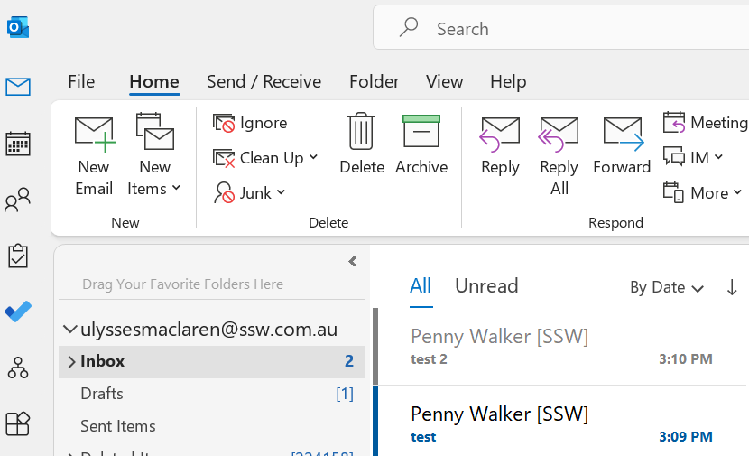
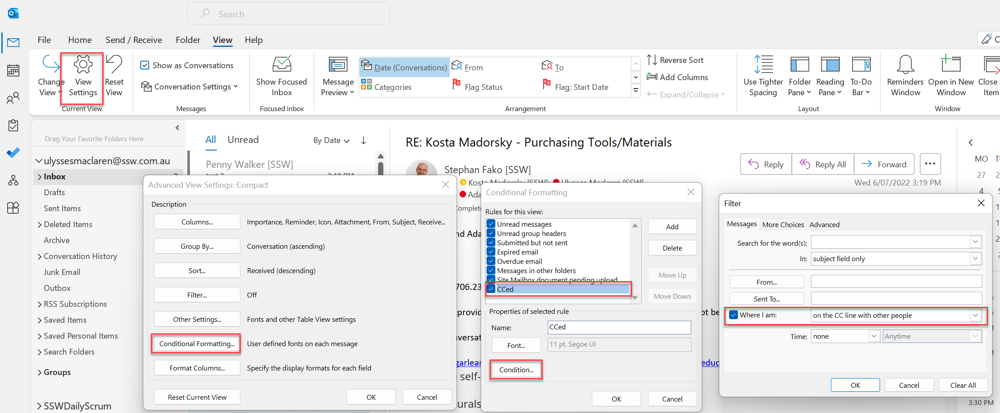

In your inbox, it's good to reduce noise by giving more attention to emails where you're on the "To" line, and dim the ones you’re CCed on.

<!--endintro-->

You can do this through 'Conditional formatting' in the 'View Settings', by creating a rule that changes the font of emails to grey if you’re in the 'CC' field.

