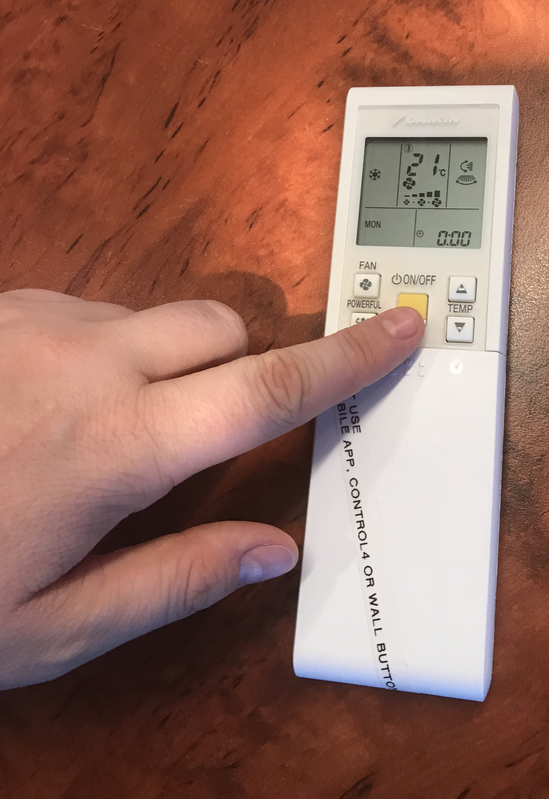
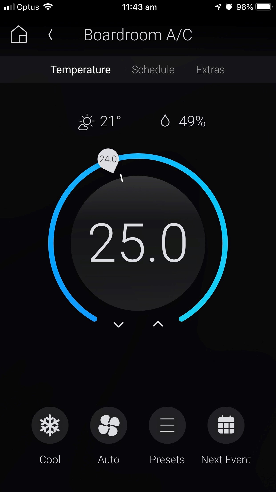
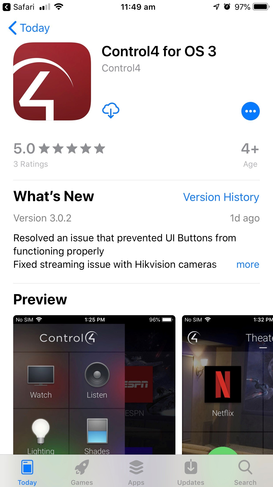
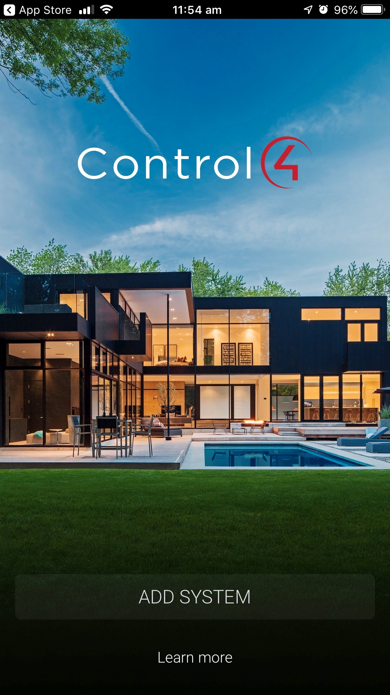
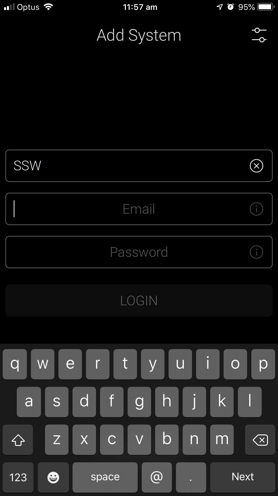
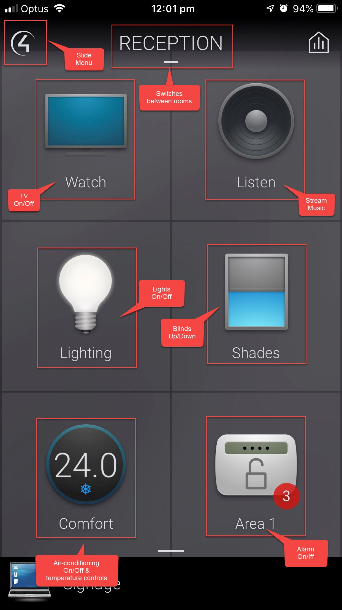
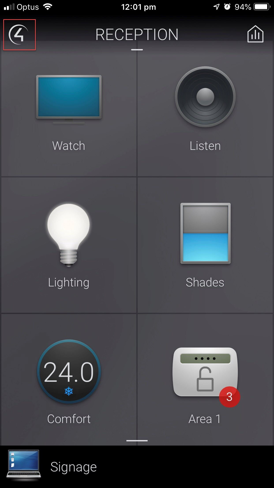
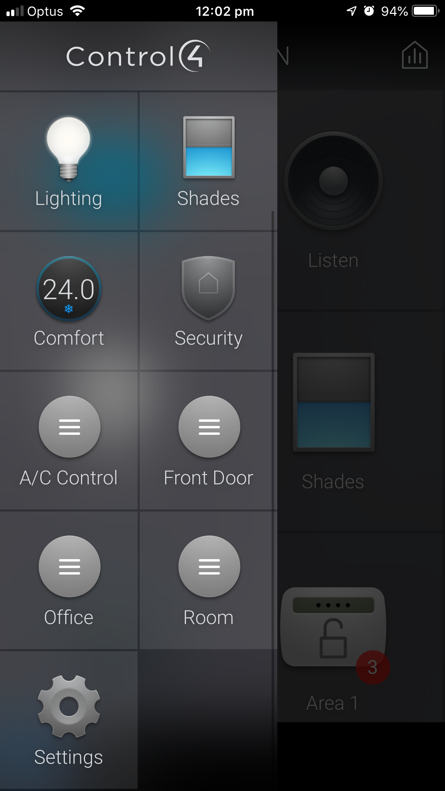
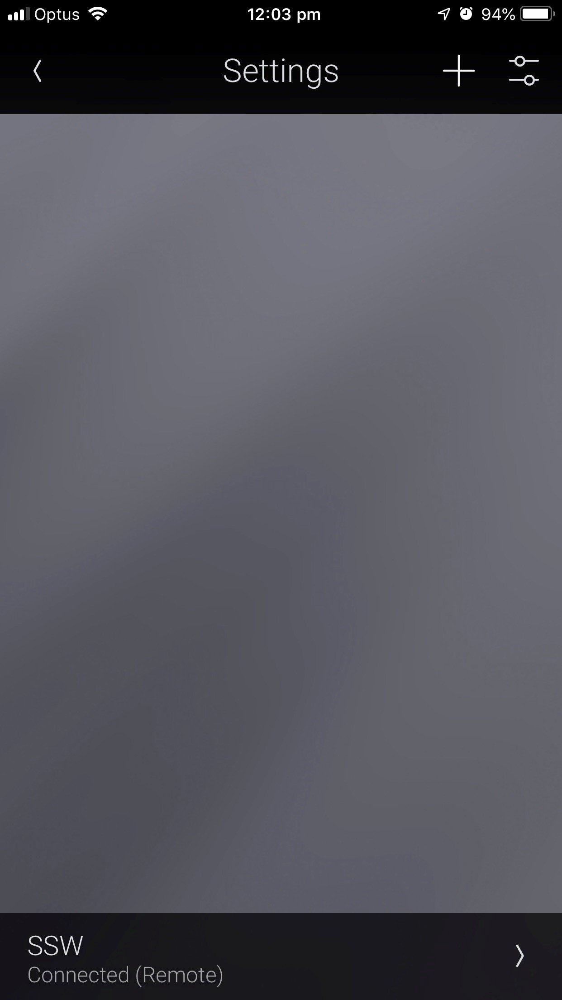
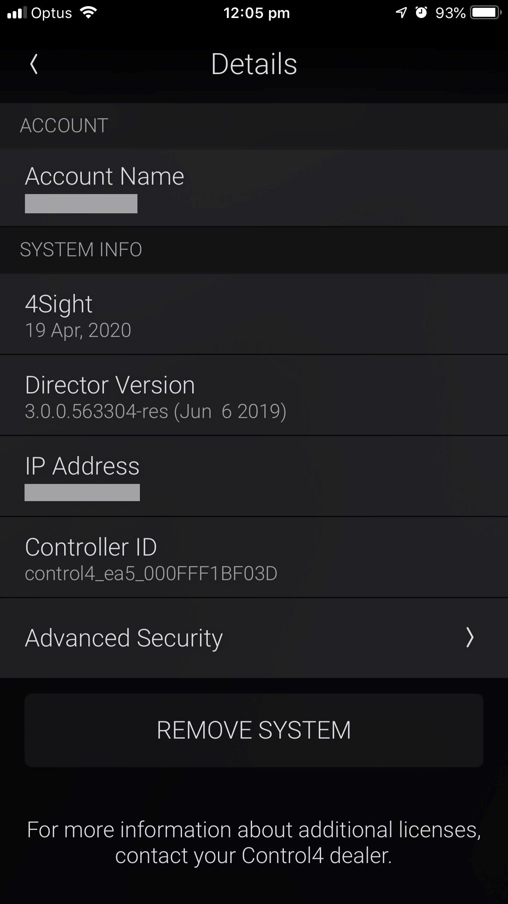

Check in on your home or office from your smartphone using the Control4 App - The Control4 App turns your iOS or Android mobile device into the smart home/office command center. It connects directly to your system and allows you to control and manage all of your system’s features, such as lights, temperature, cameras, audio/video equipment, smart door locks and more.

<!--endintro-->

Throw away your remote controls and move on to technological freedom!

::: bad

:::

::: good

:::

### Installing Control4 on your phone

To use Control4 on your phone and remotely control all services, you will need to follow these simple steps:

1. Download the app from:
  - [App Store](https://apps.apple.com/us/app/control4-for-os-3/id1320153814?ls=1) or
  - [Google Play](https://play.google.com/store/apps/details?id=com.control4.app)

2.Select "Add System" button

3. Contact your SysAdmin to set you up with an account for logging in

4. Make sure you are on the same WiFi network as your Control4 System and that you have an internet connection.

5. Use your credentials to sign into Control4

::: info
**Tip:** The System Name you enter is what the system will be called on your device. It can be anything.  
:::

### Using Control4

Once logged in, you will have access to your site's controls. These apps are customisable, but the ones we have at SSW are:

### Changing Users

If you need to change the user or sign in with new credentials, you can use the following steps to do so:

1. Tap the Control4 logo to open the menu

2. Scroll to the bottom and select the settings button

3. Select your System

4. Select "Delete". This will reset the account and allow you to enter new credentials.

