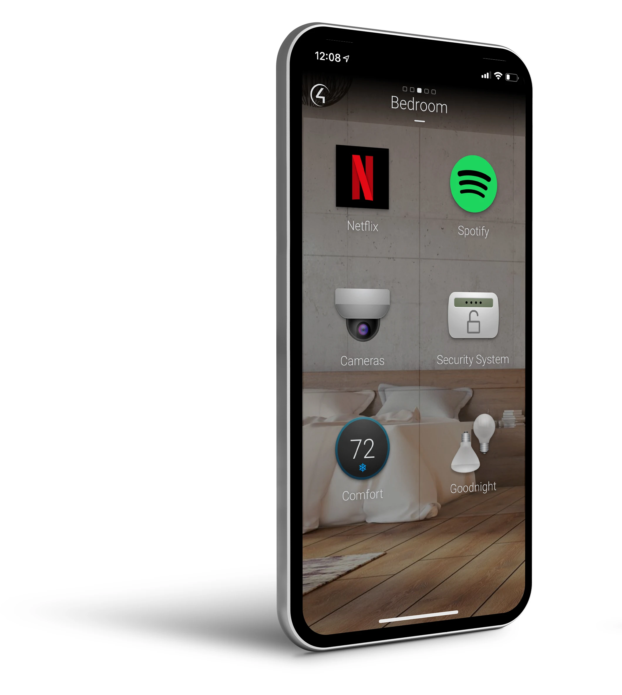
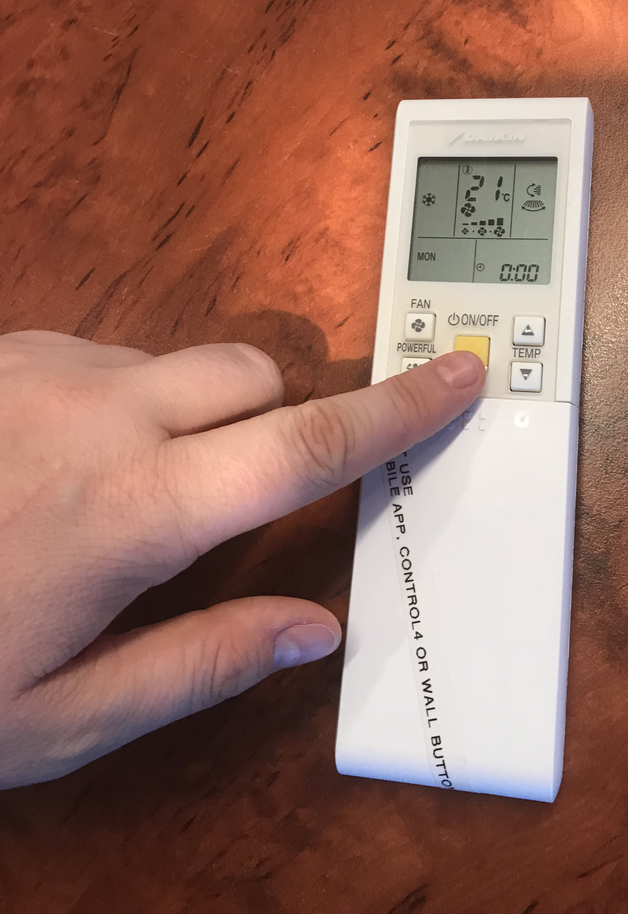

Do you check in on your home or office from your smartphone using the Control4 App?

<!--endintro-->

The Control4 App turns your iOS or Android mobile device into the smart home/office command center. It connects directly to your system and allows you to control and manage all of your system’s features, such as lights, temperature, cameras, audio/video equipment, smart door locks and more.

**Figure: Use the Control4 App** 
    Throw away your remote controls and move on to technological freedom!

::: bad
Figure: Bad example, using any pysical remote control instead of the Control4 app.

:::

::: good
Good Example: Turning on the air conditioner using Control4

:::

### Installing Control4 on your phone

To use Control4 on your phone and remotely control all services, you will need to follow these simple steps:

1. Download the app from the App Store: http://www.control4.com/software/control4-app-ios/latest
or Google Play: http://www.control4.com/software/control4-app-android/latest

> <dd><dl class="ssw15-rteElement-ImageArea">2. Select "Add System" button.</dl></dd>

> <dd>
3. Contact your SysAdmin to set you up with an account for logging in.

</dd><dd>
4. Make sure you are on the same WiFi network as your Control4 System and that you have an internet connection.

</dd><dd>5. Use your credentials to sign into Control4. 
</dd><dd>TIP: The System Name you enter is what the system will be called on your device. It can be anything.  
</dd><dd>

>             

>          
</dd>

### Using Control4

Once logged in, you will have access to your site's controls. These apps are customisable, but the ones we have at SSW are:

### Changing Users

If you need to change the user or sign in with new credentials, you can use the following steps to do so:

> <dd><dl class="ssw15-rteElement-ImageArea">1. Tap the Control4 logo to open the menu.</dl></dd>

> <dd><dl class="ssw15-rteElement-ImageArea">2. Scroll to the bottom and select the settings button.</dl></dd>

> <dd><dl class="ssw15-rteElement-ImageArea">3. Select your System:
</dl></dd>

> 

> 4. Select "Delete". This will reset the account and allow you to enter new credentials.

