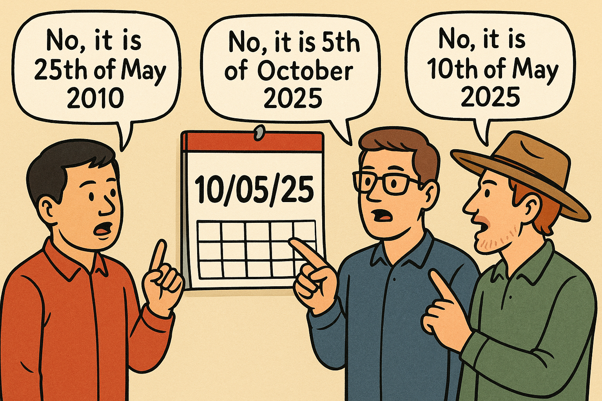
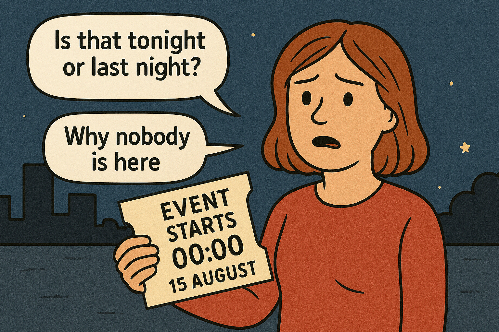

Clear, unambiguous dates and times prevent missed meetings, costly travel mistakes, and confusion across countries and time zones. 

::: greybox
“Catch up moved to 10/05 at 6. See you then”
:::

Think about this, is that 10 May or October 5? Is it 6 am or 6 pm?

<!--endintro-->

## Dates - kill the ambiguity

People in different regions format the date in different ways: 

::: img-medium  

:::

Software can also misinterpret it. For example, entering 10/05/2025 on an Aussie laptop could be read as October 5th, 2025, if opened on an American system

This is why you should avoid numeric-only formats — they can cause major confusion.

::: greybox
Use slashes on their own (e.g. 10/05/25) 
:::
::: bad
Bad example - it’s ambiguous.
:::

::: greybox
Use DD MMM YYYY → 10 May 2025 (or MMM DD YYYY → May 10 2025).

It would be better if you include the day of the week: Sat 10 May 2025.
:::
::: good
Good example - day, month, and year are clearly for everyone!

## Times - 24-hour or am/pm — both are fine (correctly!)

* Use valid formats to avoid confusion - both 24-hour and 12-hour formats are universal when used correctly:

::: greybox
24-hour: 18:00 (preferred in schedules/itineraries)

12-hour: 6 pm (note the space and lowercase am/pm)
:::
::: good
Good example - use the correct format for time
:::

::: greybox
Here are some bad examples for time: 6 (is this am or pm?), 18 pm (invalid format), or 6.00 pm (use colon instead of dot).
:::
::: bad
Bad examples: Incorrect or ambiguous time
:::

* Avoid the 12 am/12 pm trap.
  - Use noon or midnight instead of 12:00 or add to the end of the time. E.g., 12:00 noon.
  - For boundaries (e.g., validity periods), avoid 00:00; use 00:01 for start and 23:59 for end (common airline practice) to remove doubt.

::: img-medium  

:::

* Always include a time zone for cross-location events: AEST (UTC+10), AEDT (UTC+11), PT (UTC–8), etc.

## Here are some other tips:

* Use leading zeros in 24-hour times: 09:05, not 9:5.
* Don’t mix separators: use “:” for time, not “. “or “h.”
* It is recommended to use the ISO 8601 (YYYY-MM-DD) for your filenames, so they can be sorted descending or ascending by time order: e.g., 2025-08-15-sprint-review-notes.md.
