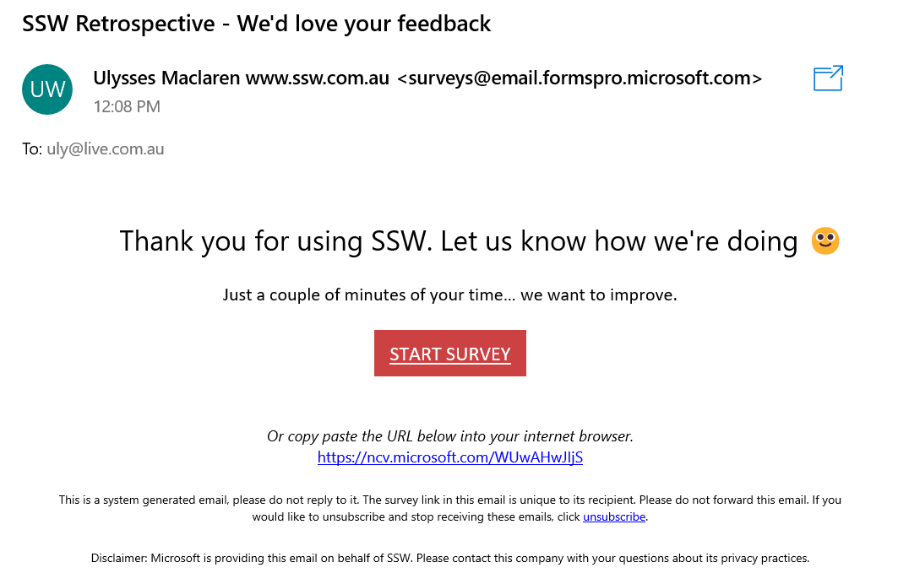
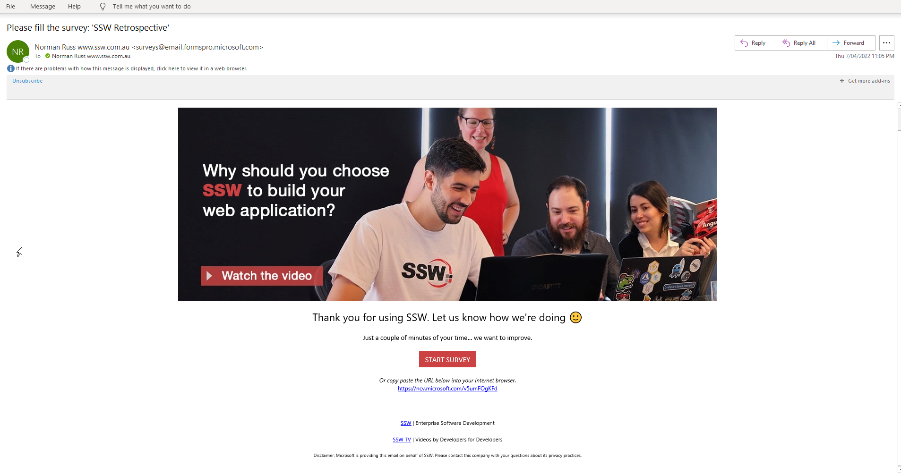
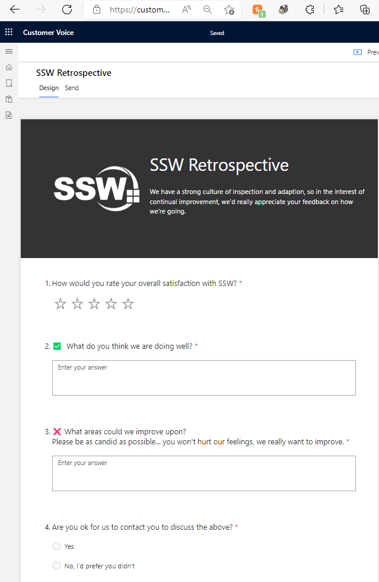
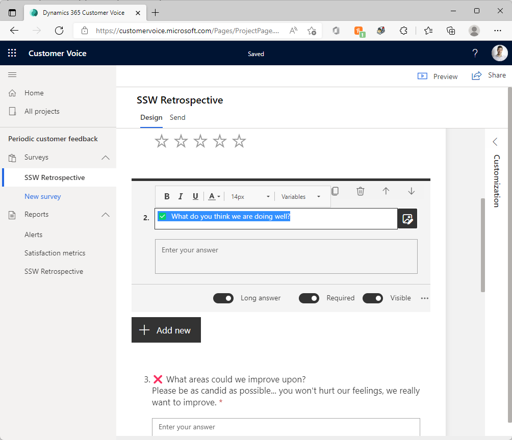
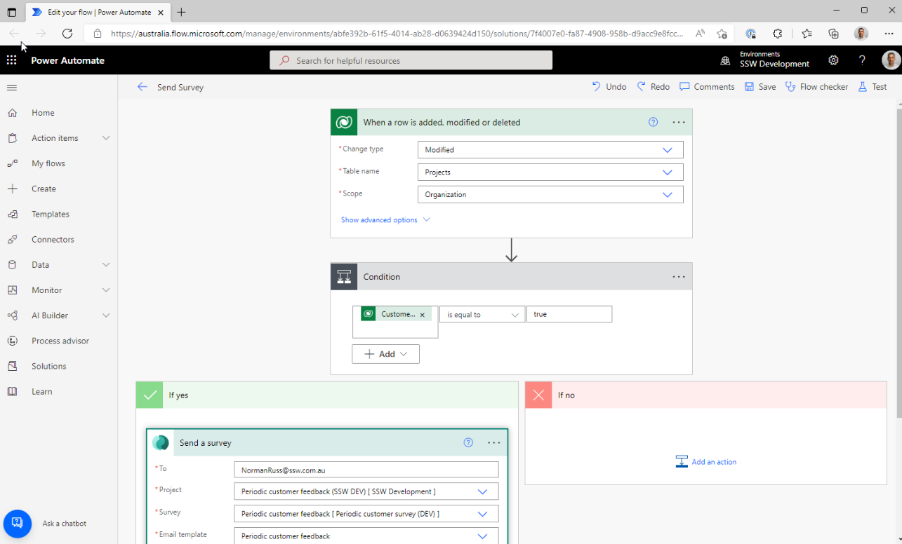
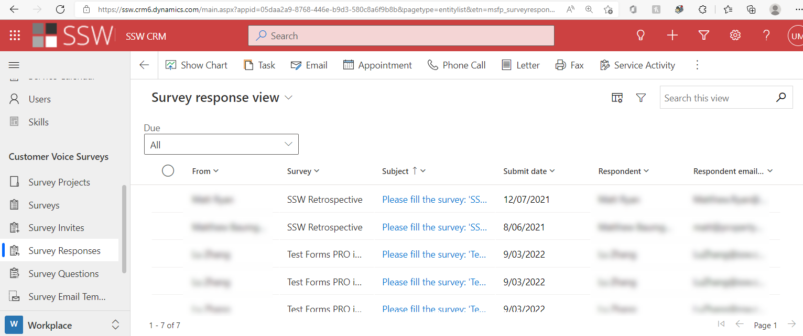
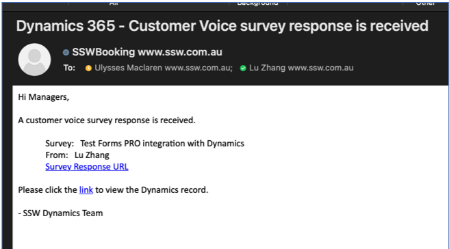

You're doing some great work for your client... or you think you are, but how do you know for sure how happy they are?

Customer feedback is something that most companies do not harness, and is key data that you should be looking at. It is as important as your profit and loss.

A focus on customer feedback will give your customers’ experience more of a weighting in your decision making.

Main options available for this are:

* MailChimp
* Salesforce Surveys and Feedback Management
* Dynamics Customer Voice **(recommended if you're already using Dynamics)**

<iframe width="560" height="315" src="https://www.youtube.com/embed/sbMReFrVYbs" title="YouTube video player" frameborder="0" allow="accelerometer; autoplay; clipboard-write; encrypted-media; gyroscope; picture-in-picture" allowfullscreen></iframe>

<!--endintro-->

Dynamics 365 has Customer Voice Surveys to harness this, and it is included with many D365 products (e.g. Sales module). 

It can also be added as a standalone product if you don’t already have it.

::: bad

:::

::: good

:::

### Creating the Survey

It’s built on the Microsoft Forms engine, so creating feedback surveys is very simple and intuitive.

If you are running Scrum projects, and your clients are used to doing Sprint Retrospectives, it makes sense to frame the questions in the same way (what went well, what didn’t, and what should we change?).

### Sending the Survey

Surveys can be sent manually, but for consistent value, you should have automated triggers in place. This could be after any significant milestone, and it’s best if it’s something easily automated: e.g.

* After a Spec Review (i.e. when you mark an Opportunity as won or lost)
* At billing milestones (e.g. $50k if your usual project sizes are > $100k... i.e. after 2 Sprints)
* At project completion (manually triggered from Dynamics | Account | Project page in the ribbon)

Note: Avoid sending these at high pressure points, when you're already asking them for a decision, e.g. too early in the sales process. 

### Receiving Responses

The survey responses are viewable in the Dynamics | Survey Responses section, and stats like customer satisfaction  (CSAT) metrics are here. 

Or you can see individual responses from their respective Account’s page.

If you’re a company that cares more about qualitative information than quantitative (e.g. you run few large projects rather than many small ones), then it’s a good idea to also make sure you set up email notifications when responses come in so that you don’t miss them, and you can analyze each one individually.

