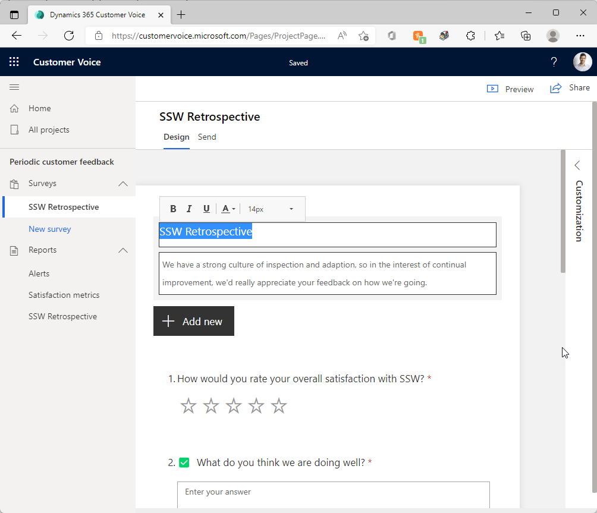

Customer feedback is something that most companies do not harness the full value of, and is a key way to give your customers’ experience more of a weighting in your decision making.

<!--endintro-->

Dynamics 365 has Customer Voice Surveys to harness this, and it is included with many D365 products. It can also be added as a standalone product if you don’t already have it.

### Creating the Survey

It’s built on the Microsoft Forms engine, so creating feedback surveys is very simple and intuitive.

Since we’re running Scrum projects, and our clients are used to doing Sprint Retrospectives, we frame the questions in the same way (what went well, what didn’t, and what should we change?).

### Sending the Survey

Surveys can be sent manually, but for consistent value, you should have automated triggers in place. This could be after any significant milestone (like after a Spec Review, or at project completion), but it’s best if it’s something easily automated, such as once you’ve billed them a certain amount (e.g. $50k if your usual project sizes are $100k-200k).

\[TODO: Mehmet - Image of trigger workflow]\
**Figure: Set up triggers to send out the surveys** 

### Receiving Responses

Responses to surveys will come into your Dynamics and can be viewed in the Survey Responses section, and aggregate information such as customer satisfaction metrics can be calculated from here. You can also see individual responses form their respective Account’s page.

If you’re a company that cares more about qualitative information than quantitative (e.g. you run few large projects rather than many small ones), then it’s a good idea to also make sure you set up email notifications when responses come in so that you don’t miss them, and you can analyze each one individually.

