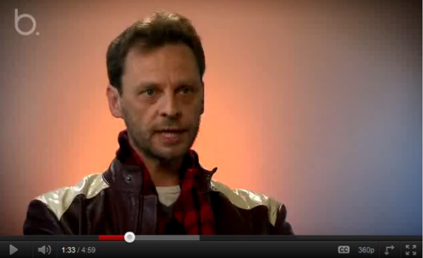

During an interview, looking at a talking head (the subject) can become monotonous. As such it is a good idea to ‘cutaway’ to the topic/product that the speaker is referring to. Not only does it make it more interesting, it improves the understandability of the video for your audience.

<!--endintro-->

As an example, if you are interviewing someone and the topic of unit testing comes up, mid-sentence you can cut to a shot of the unit testing UI.

::: bad

:::

`youtube: https://www.youtube.com/embed/zm4TctKMbNA`

::: good
Figure: Good example - Cutting away to what is being discussed improves the audiences understanding
:::
