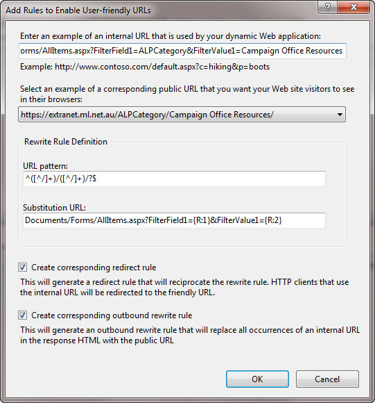

For maximum readability and SEO use kebab-case (dashes) in your URLs and [make them short and friendly](/create-friendly-short-urls).

Learn more on [Best Practices for URL Structure](https://www.searchenginejournal.com/technical-seo/url-structure/#bestprac).

<!--endintro-->

::: greybox
northwind&#46;com/**pageonworddocumentation** 
:::
::: bad
Figure: Bad example - No kebab-case in URL 
:::

::: greybox
northwind&#46;com/**PageOnWordDocumentation** 
:::
::: bad
Figure: Bad example - PascalCase (better readability and still works in small caps, but other people might share it without the MixedCase)
:::

::: greybox
northwind&#46;com/**page on word documentation** 

...will become

northwind&#46;com/**page20%on20%word20%documentation** 
:::
::: bad
Figure: Bad example - spaces it will show up in your URL structure as 20%, which is bad for readability and SEO
:::

::: greybox
northwind&#46;com/**page\_on\_word\_documentation** 
:::
::: ok
Figure: OK example - underscored (snake\_case) URLs have good readability but are not recommended by Google
::: 

::: greybox
northwind&#46;com/**page-on-word-documentation** 
:::
::: good
Figure: Good example - kebab-case is recommended by Google. Note: Don't use any uppercase
:::

::: info
**Not for domains!** This is only for pages and documents. Domains are bad when they have dashes in them.
:::

Read more on [SEO 101: Hyphens vs. Underscores in URLs](https://www.seomechanic.com/seo-101-hyphens-underscores-_-urls/).

---

#### More info

You can install the IIS [URL Rewrite Module](http://learn.iis.net/page.aspx/460/using-the-url-rewrite-module/) for IIS7 you can make ugly URL's much more friendly.

The caveat here is that it will only work if the URL is in the clear on the page.

::: greybox
**Note:** This could only be done with certain links as others are postbacks as well.
:::
