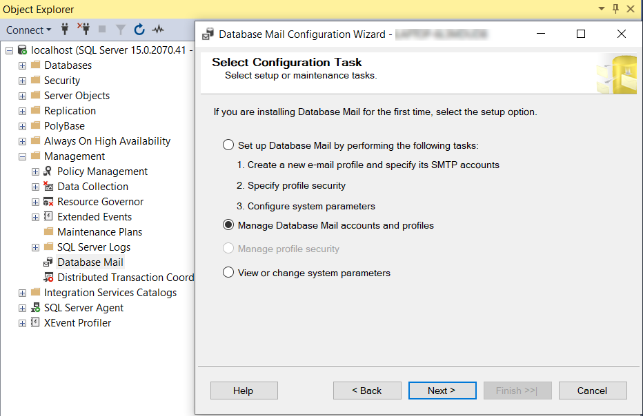

SQL Server includes Database Mail (it was a new feature released back in 2005 as a replacement for SQL Mail). Database Mail is a great feature as it allows:

* HTML messages natively supported - so there's no need to use 3rd party dlls anymore
* Communication direct with SMTP server - There's no need for outlook or MAPI profiles on server
* Multiple profiles and accounts supported to specify multiple SMTP servers or different email infrastructure situations
* SQL Server queues messages even when the external mailing process fails
* High security - users and roles have to be granted permission to send mail
* Logging and auditing
* Attachment size regulations and file extension requirements


<!--endintro-->

::: bad  
  
:::


```sql
EXEC master.dbo.xp_smtp_sendmail
@FROM = N'your@email.com',
@FROM_NAME = N'Sophie Belle',
@TO = 'recipient@email.com',
@subject = 'Vendor List',
@message = 'The list of vendors is attached.',
@type = N'text/html',
@server = N'mail.company.com.au'
```

::: bad
Figure: Bad example - Avoid using SQL Mail -  you need to have Outlook on the server and there is no built-in logging

:::


::: good  
  
:::

```sql
USE msdb
Execute dbo.sp_send_dbmail
@profile_name = 'UTS',
@recipients = 'your@email.com,
@body = 'The list of vendors is attached.',
@query = 'USE AdventureWorks; SELECT VendorID, Name FROM Purchasing.Vendor',
@subject = 'Vendor List',
@attach_query_result_as_file = 1
```

::: good
Figure: Good example - Use database mail for scalability, built-in logging and HTML capability

:::
