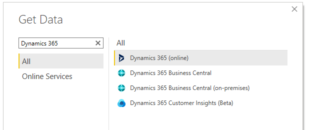
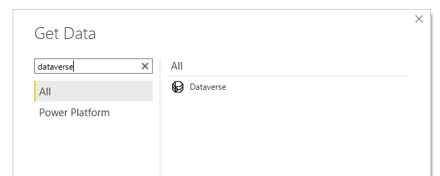

When creating a Power BI connection to Dynamics 365, the first thing that comes to mind when searching for a connector is to search for Dynamics 365, seems logical enough right?

<!--endintro-->

::: bad  
  
:::

Wrong.

When connecting to Dynamics 365 data always use the Dataverse connector (if it is available). Your system admin will need to tinker with some settings to enable this support, but it's simple and easy enough to do, here's the link: <https://docs.microsoft.com/en-us/powerapps/maker/data-platform/view-entity-data-power-bi.?WT.mc_id=DX-MVP-33518>

Once enabled instead of using Dynamics 365 (online) connector use the Dataverse connector.

::: good  
  
:::

The advantages of using the Dataverse connector are:

* Supports both Import and Direct Query (Direct Query means live reporting 🙂)
* Dataverse is built on top of TDS (Tabular Data Stream), meaning it should be much faster than the WebAPI connector
* Potential to write custom SQL queries for data sources

The disadvantages of using the Dataverse connector are:

* None
