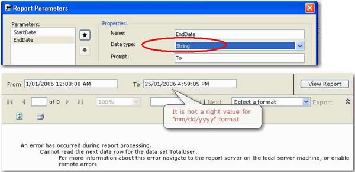

Use the DateTime data type for date parameters instead of using strings. There are 3 reasons to do this:

<!--endintro-->

1. Stop the bug "Cannot read the next data row for the data set"
Although a hardcoded string will work, it will not work for all users regional date/time settings.
E.g. a string data type parameter with a value of "26/01/2006" is correct for "dd/mm/yyyy", but it is wrong for "mm/dd/yyyy"

2. When SQL Reporting Services is using the DateTime data type parameter, it will get the datetime value on the users setting (aka the Culture DateTime format).

3. Your users also get the advantage of a date/time picker control, which automatically works out the correct regional date format. This solves the US/Australian date problem. (i.e. DD and MM are reversed).

::: bad  
  
:::

::: good  

:::

::: greybox
We have a program called [SSW Code Auditor](https://codeauditor.com) to check for this rule.
:::
