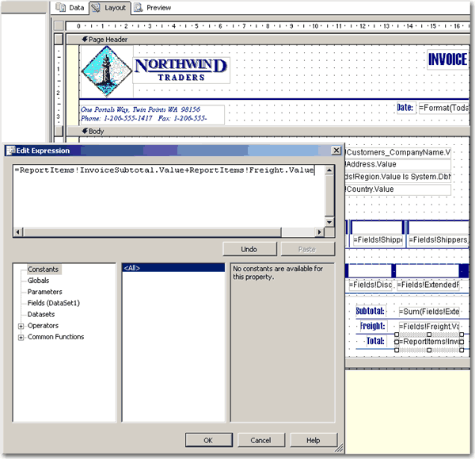
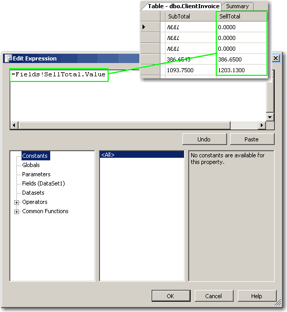

Most reports contain some sort of calculation - order totals, freight costs and so on. You have 3 options on how to display this in your report:

<!--endintro-->

1. **Use an expression in the report (bad)**. Avoid doing this because your logic is scattered throughout the report, and also because this logic cannot be shared around reports or with your other web and windows applications.

2. **Call an assembly with the calculated logic (better)**. This is better than using a calculation expression because the logic can be shared over multiple reports, and it is easy to find as all the logic is inside the one .NET project. It is not the best solution because there is an extra level of complexity as you have to build, compile and reference the assembly containing the logic.

3. **Use a denormalised database field (best)**. This is the best way because not only is the calculated value accessible directly from the report's data set, but the value is already pre-calculated which can provide a performance improvement (compared to calculating the value each time the report runs).

::: bad  
  
:::

::: bad  
  
:::

::: good  

:::
