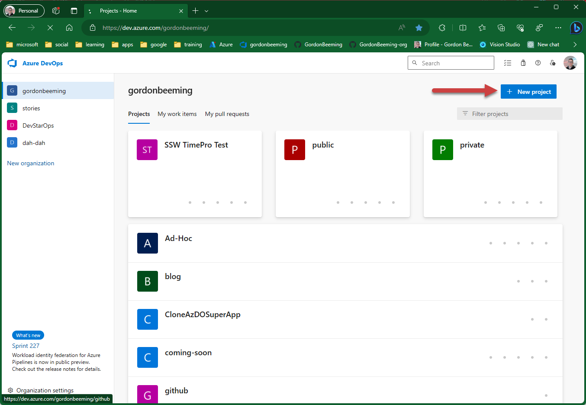
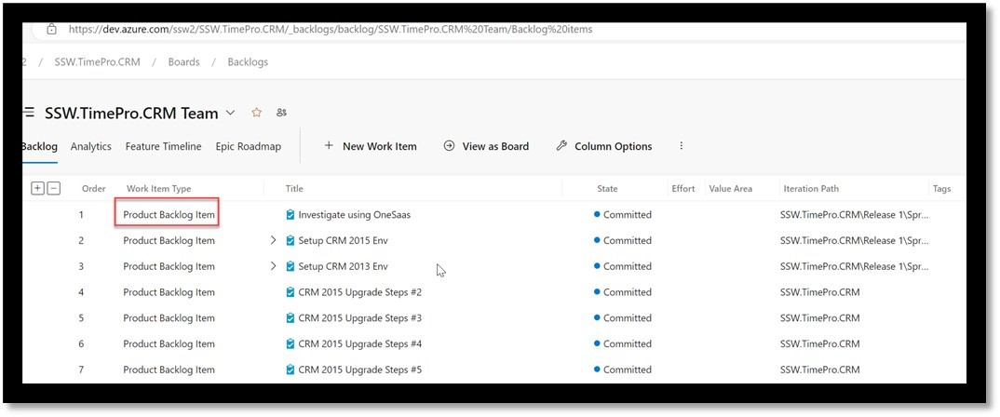
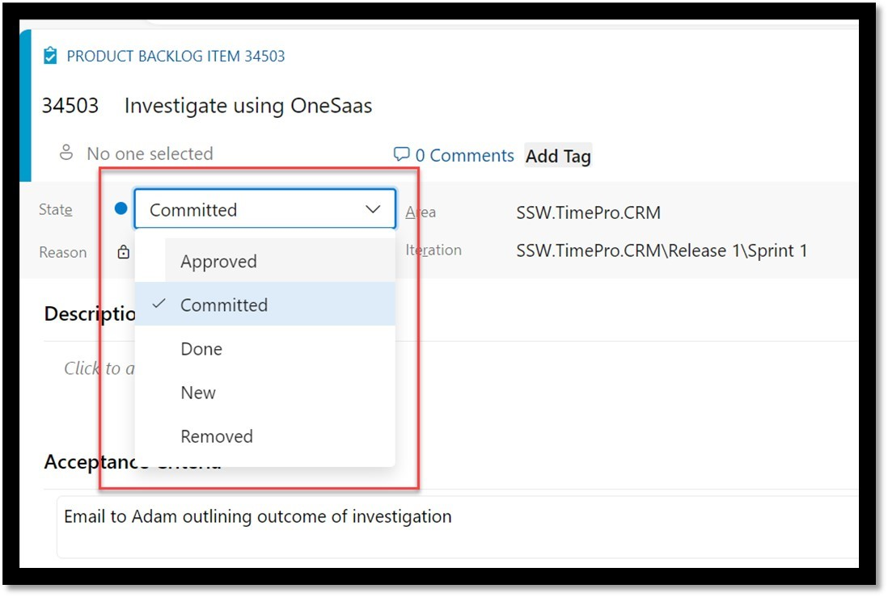

When initiating a new project in Azure DevOps, selecting the right template is crucial as it sets the groundwork for project management and collaboration. The Scrum template is a recommended choice due to its adherence to widely recognized Scrum terminology and practices. This rule guides you on how to select the Scrum template and elaborates on the benefits of doing so.

<!--endintro-->

1. Go to Azure DevOps | New Project.
1. Fill in the Name, Description, Visibility.
1. Click Work item process | Scrum.
1. Click Create.

::: img-large

:::

::: img-large

:::

Using the Scrum template has its fair share of cool perks:

**Terminology:** The work item types and states are all in Scrum-speak, which helps everyone on the team get on the same page quickly.

**Consistency:** It keeps things uniform across projects, so jumping in and out or teaming up is a breeze.

Azure DevOps does have other templates like Agile and CMMI, but the Scrum template has a special spot. It sticks to the Scrum playbook, making it a go-to for teams keen on keeping the Scrum spirit alive. It's all about boosting agility, making chats flow easily, and letting new folks blend in without a hitch.

::: img-large

:::

::: img-large

:::

