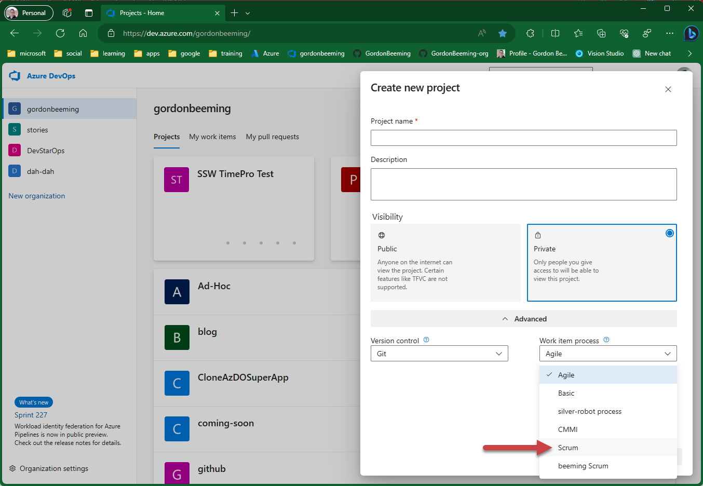

When you create a new project in Azure DevOps you have the option to select a template. You should always select the Scrum template. The 2 figures below show how to do so. This has a few benefits. 

* Work item types adhere to the Scrum terminology
* Work item states adhere to the Scrum terminology
* Consistency across SSW

::: img-small

:::

::: img-small

:::